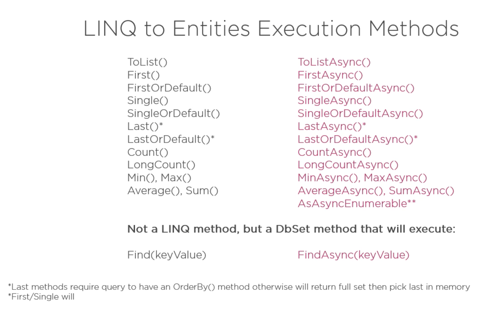

# 15 aggregation



`Last` et `LastOrDefault` require un `OrderBy` :

```cs
void QueryFilter(string queryString)
{
    var samurais = _context.Samurais
        .Last();
}
```

```bash
Unhandled exception. System.InvalidOperationException: Queries performing 'Last' operation must have a deterministic sort order. Rewrite the query to apply an 'OrderBy' clause on the sequence before calling 'Last'.
```

`Single` lance une exception s'il y a plus d'enregistrement que `un` ou `aucun`.

`First` , `Single` ou `Last` lance une exception s'il n'y a aucun enregistrement.

`FirtsOrDefault`, `SingleOrDefault` et `LastOrDefault` retournent `null` s'il n'y a pas d'enregistrement.


## `FirstOrDefault`

```cs
QueryFilter("Azuka");

void QueryFilter(string name)
{
    var samurai = _context.Samurais
        .Where(s => s.Name == name)
        .FirstOrDefault();
}
```

```sql
Executed DbCommand (3ms) [Parameters=[@__name_0='Azuka' (Size = 4000)], CommandType='Text', CommandTimeout='30']
      SELECT TOP(1) [s].[Id], [s].[Name]
      FROM [Samurais] AS [s]
      WHERE [s].[Name] = @__name_0
```

Cette fois la méthode renvoie un enregistrement unique et non une liste (ici un `Samurai`).

`"Azuka"` n'est pas dans la `BDD` mais cela ne génére pas une `exception`.

On peut simplifier l'écriture en mettant le prédicat directement dans `FirstOrDefault` :

```cs
void QueryFilter(string name)
{
    var samurais = _context.Samurais
        .FirstOrDefault(s => s.Name == name);
}
```


## Recherche par `Id`

```cs
void QueryFilter()
{
    var samurais = _context.Samurais
        .FirstOrDefault(s => s.Id == 2);
}
```

Il existe une méthode de `DbSet` et non pas de `Linq` qui exécute la même tâche, mais de manière plus **performante**.

### `Find(<id>)`

```cs
var samurai = _context.Samurai.Find(2);
```

`Find` va d'abord chercher en mémoire l'enregistrement s'il est déjà *tracker*, ainsi il sait s'il convient ou non de relancer une requête.

