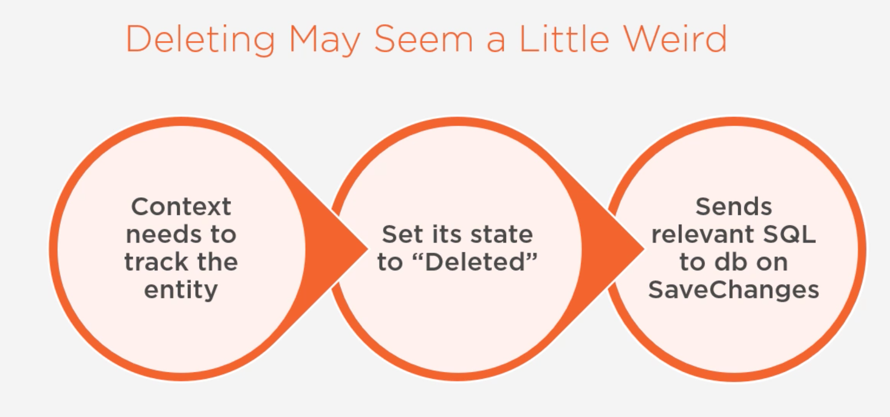
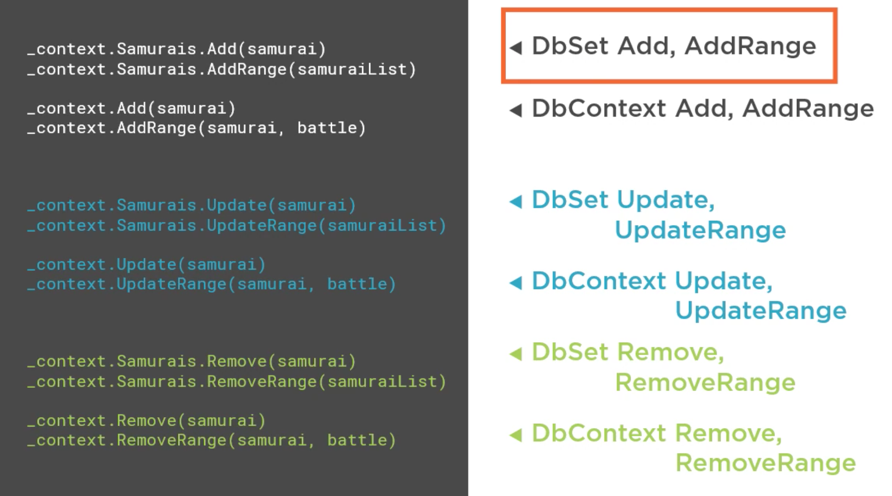
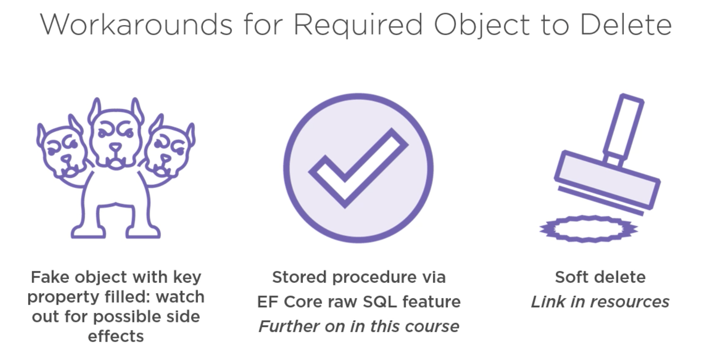

# 16 `Update` et `Delete`

## `Updating`

```cs
void RetrieveAndUpdateSamurai()
{
    var samurai = _context.Samurai.FirstOrDefault();
    samurai.Name += " San";
    _context.SaveChanges();
}
```

```sql
info: 10/05/2021 16:41:47.254 RelationalEventId.CommandExecuted[20101] (Microsoft.EntityFrameworkCore.Database.Command) 
      Executed DbCommand (20ms) [Parameters=[], CommandType='Text', CommandTimeout='30']
      SELECT TOP(1) [s].[Id], [s].[Name]
      FROM [Samurais] AS [s]
info: 10/05/2021 16:41:47.392 RelationalEventId.CommandExecuted[20101] (Microsoft.EntityFrameworkCore.Database.Command) 
      Executed DbCommand (20ms) [Parameters=[@p1='1', @p0='Alf San' (Size = 4000)], CommandType='Text', CommandTimeout='30']
      SET NOCOUNT ON;
      UPDATE [Samurais] SET [Name] = @p0
      WHERE [Id] = @p1;
      SELECT @@ROWCOUNT;
```

À la fin le `SELECT` renvoie le nombre de lignes importées.

Comme le `samurai` est *tracké* dans `DbContext`, les changement sont notifiés et la `BBD` est mise à jour lorsqu'on appelle `SaveChanges`.


## `Skip` et `Take`

Ces deux méthodes peuvent être très utiles pour la pagination.


## `Batch Update`

Pour qu'un `Batch Update` soit déclenché, il faut minimum `4` enregistrement à `updater`.

```cs
void RetrieveAndUpdateMultipleSamurais()
{
    var samurais = _context.Samurais.Skip(1).Take(5).ToList();
    samurais.ForEach(s => s.Name += "San");
    
    _context.SaveChanges();
}
```

Tous les `INSERT` vont être exécutés en une seule commande :

```sql
Executed DbCommand (7ms) [Parameters=[@p1='2', @p0='Doni San' (Size = 4000), @p3='3', @p2='Robi San' (Size = 4000), @p5='4', @p4='Sara San' (Size = 4000), @p7='5', @p6='Michel San' (Size = 4000), @p9='6', @p8='Micheline San' (Size = 4000)], CommandType='Text', CommandTimeout='30']
      SET NOCOUNT ON;
      UPDATE [Samurais] SET [Name] = @p0
      WHERE [Id] = @p1;
      SELECT @@ROWCOUNT;
      
      UPDATE [Samurais] SET [Name] = @p2
      WHERE [Id] = @p3;
      SELECT @@ROWCOUNT;
      
      UPDATE [Samurais] SET [Name] = @p4
      WHERE [Id] = @p5;
      SELECT @@ROWCOUNT;
      
      UPDATE [Samurais] SET [Name] = @p6
      WHERE [Id] = @p7;
      SELECT @@ROWCOUNT;
      
      UPDATE [Samurais] SET [Name] = @p8
      WHERE [Id] = @p9;
      SELECT @@ROWCOUNT;
```

Si il n'y avait que trois modifications, chaque modification aurait sa propre commande `sql` :

```cs
var samurais = _context.Samurais.Skip(3).Take(3).ToList();
samurais.ForEach(s => s.Name += " Ko");

_context.SaveChanges();
```

```sql
      Executed DbCommand (3ms) [Parameters=[@p1='4', @p0='Sara San Ko' (Size = 4000)], CommandType='Text', CommandTimeout='30']
      SET NOCOUNT ON;
      UPDATE [Samurais] SET [Name] = @p0
      WHERE [Id] = @p1;
      SELECT @@ROWCOUNT;
info: 10/05/2021 17:02:20.078 RelationalEventId.CommandExecuted[20101] (Microsoft.EntityFrameworkCore.Database.Command) 
      Executed DbCommand (2ms) [Parameters=[@p1='5', @p0='Michel San Ko' (Size = 4000)], CommandType='Text', CommandTimeout='30']
      SET NOCOUNT ON;
      UPDATE [Samurais] SET [Name] = @p0
      WHERE [Id] = @p1;
      SELECT @@ROWCOUNT;
info: 10/05/2021 17:02:20.080 RelationalEventId.CommandExecuted[20101] (Microsoft.EntityFrameworkCore.Database.Command) 
      Executed DbCommand (2ms) [Parameters=[@p1='6', @p0='Micheline San Ko' (Size = 4000)], CommandType='Text', CommandTimeout='30']
      SET NOCOUNT ON;
      UPDATE [Samurais] SET [Name] = @p0
      WHERE [Id] = @p1;
      SELECT @@ROWCOUNT;
```

`3` commandes exécutées.


## Opérations Multiple

On peut grouper des opérations d'ajout et de modification d'objets.

```cs
void MultipleDatabaseOperations()
{
    var samurai = _context.Samurais.FirstOrDefault();
    samurai.Name += " San";
    _context.Samurais.Add(new() { Name = "Ichiro" });
    
    _context.SaveChanges();
}
```

Ici `EF Core` génère deux commandes, si on avait au moins `4` opérations, `EF Core` aurait alors *batché* les opérations en une seule commandes.


## `Delete`



1. Le `context` doit d'abord *tracker* un objet
2. On doit ensuite mettre son `state` sur `deleted`
3. Puis on génère un `sql` adéquat qu'on va envoyer à la `BDD` lorsqu'on appelle `SaveChanges`

Il faut donc d'abord **retrouver l'objet**.

```cs
void RetrieveAndDeleteASamurai()
{
    var samurai = _context.Samurais.Find(18);
    _context.Samurais.Remove(samurai);
    
    _context.SaveChanges();
}
```

```sql
      Executed DbCommand (28ms) [Parameters=[@__p_0='3'], CommandType='Text', CommandTimeout='30']
      SELECT TOP(1) [s].[Id], [s].[Name]
      FROM [Samurais] AS [s]
      WHERE [s].[Id] = @__p_0
info: 11/05/2021 09:21:18.682 RelationalEventId.CommandExecuted[20101] (Microsoft.EntityFrameworkCore.Database.Command) 
      Executed DbCommand (2ms) [Parameters=[@p0='3'], CommandType='Text', CommandTimeout='30']
      SET NOCOUNT ON;
      DELETE FROM [Samurais]
      WHERE [Id] = @p0;
      SELECT @@ROWCOUNT;
```

On a donc deux commandes. Le nombre de ligne(s) supprimé(s) est ensuite renvoyé.


## Résumé des commandes



Chaque opération peut être effectué en `batch` avec le mot `Range`.

Elles peuvent toutes être reliées directement sur le `context` si nécessaire :

```cs
_context.Remove(samurai);
```


## Plusieurs options de `Delete`



https://docs.microsoft.com/en-us/ef/core/querying/filters


