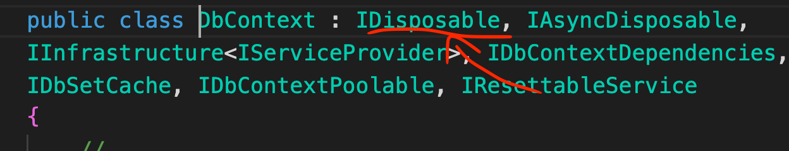
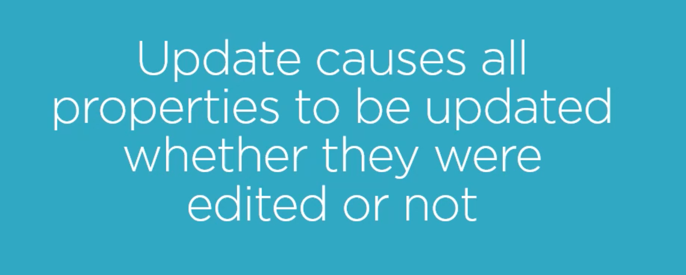
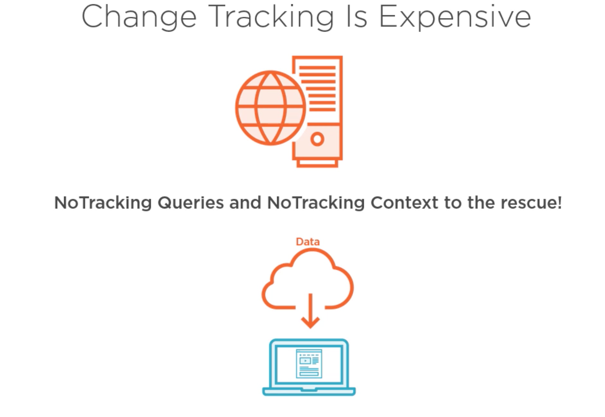
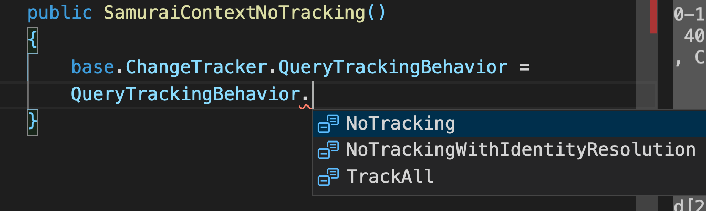

# 17 Scénario dé-connecté

Dans le cas d'une `Web API` on ne peux pas maintenir un context pour tous les utilisateurs.

Il n'est donc pas possible de **tracker** les objets comme dans un scénario connecté.


## Modification de `Battle`

On va ajouter deux propriétés :

```cs
using System;
using System.Collections.Generic;

namespace SamuraiApp.Domain
{
    public class Battle
    {
        public int Id { get; set; }
        public string Name { get; set; }
        public DateTime StartDate { get; set; }
        public DateTime EndDate { get; set; }
        public List<Samurai> Samurais { get; set; } = new();

    }
}
```

On relance une migration dans `SamuraiApp.Data` :

```bash
dotnet ef migrations add BattlesDates
dotnet ef database update
```


## Simulation d'un scénario dé-connecté avec deux `context`

```cs
void QueryAndUpdateBattles_Disconnected()
{
    List<Battle> disconnectedBattles;
    
    using(var context1 = new SamuraiContext())
    {
        disconnectedBattles = context1.Battles.ToList();
    } // context1 is disposed
    
    disconnectedBattles.ForEach(b => {
        b.StartDate = new DateTime(1570, 01, 01);
        b.EndDate = new DateTime(1570, 12, 01);
    });
    
    using(var context2 = new SamuraiContext())
    {
        context2.UpdateRange(disconnectedBattles);
        context2.SaveChanges();
    }
}
```

`using` permet d'être sûre que l'objet soit bien détruit à la fin du bloc.

L'objet doit implémenter `IDisposable`.

`SamuraiContext` hérite de `DbContext` qui implémente `IDisposable` :



`UpdateRange` fait deux actions :

1. Il *track* tous les objets qui lui sont passés
2. Il les marque comme `modified`

```sql
      Executed DbCommand (16ms) [Parameters=[@p3='1', @p0='1570-12-01T00:00:00.0000000', @p1='Battle of Toilet Area' (Size = 4000), @p2='1570-01-01T00:00:00.0000000'], CommandType='Text', CommandTimeout='30']
      SET NOCOUNT ON;
      UPDATE [Battles] SET [EndDate] = @p0, [Name] = @p1, [StartDate] = @p2
      WHERE [Id] = @p3;
      SELECT @@ROWCOUNT;
info: 11/05/2021 10:37:42.884 RelationalEventId.CommandExecuted[20101] (Microsoft.EntityFrameworkCore.Database.Command) 
      Executed DbCommand (2ms) [Parameters=[@p3='2', @p0='1570-12-01T00:00:00.0000000', @p1='Battle of Popota desert' (Size = 4000), @p2='1570-01-01T00:00:00.0000000'], CommandType='Text', CommandTimeout='30']
      SET NOCOUNT ON;
      UPDATE [Battles] SET [EndDate] = @p0, [Name] = @p1, [StartDate] = @p2
      WHERE [Id] = @p3;
      SELECT @@ROWCOUNT;
```

Le `Name` est aussi changé, même s'il garde la même valeur, `UpdateRange` dit qu'il y a quelque chose de modifié, mais pas quoi.

Avec `Update`  toutes les propriété de l'objet sont mises à jour même si il n'y en a qu'une qui change.




## `No-Tracking`

Pour la construction de site `Web` ou de `Web Api` il peut être intéressant pour des raisons de performance de désactiver le *trackage* par `EF Core`.



## Méthode `AsNoTracking`

```cs
var samurai = _context.Samurais.AsNoTracking().FirstOrDefault();
```

`AsNoTracking` retourne une `Query` et pas un `DbSet`.

Utile pour spécifier des cas particuliers.

## Régler dans le constructeur de la classe `ChangeTracker`

```cs
public class SamuraiContextNoTrack : DbContext
{
    public SamuraiContextNoTrack()
    {
        ChangeTracker.QueryTrackingBehavior = QueryTrackingBehavior.NoTracking;
    }
}
```

On peut utiliser `DbSet.AsTracking()` pour que certaine requête soient *trackées*.


## `SamuraiContextNoTracking`

On va créer un nouveau `context` implémentant le `no-tracking` :

```cs
using Microsoft.EntityFrameworkCore;

namespace SamuraiApp.Data
{
    public class SamuraiContextNoTracking : SamuraiContext
    {
        public SamuraiContextNoTracking()
        {
            base.ChangeTracker.QueryTrackingBehavior = QueryTrackingBehavior.NoTracking;
        }
    }
}
```

On a plusieurs options, par défaut c'est `TrackAll` :



Il suffit ensuite de modifier notre `Program` :

```cs
SamuraiContextNoTracking _contextNT = new SamuraiContextNoTracking();
```

Les codes précédents continuent de *builder*.


