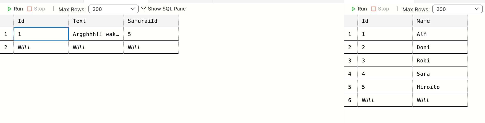
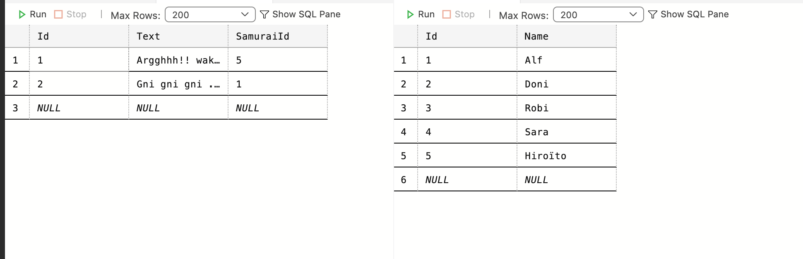
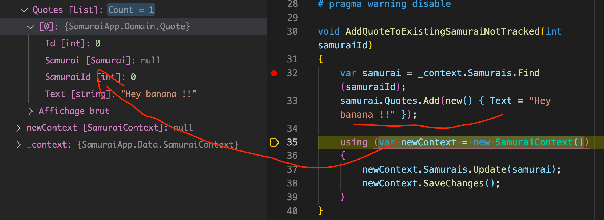
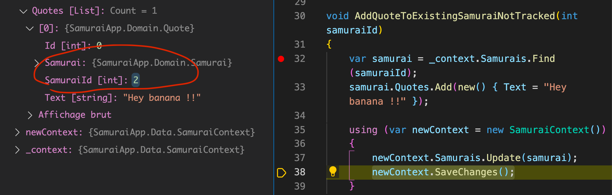
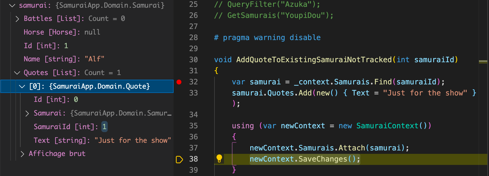
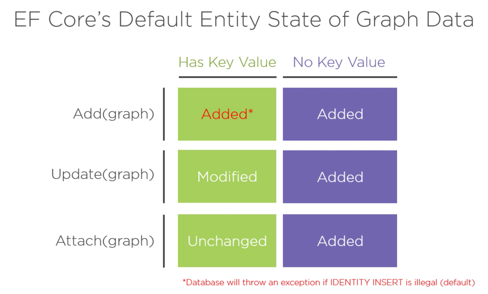

# 18 Données reliées

Un `Samurai` peut avoir plusieurs `Quote` (citations).

```cs
public class Samurai
{
    // ...
    public List<Quote> Quotes { get; set; } = new();

}

public class Quote
{
    // ...
    public Samurai Samurai { get; set; }
    public int SamuraiId { get; set; }
}
```

## `InsertNewSamuraiWithAQuote`

On va écrire une méthode pour insérer un `Samurai` et une `Quote` :

```cs
void InsertNewSamuraiWithAQuote()
{
    var samurai = new Samurai { Name = "Hiroito"};
    samurai.Quotes.Add(new() { Text = "Argghhh !!! Waka Waka"});
    
    _context.Add(samurai);
    
    _context.SaveChanges();
    
}
```

```sql
Executed DbCommand (33ms) [Parameters=[@p0='Hiroïto' (Size = 4000)], CommandType='Text', CommandTimeout='30']
      SET NOCOUNT ON;
      INSERT INTO [Samurais] ([Name])
      VALUES (@p0);
      SELECT [Id]
      FROM [Samurais]
      WHERE @@ROWCOUNT = 1 AND [Id] = scope_identity();
info: 12/05/2021 10:22:43.015 RelationalEventId.CommandExecuted[20101] (Microsoft.EntityFrameworkCore.Database.Command) 
      Executed DbCommand (14ms) [Parameters=[@p1='5', @p2='Argghhh!! waka Waka' (Size = 4000)], CommandType='Text', CommandTimeout='30']
      SET NOCOUNT ON;
      INSERT INTO [Quotes] ([SamuraiId], [Text])
      VALUES (@p1, @p2);
      SELECT [Id]
      FROM [Quotes]
      WHERE @@ROWCOUNT = 1 AND [Id] = scope_identity();
```

Le `samurai` est créé puis avec l'`Id` du `samurai` la `quote` est créée.




## `AddQuoteToExistingSamuraiWhileTracked`

```cs
void AddQuoteToExistingSamuraiWhileTracked()
{
    var samurai = _ context.Samurai.FirstOrDefault();
    samurai.Quotes.Add(new Quote { Text = "Gni gni gni ..." });
    
    _context.saveChanges();
}
```

Ici grâce à la première ligne le `samurai` est *tracké* par le `context`.




## `Not Tracked` scénario

```cs
void AddQuoteToExistingSamuraiNotTracked(int samuraiId)
{
    var samurai = _context.Samurai.Find(samuraiId);
    
    samurai.Quotes.Add(new Quote { Text = "Popo litu popu !" });
    
    using (var newContext = new samuraiContext())
    {
        newContext.Samurais.Update(samurai);
        newContext.SaveChanges();
    }
}
```

```sql
Executed DbCommand (27ms) [Parameters=[@__p_0='2'], CommandType='Text', CommandTimeout='30']
      SELECT TOP(1) [s].[Id], [s].[Name]
      FROM [Samurais] AS [s]
      WHERE [s].[Id] = @__p_0
info: 12/05/2021 15:40:05.665 RelationalEventId.CommandExecuted[20101] (Microsoft.EntityFrameworkCore.Database.Command) 
      Executed DbCommand (3ms) [Parameters=[@p0='2', @p1='Hey banana !!' (Size = 4000)], CommandType='Text', CommandTimeout='30']
      SET NOCOUNT ON;
      INSERT INTO [Quotes] ([SamuraiId], [Text])
      VALUES (@p0, @p1);
      SELECT [Id]
      FROM [Quotes]
      WHERE @@ROWCOUNT = 1 AND [Id] = scope_identity();
info: 12/05/2021 15:40:05.684 RelationalEventId.CommandExecuted[20101] (Microsoft.EntityFrameworkCore.Database.Command) 
      Executed DbCommand (4ms) [Parameters=[@p1='2', @p0='Doni' (Size = 4000)], CommandType='Text', CommandTimeout='30']
      SET NOCOUNT ON;
      UPDATE [Samurais] SET [Name] = @p0
      WHERE [Id] = @p1;
      SELECT @@ROWCOUNT;
```

On voit que deux `update` sont exécutés car `Update` enregistre la totalité de l'objet.



Il faut attendre `Update` pour que la clé étrangère soit déterminée :



## `Attach`


Dans les méthodes capables de *tracker*, il existe aussi `Attach`.

`Attach` connecte juste l'objet au `context` et met son état à `unmodified`.

`EF Core` va quand même remarquer l'absence de `samuraiId` dans la `Quote` et mettre à jour correctement la `Quote`.

```cs
void AddQuoteToExistingSamuraiNotTracked(int samuraiId)
{
    var samurai = _context.Samurais.Find(samuraiId);
    samurai.Quotes.Add(new() { Text = "Just for the show" });

    using (var newContext = new SamuraiContext())
    {
        newContext.Samurais.Attach(samurai);
        newContext.SaveChanges();
    }
}

AddQuoteToExistingSamuraiNotTracked(1);
```


Avant le `Attach`, la `Quote` n'a pas de clé étrangère.



Après le `Attach`, la clé étrangère `SamuraiId` est bien renseignée.

```sql
      Executed DbCommand (31ms) [Parameters=[@__p_0='1'], CommandType='Text', CommandTimeout='30']
      SELECT TOP(1) [s].[Id], [s].[Name]
      FROM [Samurais] AS [s]
      WHERE [s].[Id] = @__p_0
info: 05/12/2021 16:00:55.868 RelationalEventId.CommandExecuted[20101] (Microsoft.EntityFrameworkCore.Database.Command) 
      Executed DbCommand (4ms) [Parameters=[@p0='1', @p1='Just for the show' (Size = 4000)], CommandType='Text', CommandTimeout='30']
      SET NOCOUNT ON;
      INSERT INTO [Quotes] ([SamuraiId], [Text])
      VALUES (@p0, @p1);
      SELECT [Id]
      FROM [Quotes]
      WHERE @@ROWCOUNT = 1 AND [Id] = scope_identity();
```

Cette fois ci, il n'y a qu'un seul `INSERT`.



On voit que `Attach` peut économiser des commandes inutiles et donc amméliorer les performances.


## Ajouter la `Foreign Key` à la main

On peut utiliser une écriture plus simple en renseignant à la main la clé étrangère.

```cs
void Simpler_AddQuoteToExistingSamuraiNotTracked(int samuraiId)
{
    var quote = new quote { Text = "Happy to eat you", SamuraiId = samuraiId };
    using var newContext = new SamuraiContext();
    newContext.Quotes.Add(quote);
    newContext.saveChanges();
}
```

L'instruction `using` peut s'écrire sans les accolades. Le bloc s'étant jusqu'à la fin de la méthode.

`Dispose` est appelé automatiquement à la fin de la méthode.

Permet d'utiliser proprement les objets implémentant `IDisposable` ou `IAsyncDisposable`.

C'est équivalent à :

```cs
void Simpler_AddQuoteToExistingSamuraiNotTracked(int samuraiId)
{
    var quote = new quote { Text = "Happy to eat you", SamuraiId = samuraiId };
    
    {
        var newContext = new SamuraiContext();
    	try
        {
            newContext.Quotes.Add(quote);
    		newContext.saveChanges();
        }
        finally
        {
            newContext?.Dispose();
        }
    }
}
```

On voit qu'un bloc de portée a été ajouté à toute l'opération de façon que `newContext` n'existe pas à l'extérieur de ce bloc.

```sql
Executed DbCommand (27ms) [Parameters=[@p0='1', @p1='Cut cut cut' (Size = 4000)], CommandType='Text', CommandTimeout='30']
      SET NOCOUNT ON;
      INSERT INTO [Quotes] ([SamuraiId], [Text])
      VALUES (@p0, @p1);
      SELECT [Id]
      FROM [Quotes]
      WHERE @@ROWCOUNT = 1 AND [Id] = scope_identity();
```

cette fois on a plus qu'une seule commande.


