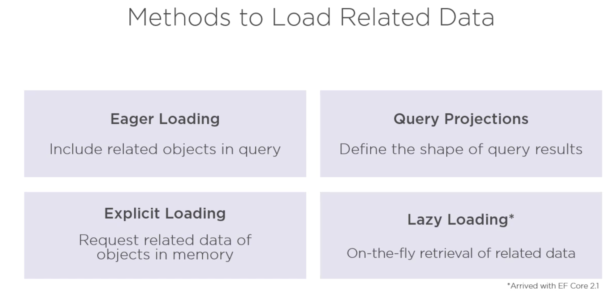
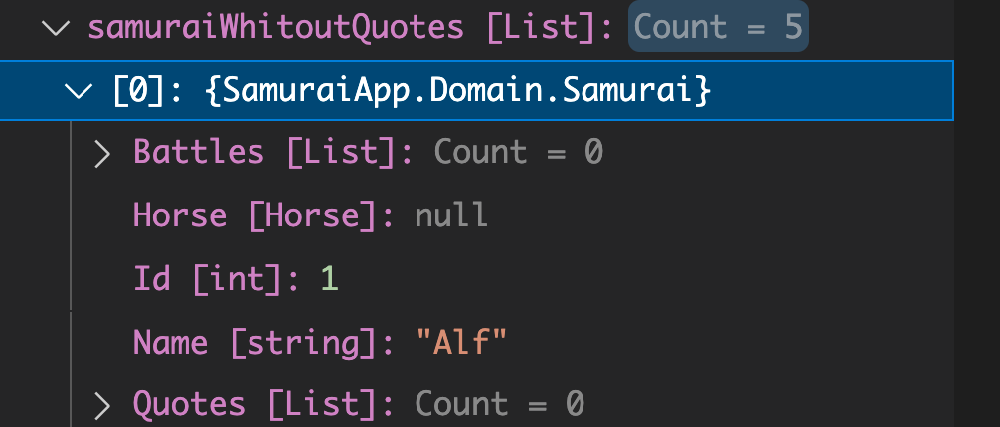
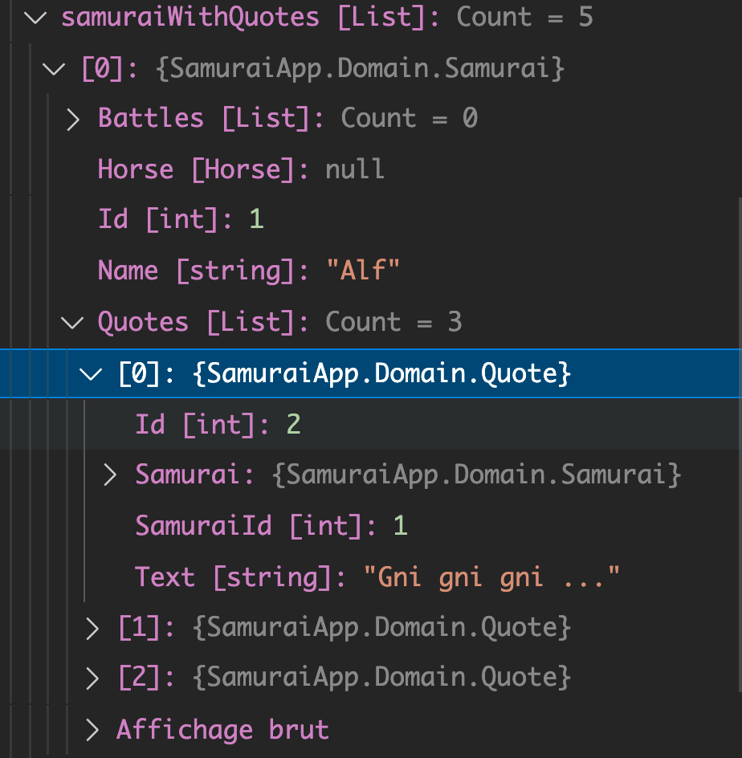
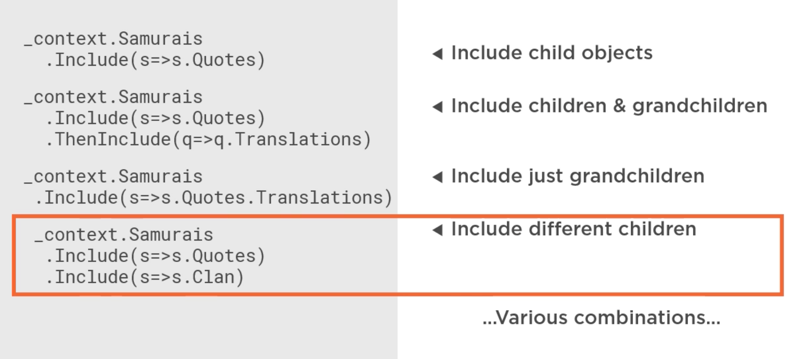
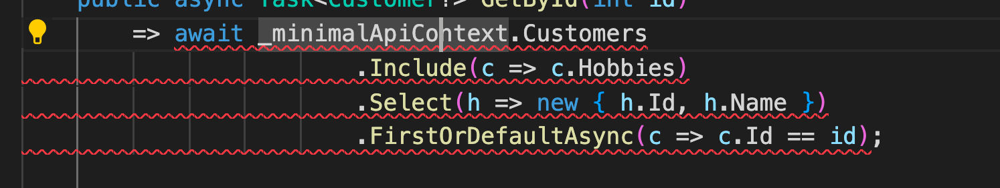
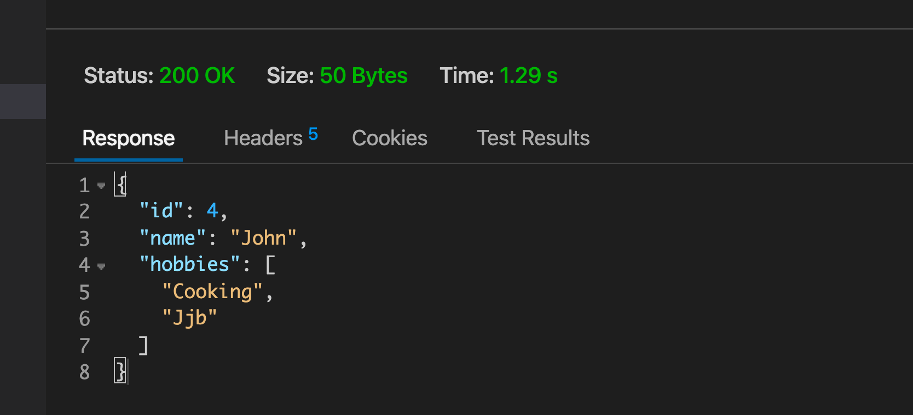

# 19 Eager Loading : `Includes`



### `Whitout Quotes`

```cs
void EagerLoadSamuraiWithoutQuotes()
{
    var samuraiWithoutQuotes = _context.Samurais.ToList();
}
```




### `Whit Quotes` : utilisation de `Include`

```cs
void EagerLoadSamuraiWithQuotes()
{
    var samuraiWhitQuotes = _context.Samurais.Include(s => s.Quotes).ToList();
}
```



```sql
Executed DbCommand (4ms) [Parameters=[], CommandType='Text', CommandTimeout='30']
      SELECT [s].[Id], [s].[Name], [q].[Id], [q].[SamuraiId], [q].[Text]
      FROM [Samurais] AS [s]
      LEFT JOIN [Quotes] AS [q] ON [s].[Id] = [q].[SamuraiId]
      ORDER BY [s].[Id], [q].[Id]
```

`EF Core` crée un `LEFT JOIN` et exécute **une seule requête**, c'est le comportement par défaut.

Il est possible de *splitter* en plusieurs requête avec `AsSplitQuery` :

```cs
void EagerLoadSamuraiWitjQuotes()
{
    var splitQuery = _context.Samurais.AsSplitQuery().Include(s => s.Quotes).ToList();
}
```

```sql
Executed DbCommand (19ms) [Parameters=[], CommandType='Text', CommandTimeout='30']
      SELECT [s].[Id], [s].[Name]
      FROM [Samurais] AS [s]
      ORDER BY [s].[Id]
info: 13/05/2021 08:21:55.456 RelationalEventId.CommandExecuted[20101] (Microsoft.EntityFrameworkCore.Database.Command) 
      Executed DbCommand (7ms) [Parameters=[], CommandType='Text', CommandTimeout='30']
      SELECT [q].[Id], [q].[SamuraiId], [q].[Text], [s].[Id]
      FROM [Samurais] AS [s]
      INNER JOIN [Quotes] AS [q] ON [s].[Id] = [q].[SamuraiId]
      ORDER BY [s].[Id]
```

On a ici deux tables qui seront assemblées en objets en mémoire par `EF Core`.

Pour des besoins de performance il peut être intérressant de garder cette option à l'esprit.


## Filtre et `Include`

Avant `EF Core 5` il était impossible de filtrer avec un `Include` et on recevait donc la totalité des enregistrements.

### `Where`

```cs
void EagerLoadSamuraiWithQuotes()
{
    var filteredInclude = _context.Samurais
        						.Include(s => s.Quotes.Where(q => q.Text.Contains("gni")))
        						.ToList();
}
```

```sql
Executed DbCommand (55ms) [Parameters=[], CommandType='Text', CommandTimeout='30']
      SELECT [s].[Id], [s].[Name], [t].[Id], [t].[SamuraiId], [t].[Text]
      FROM [Samurais] AS [s]
      LEFT JOIN (
          SELECT [q].[Id], [q].[SamuraiId], [q].[Text]
          FROM [Quotes] AS [q]
          WHERE [q].[Text] LIKE N'%gni%'
      ) AS [t] ON [s].[Id] = [t].[SamuraiId]
      ORDER BY [s].[Id], [t].[Id]

```

On reçoit ici tous les `samurais`, mais seule la `Quote` qui contient `"gni"` est renvoyée.

### Filtrer les `samurais`

```cs
var filterPrimaryEntityWithInclude = 
    _context.Samurais.Where(s =< s.Name.Contains("bo"))
    	.Includes(s => s.Quotes).FirstOrDefault();
```

```sql
SELECT [t].[Id], [t].[Name], [q].[Id], [q].[SamuraiId], [q].[Text]
FROM (
          SELECT TOP(1) [s].[Id], [s].[Name]
          FROM [Samurais] AS [s]
          WHERE [s].[Name] LIKE N'%ro%'
      ) AS [t]
LEFT JOIN [Quotes] AS [q] ON [t].[Id] = [q].[SamuraiId]
ORDER BY [t].[Id], [q].[Id]      
```

Cette fois ci la sous-requête est dans le `FROM` et pas dans le `LEFT JOIN`.


### Remarque

`Include` s'applique à un `DbSet`, il doit donc être placé avant `FirstOrDefault` ou `Find` qui eux ne renvoient qu'un élément (et pas un `DbSet`).


## variations




## Problème avec `Include` et `Select`

On peut vouloir ne pas obtenir tous les champs d'objets imbriqués :

```cs
public async Task<Customer?> GetById(int id) 
        => await _minimalApiContext.Customers
                        .Include(c => c.Hobbies)
                        .FirstOrDefaultAsync(c => c.Id == id);
```

```
{
  "id": 4,
  "name": "John",
  "hobbies": [
    {
      "id": 2,
      "name": "Cooking",
      "customers": [
        null
      ]
    },
    {
      "id": 3,
      "name": "Jjb",
      "customers": [
        null
      ]
    }
  ]
}
```

Je n'ai pas envie d'obtenir le champs `customers` car c'est une référence circulaire mise à `null` par le `jsonSerializer`.

On pourrait vouloir utiliser `Select` :

```cs
.Include(c => c.Hobbies).Select(h => new { h.Id, h.Name })...
```

Mais cela ne fonctionne pas :



On doit utiliser un `Dto` avec deux `Select` :

```cs
public class CustomerDto
{
    public int Id { get; set; }
    public string Name { get; set; } = String.Empty;
    public List<string> Hobbies { get; set; } = new();
}
```

```cs
// CustomerRepository

public async Task<CustomerDto?> GetById(int id) 
        => await _minimalApiContext.Customers
    .Select(c => new CustomerDto {
        Id = c.Id, 
        Name = c.Name, 
        Hobbies = c.Hobbies.Select(h => h.Name).ToList()
    })
    .FirstOrDefaultAsync(c => c.Id == id);
```




