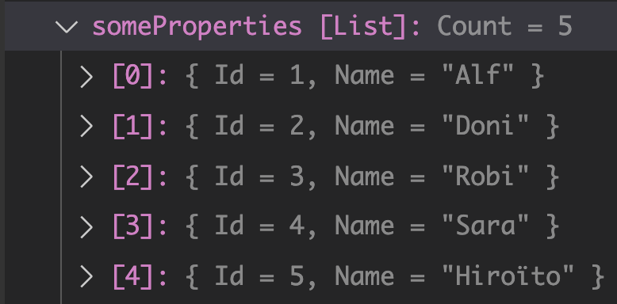
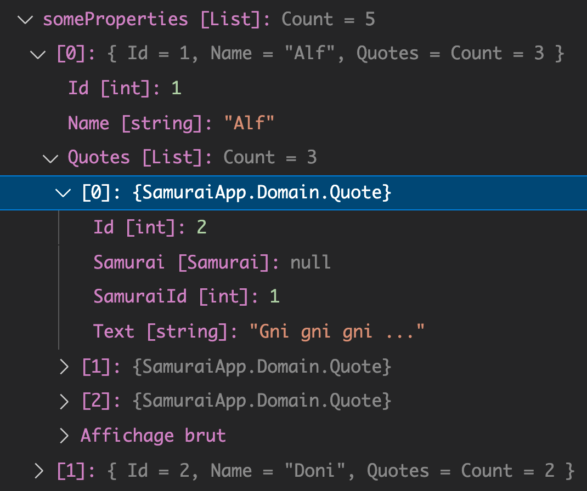
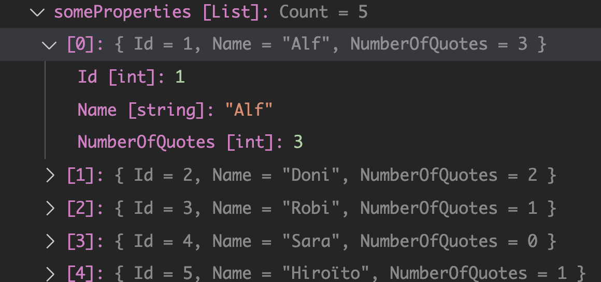
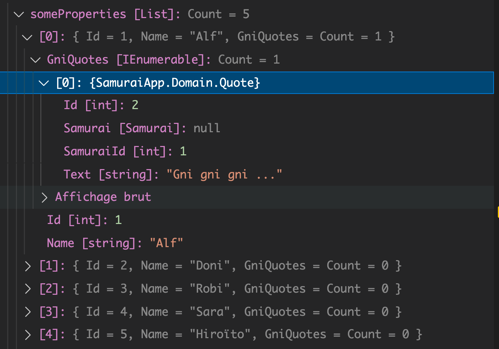
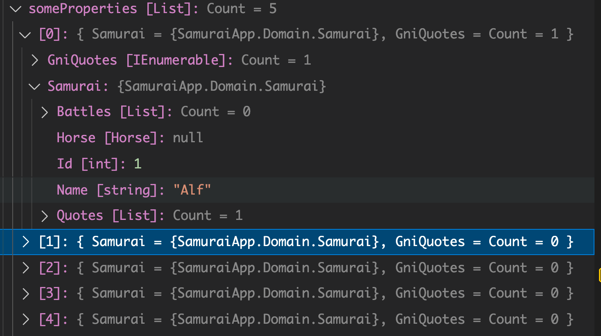
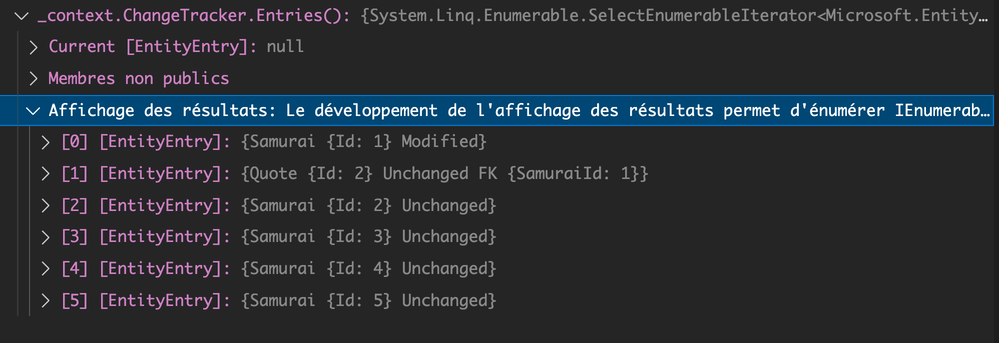
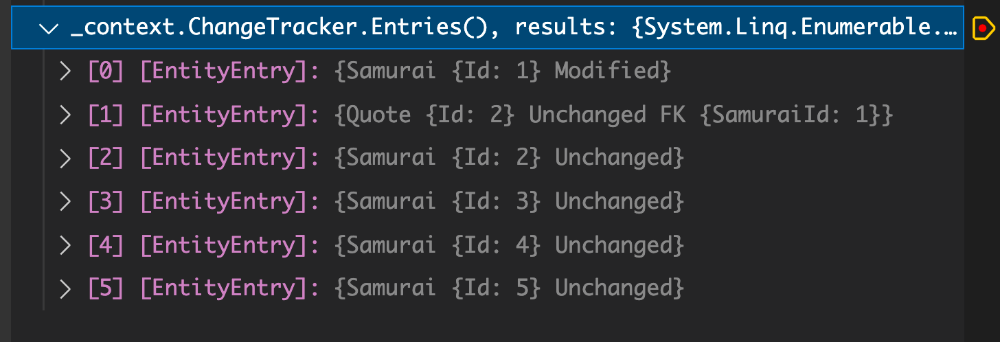

# 20 Projections

On peut grâce à une projection ne récupérer que les données dont on a besoin plutôt que l'ensemble des champs d'un enregistrement.

## `Select`

```cs
void ProjectSomeProperties()
{
    var someProperties = _context.Samurais.Select(s => new { s.Id, s.Name }).ToList();
}
```

On utilise un objet anonyme pour définir les propriétés désirées.

```sql
Executed DbCommand (22ms) [Parameters=[], CommandType='Text', CommandTimeout='30']
      SELECT [s].[Id], [s].[Name]
      FROM [Samurais] AS [s]
```




### `Samurais` with `Quotes`

```cs
var someProperties = _context.Samurais.Select(s => new { s.Id, s.Name, s.Quotes }).ToList();
```

```sql
      Executed DbCommand (22ms) [Parameters=[], CommandType='Text', CommandTimeout='30']
      SELECT [s].[Id], [s].[Name], [q].[Id], [q].[SamuraiId], [q].[Text]
      FROM [Samurais] AS [s]
      LEFT JOIN [Quotes] AS [q] ON [s].[Id] = [q].[SamuraiId]
      ORDER BY [s].[Id], [q].[Id]
```



### Propriété calculée

On peut juste vouloir le nombre de `Quotes` :

```cs
var somePropsWithQuotes = _context.Samurais
    .Select(s => new { s.Id, s.Name, NumberOfQuotes = s.Quotes.Count })
    .ToList();
```

```sql
Executed DbCommand (44ms) [Parameters=[], CommandType='Text', CommandTimeout='30']
      SELECT [s].[Id], [s].[Name], (
          SELECT COUNT(*)
          FROM [Quotes] AS [q]
          WHERE [s].[Id] = [q].[SamuraiId]) AS [NumberOfQuotes]
      FROM [Samurais] AS [s]
```

Le `COUNT` est effectué sur la base de données et non pas dans le code `.net`.



### Filtrer sur une propriété

```cs
var somePropsWithQuotes = _context.Samurais
    .Select(s => new { s.Id, s.Name, GniQuotes = s.Qotes.Where(q => q.Text.Contains("gni"))})
    .ToList();
```

```sql
Executed DbCommand (21ms) [Parameters=[], CommandType='Text', CommandTimeout='30']
      SELECT [s].[Id], [s].[Name], [t].[Id], [t].[SamuraiId], [t].[Text]
      FROM [Samurais] AS [s]
      LEFT JOIN (
          SELECT [q].[Id], [q].[SamuraiId], [q].[Text]
          FROM [Quotes] AS [q]
          WHERE [q].[Text] LIKE N'%gni%'
      ) AS [t] ON [s].[Id] = [t].[SamuraiId]
      ORDER BY [s].[Id], [t].[Id]
```



C'est traduis en `SQL` par une sous-requête dans le `LEFT JOIN`.


### `track` des types anonymes

```cs
var samuraiAndQuote = _context.Samurais
    .Select(s => new { Samurai = s, GniQuote = s.Quotes.Where(q => q.Text.Contains("gni"))})
    .ToList();
```



Même si c'est un type anonyme qui est renvoyé, chaque `samurai` a bien les `Quotes` filtrer par notre `Query`.

```cs
var samuraiAndQuote = _context.Samurais
    .Select(s => new { Samurai = s, GniQuote = s.Quotes.Where(q => q.Text.Contains("gni"))})
    .ToList();

var firstSamurai = samuraiAndQuotes[0].samurai.Name += " the Gni";
```

`EF Core` ne *track* pas les types anonymes, mais il *track* bien les types de ses `DbSet` à l'intérieur de types anonymes.

### `_context.ChangeTracker.Entries()`

On insère cette expression dans la partie `Watch` du `debugger`.



On voit que le `samurai` d'`Id: 1` est bien noté comme modifié, preuve qu'il est *tracké* par le `context`.

Pour avoir les résultats :

### `_context.ChangeTracker.Entries(), results`



