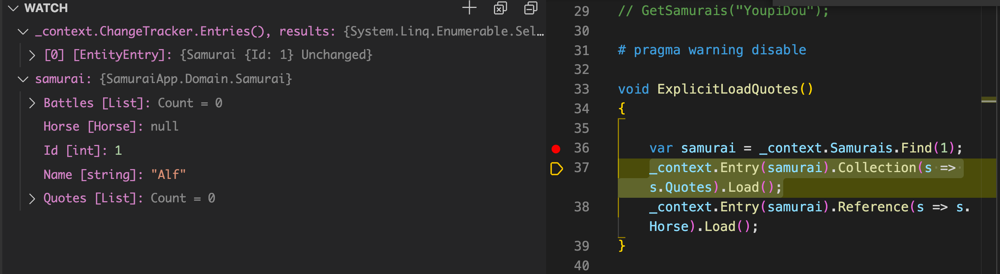
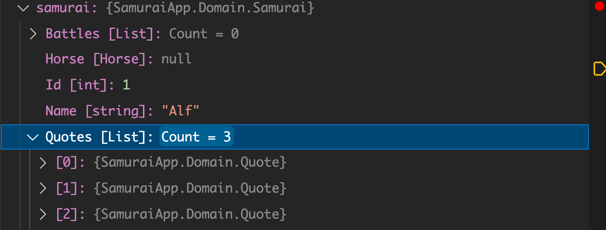
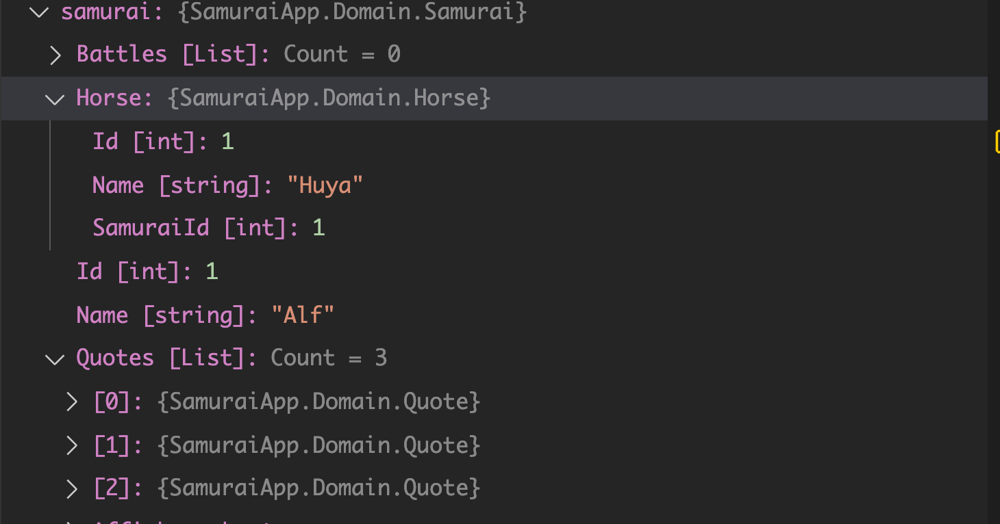
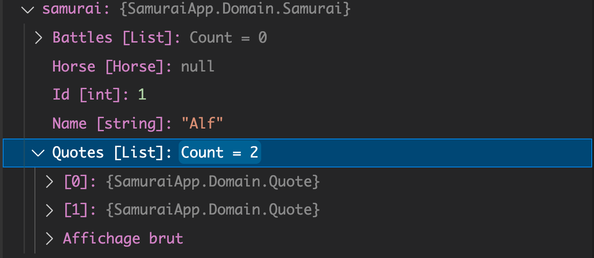
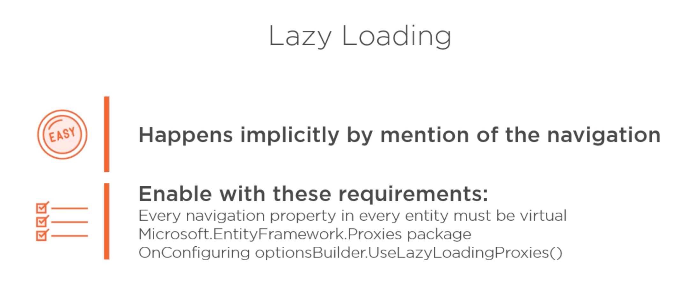

# 21 Explicit Loading

## Requête pour charger des objets en relation en mémoire

```cs
DbContext.Entry().Collection().Load()
DbContext.Entry.Reference.Load()
```

```cs
_context.Entry(samurai).Collections(s => s.Quotes).Load();
_context.Entry(samurai).Reference(s => s.Horse).Load();
```

Pour un objet simple : `Reference`.

Pour une `List` d'objets : `Collection`.

```cs
void ExplicitLoadQuotes()
{
    _context.Set<Horse>().Add(new Horse { samuraiId = 1, Name = "Huya" });
    _context.SaveChanges();
    _context.ChangeTracker.Clear();
    
    var samurai = _context.Samurais.Find(1);
    _context.Entry(samurai).Collection(s => s.Quotes).Load();
    _context.Entry(samurai).Reference(s => s.Horse).Load();
}
```

`Set<Horse>` crée un `DbSet` de type `Horse` et le retourne.

`_context.ChangeTracker.Clear`  arrête le *tracking* (le suivie) de toutes les entités actuellement *trackées* (suivies). 



À ce stade, on a un `samurai` en mémoire qui n'a ni `Horse` ni `Quotes`.

Grâce à `Collection(s => s.Quotes)`, les `Quotes` sont maintenant chargées et associées au `samuari` :



```sql
Executed DbCommand (4ms) [Parameters=[@__p_0='1'], CommandType='Text', CommandTimeout='30']
      SELECT [q].[Id], [q].[SamuraiId], [q].[Text]
      FROM [Quotes] AS [q]
      WHERE [q].[SamuraiId] = @__p_0
```

Puis grâce à `Reference(s => s.Horse)` c'est au tour du `Horse` d'être chargé depuis la `BDD` :



```sql
Executed DbCommand (2ms) [Parameters=[@__p_0='1'], CommandType='Text', CommandTimeout='30']
      SELECT [h].[Id], [h].[Name], [h].[SamuraiId]
      FROM [Horse] AS [h]
      WHERE [h].[SamuraiId] = @__p_0
```


## Plus sur `Explicit Loading`

On ne peut l'exécuter qu'à partir d'un objet unique.

Si on a une liste de `samurais`, il peut être moins coûteux de refaire une requête globale que d'itérer sur chaque `samurai` pour appliquer un `Explicit Loading`.

### Filter les données venant d'être chargées

```cs
var happyQuotes = context.Entry(samurai).Collection(s => s.Quotes)
    .Query().Where(q => q.Text.Contains("gni"))
    .ToList();
```



```sql
Executed DbCommand (6ms) [Parameters=[@__p_0='1'], CommandType='Text', CommandTimeout='30']
      SELECT [q].[Id], [q].[SamuraiId], [q].[Text]
      FROM [Quotes] AS [q]
      WHERE ([q].[SamuraiId] = @__p_0) AND ([q].[Text] LIKE N'%gni%')
```


## `Lazy Loading`

Est sur `OFF` par défaut.




