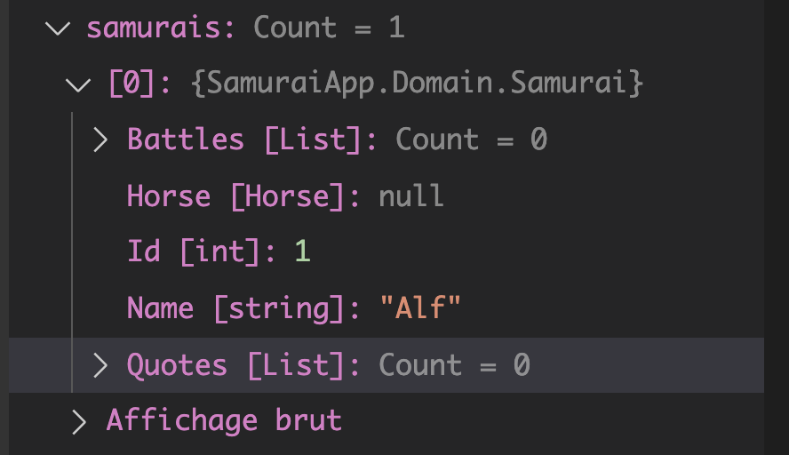
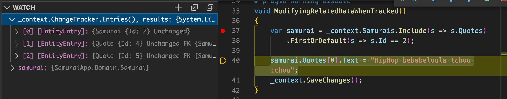
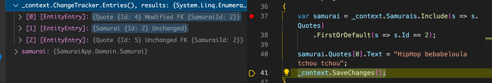
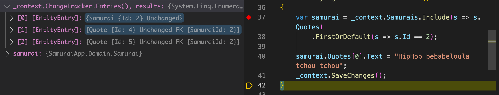
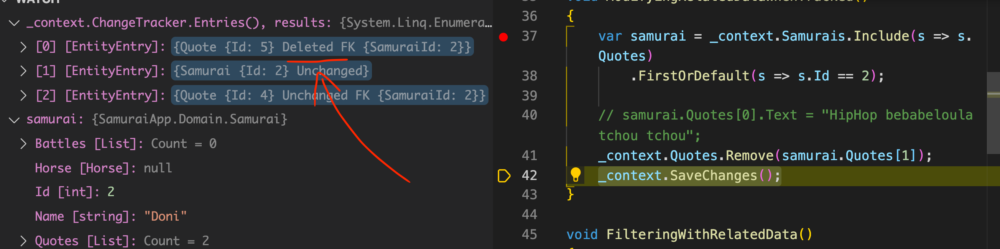
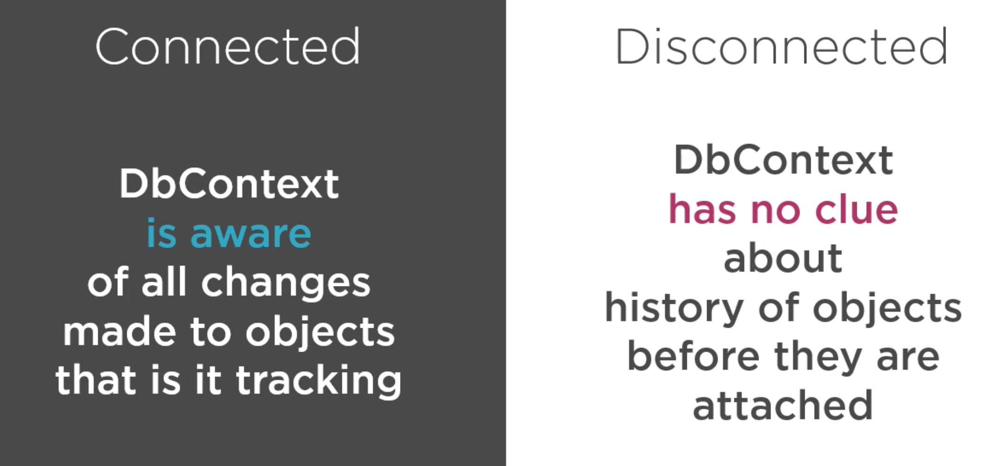
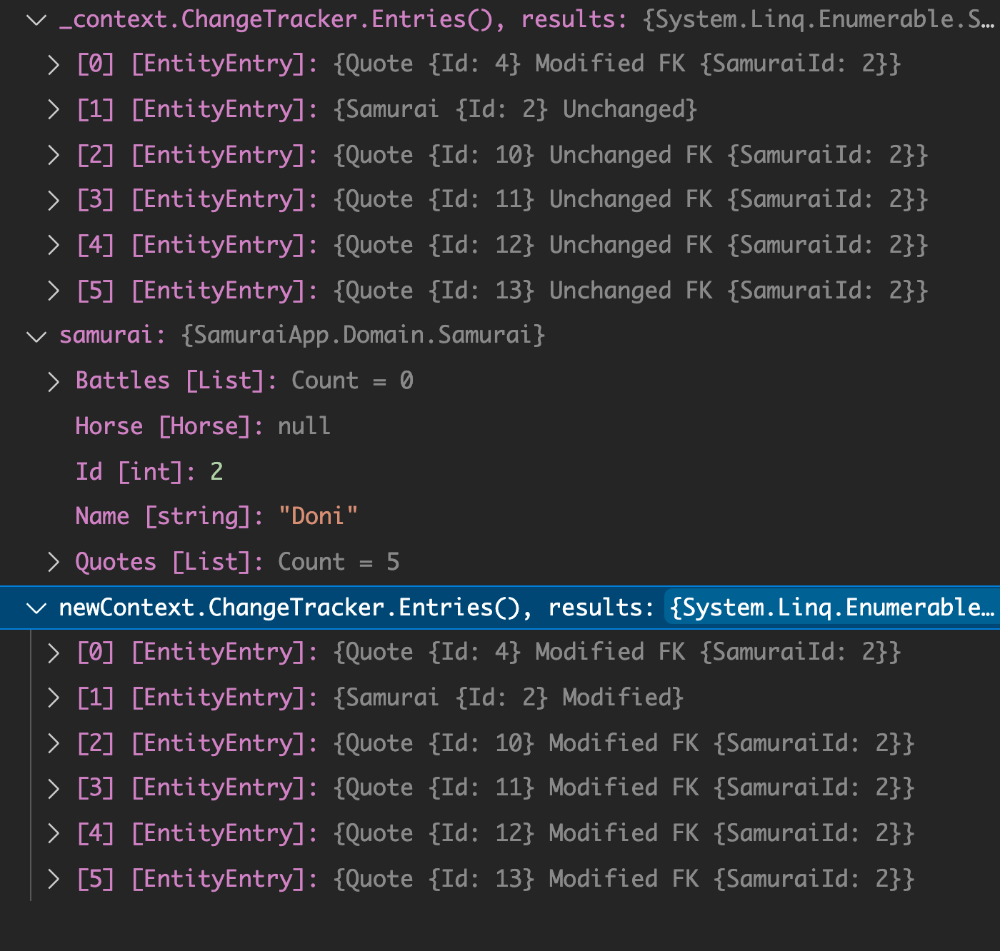
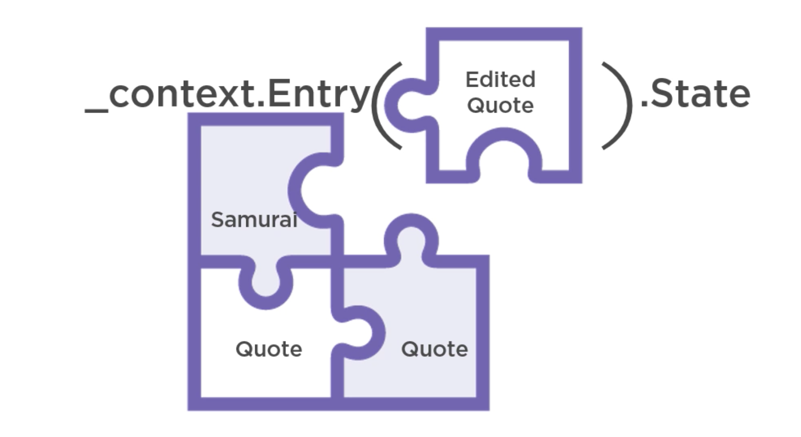
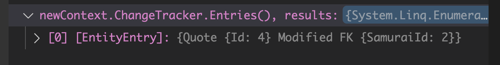
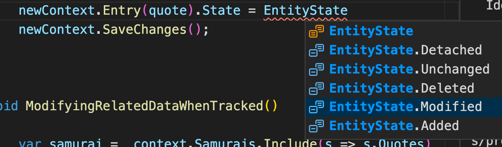

# 22 Filtrer et Modifier des données en relation


## Filtrer

```cs
void FilteringWithRelatedData()
{
    var samurais = _context.Samurais
        .Where(s => s.Quotes.Any(q => q.Text.Contains("happy")))
        .ToList();
}
```

Cela me renvoie le bon nombre de `samurai` malgré que cela ne renvoie pas les `quotes`.



```sql
Executed DbCommand (22ms) [Parameters=[], CommandType='Text', CommandTimeout='30']
      SELECT [s].[Id], [s].[Name]
      FROM [Samurais] AS [s]
      WHERE EXISTS (
          SELECT 1
          FROM [Quotes] AS [q]
          WHERE ([s].[Id] = [q].[SamuraiId]) AND ([q].[Text] LIKE N'%gni%'))
```

`SELECT 1 FROM table_name` renvoie `1` pour chaque ligne de la table. C'est utile pour déterminer à moindre coût si un enregistrement correspond à la clause `WHERE` et/ou à la clause `JOIN`.


## Modifier des données en relation

### `TRACKED`

```cs
void ModifyingRelatedDataWhenTracked()
{
    var samurai = _context.Samurais.Include(s => s.Quotes)
        .FisrtOrDefault(s => s.Id == 2);
    samurai.Quotes[0].Text = "New Quote with hiphop style popopop yo!";
    _context.saveChanges();
}
```

> ### Astuce Debugger
>
> Dans `watch` on utilise l'expression `_context.ChangeTracker.Entries(), results`.



Après la première requête, on voit que `samurai` et ses deux `quote` sont *trackés* avec le status `unchanged`.



Une fois la `quote` modifiée (simplement par assignement), le `context` change son status à `modified`.



Une fois les modifications sauvées en `BDD`, le status revient à `unchanged`.

Il est aussi simple de supprimer une `quote` d'un objet *tracké* :

```cs
void ModifyingRelatedDataWhenTracked()
{
    var samurai = _context.Samurais.Include(s => s.Quotes)
        .FisrtOrDefault(s => s.Id == 2);
    samurai.Quotes[0].Text = "New Quote with hiphop style popopop yo!";
    _context.Quotes.Remove(samurai.Quotes[1]);
    _context.saveChanges();
}
```




### `NOT TRACKED`



```cs
void ModifyingRelatedDataWhenNotTracked()
{
    var samurai = _context.Samurais.Include(s => s.Quotes)
        .FirstOrDefault(s => s.Id == 2);
    
    var quote = samurai.Quotes[0];
    quote.Text += " did you hear that again ?";
    
    using var newContext = new SamouraiContext();
    newContext.Quotes.Update(quote);
    newContext.SaveChanges();
}
```

Avec `Update` chaque entité prend le status `Modified` :




## séparer le comportement d'une entité en ralation



Pour avoir un contrôle plus fin de la mise à jour d'une entité dans une relation (un `graph`), on peut utiliser `Entry(<Object>).State`.

```cs
void ModifyingRelatedDataWhenNotTracked()
{
    var samurai = _context.Samurais.Include(s => s.Quotes)
        .FirstOrDefault(s => s.Id == 2);
    
    var quote = samurai.Quotes[0];
    quote.Text += " did you hear that again ?";
    
    using var newContext = new SamouraiContext();
    // newContext.Quotes.Update(quote);
    
    newContext.Entry(quote).State = EntityState.Modified;
    newContext.SaveChanges();
}
```



On voit que le context n'a alors que la `quote` modifiée comme entrée.

```sql
Executed DbCommand (27ms) [Parameters=[@p2='4', @p0='2', @p1='HipHop bebabeloula tchou tchou did you hear that again ?' (Size = 4000)], CommandType='Text', CommandTimeout='30']
      SET NOCOUNT ON;
      UPDATE [Quotes] SET [SamuraiId] = @p0, [Text] = @p1
      WHERE [Id] = @p2;
      SELECT @@ROWCOUNT;
```

Il n'y a plus qu'une seule requête. C'est une net amélioartion de performance.

### Tous les états



