# 23 Utiliser les relations `Many-To-Many`

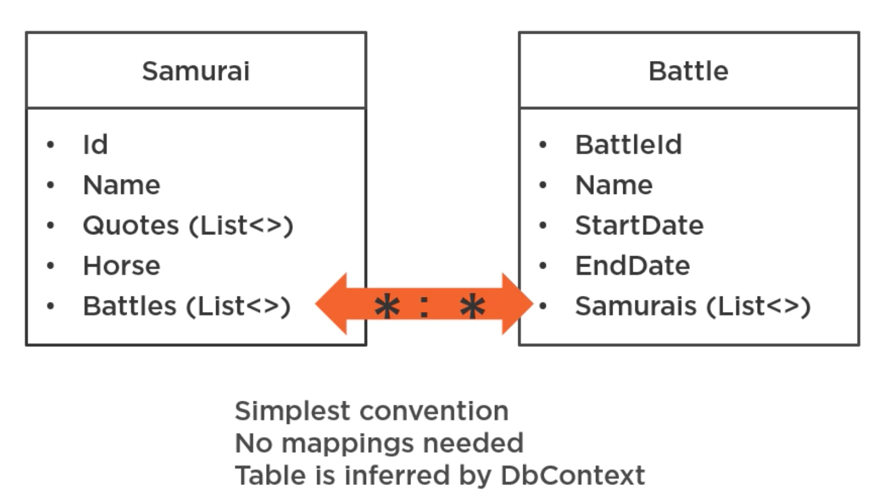

## Retirer le payload : créer une nouvelle `migration`

On va d'abord mettre en commentaire tous les ajouts au `modelBuilder` :

`SamuraiContext.cs`

```cs
protected override void OnModelCreating(ModelBuilder modelBuilder)
{
    // modelBuilder.Entity<Samurai>()
    //     .HasMany(s => s.Battles)
    //     .WithMany(b => b.Samurais)
    //     .UsingEntity<BattleSamurai>(
    //         bs => bs.HasOne<Battle>().WithMany(),
    //         bs => bs.HasOne<Samurai>().WithMany()
    //     )
    //     .Property(bs => bs.DateJoined)
    //     .HasDefaultValueSql("getdate()");
}
```

Ainsi on désactive le `payload` de la relation `many-to-many`.

On va effectuer la `migration` :

```bash
dotnet ef migrations add RemovePayload
```


Puis on va l'exécuter :

```bash
dotnet ef database update
```

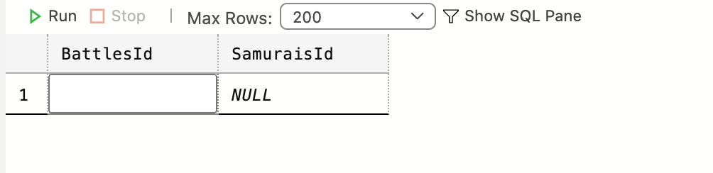

On a une table de jointure simple.


## Ajouter un nouveau `samurai` à une bataille qui existe déjà

```cs
void AddingNewSamuraiToAnExisteingBattle()
{
    var battle = _context.battles.FirtsOrDefault();
    battle.Samurais.Add(new Samurai { Name = "Rabbit FastSword" });
    
    _context.SaveChanges();
}
```

```sql
Executed DbCommand (23ms) [Parameters=[@p0='Rabbit FastSword' (Size = 4000)], CommandType='Text', CommandTimeout='30']
      SET NOCOUNT ON;
      INSERT INTO [Samurais] ([Name])
      VALUES (@p0);
      SELECT [Id] # <= retourne l'Id
      FROM [Samurais]
      WHERE @@ROWCOUNT = 1 AND [Id] = scope_identity();
info: 17/05/2021 10:12:57.060 RelationalEventId.CommandExecuted[20101] (Microsoft.EntityFrameworkCore.Database.Command) 
      Executed DbCommand (4ms) [Parameters=[@p1='1', @p2='6'], CommandType='Text', CommandTimeout='30']
      SET NOCOUNT ON;
      INSERT INTO [BattleSamurai] ([BattlesId], [SamuraisId])
      VALUES (@p1, @p2);
```

Une entrée est ajoutée dans la table `Samurai` et une autre dans la table de jointure `BattleSamurai` avec l'`Id` retournée du `Samurai` fraîchement créé.


## récupérer une `Battle` et ses `Samurais`

```cs
void ReturnBattleWithSamurais()
{
    var battle = _context.Battle.Include(b => b.Samurais).FirstOrDefault();
}
```

```sql
Executed DbCommand (20ms) [Parameters=[], CommandType='Text', CommandTimeout='30']
      SELECT [t].[Id], [t].[EndDate], [t].[Name], [t].[StartDate], [t0].[BattlesId], [t0].[SamuraisId], [t0].[Id], [t0].[Name]
      FROM (
          SELECT TOP(1) [b].[Id], [b].[EndDate], [b].[Name], [b].[StartDate]
          FROM [Battles] AS [b]
      ) AS [t]
      LEFT JOIN (
          SELECT [b0].[BattlesId], [b0].[SamuraisId], [s].[Id], [s].[Name]
          FROM [BattleSamurai] AS [b0]
          INNER JOIN [Samurais] AS [s] ON [b0].[SamuraisId] = [s].[Id]
      ) AS [t0] ON [t].[Id] = [t0].[BattlesId]
      ORDER BY [t].[Id], [t0].[BattlesId], [t0].[SamuraisId], [t0].[Id]
```


## Récupérer toutes les `Battles` et avec leurs `Samurais`

```cs
void ReturnAllBattlesWithSamurais()
{
    var battles = _context.Battles.Include(b => b.Samurais).ToList();
}
```

```sql
Executed DbCommand (20ms) [Parameters=[], CommandType='Text', CommandTimeout='30']
      SELECT [b].[Id], [b].[EndDate], [b].[Name], [b].[StartDate], [t].[BattlesId], [t].[SamuraisId], [t].[Id], [t].[Name]
      FROM [Battles] AS [b]
      LEFT JOIN (
          SELECT [b0].[BattlesId], [b0].[SamuraisId], [s].[Id], [s].[Name]
          FROM [BattleSamurai] AS [b0]
          INNER JOIN [Samurais] AS [s] ON [b0].[SamuraisId] = [s].[Id]
      ) AS [t] ON [b].[Id] = [t].[BattlesId]
      ORDER BY [b].[Id], [t].[BattlesId], [t].[SamuraisId], [t].[Id]
```


## Ajouter tous mes `Samurais` à toutes mes `Battles`

On doit d'abord modifier le `Logger` pour avoir des infos sur les `Transactions` :

```cs
protected override void OnConfiguring(DbContextOptionsBuilder optionsBuilder)
{
    optionsBuilder
        .UseSqlServer("Server=localhost,1433; Database=samuraidb; User=sa; Password=huk@r2Xmen99")
        // .LogTo(_writer.WriteLine);
        .LogTo(Console.WriteLine,
               new[] { DbLoggerCategory.Database.Command.Name,
                      DbLoggerCategory.Database.Transaction.Name },
               LogLevel.Debug)
        .EnableSensitiveDataLogging();
}
```

Le `LogLevel` passe de `Information` à `Debug`.

```cs
void AddAllSamuraisToAllBattles()
{
    var allBattles = _context.Battles.ToList();
    var allSamurais = _context.Samurais.ToList();
    
    foreach(var battle in allBattles)
    {
        battle.Samurais.AddRange(allSamurais);
    }
    
    _context.SaveChanges();
}
```

On obtient une `exception` car certain de ses `Samurais` sont déjà insérer :

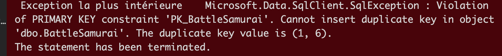

`EF Core` utilise toujours les `Transactions`, de ctte manière qi quelque chose ne fonctionne pas, c'est toute la procédure qui est annulée :

```sql
Beginning transaction with isolation level 'Unspecified'.
dbug: 05/17/2021 10:41:24.721 RelationalEventId.TransactionStarted[20200] (Microsoft.EntityFrameworkCore.Database.Transaction) 
      Began transaction with isolation level 'ReadCommitted'.
dbug: 05/17/2021 10:41:24.756 RelationalEventId.CommandCreating[20103] (Microsoft.EntityFrameworkCore.Database.Command) 
      Creating DbCommand for 'ExecuteReader'.
dbug: 05/17/2021 10:41:24.756 RelationalEventId.CommandCreated[20104] (Microsoft.EntityFrameworkCore.Database.Command) 
      Created DbCommand for 'ExecuteReader' (0ms).
dbug: 05/17/2021 10:41:24.763 RelationalEventId.CommandExecuting[20100] (Microsoft.EntityFrameworkCore.Database.Command) 
      Executing DbCommand [Parameters=[@p0='1', @p1='1', @p2='1', @p3='2', @p4='1', @p5='3', @p6='1', @p7='4', @p8='1', @p9='5', @p10='1', @p11='6', @p12='1', @p13='7', @p14='2', @p15='1', @p16='2', @p17='2', @p18='2', @p19='3', @p20='2', @p21='4', @p22='2', @p23='5', @p24='2', @p25='6', @p26='2', @p27='7'], CommandType='Text', CommandTimeout='30']
      SET NOCOUNT ON;
      INSERT INTO [BattleSamurai] ([BattlesId], [SamuraisId])
      VALUES (@p0, @p1),
      (@p2, @p3),
      (@p4, @p5),
      (@p6, @p7),
      (@p8, @p9),
      (@p10, @p11),
      (@p12, @p13),
      (@p14, @p15),
      (@p16, @p17),
      (@p18, @p19),
      (@p20, @p21),
      (@p22, @p23),
      (@p24, @p25),
      (@p26, @p27);
dbug: 05/17/2021 10:41:24.801 RelationalEventId.TransactionDisposed[20204] (Microsoft.EntityFrameworkCore.Database.Transaction) 
      Disposing transaction.

```

On voit à la fin que la `transaction` est annulée

`disposing` = élimination/suppression

On doit enlever à la main les `Samurais` déjà enregistrés :

```cs
void AddAllSamuraisToAllBattles()
{
    var allBattles = _context.Battles.ToList();
    var allSamurais = _context.Samurais.Where(s => s.Id != 6 && s.Id != 7).ToList();
    
    foreach(var battle in allBattles)
    {
        battle.Samurais.AddRange(allSamurais);
    }
    
    _context.SaveChanges();
}
```

cette fois la `transaction` est bien allée jusqu'au bout.

Une solution simple à ce problème est de `Include` tous les `Samurais` aus `Battles`,

ainsi les `Samurais` déjà dans les `Battles` seront *trackés* comme `Unchanged` :

```cs
void AddAllSamuraisToAllBattles()
{
    var allBattles = _context.Battles.Include(b => b.Samurais).ToList();
    var allSamurais = _context.Samurais.ToList();
    
    foreach(var battle in allBattles)
    {
        battle.Samurais.AddRange(allSamurais);
    }
    
    _context.SaveChanges();
}
```

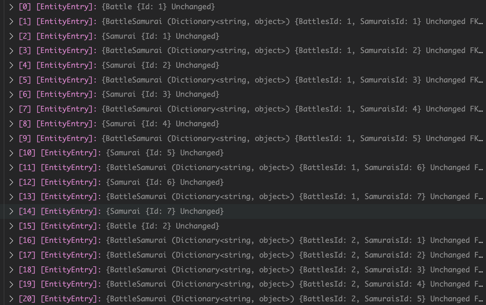

Aucune `transaction` n'est créé par `EF Core` car toutes les `Entry` sont marquées `Unchanged`.

#### ! Si beaucoup de données, il peut y avoir un problème de performance.


## Modifier ou Supprimer des relations `Many-To-Many`

Une modification de la table de jointure demande un certain `workflow` :

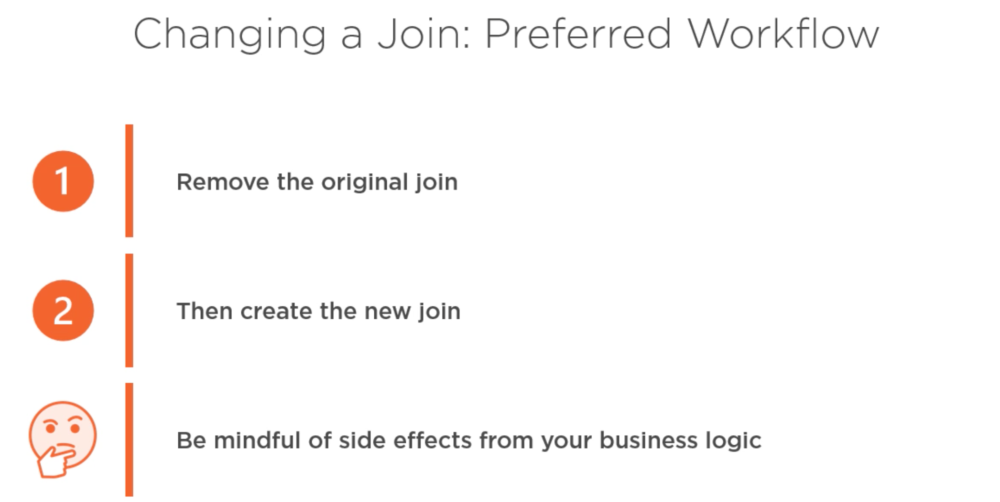

- Retirer l'entrée dans la table de jointure
- Créer une nouvelle jointure
- Faire attention aux effets de bord avec la logique métier.

On va laisser `EF Core` déduire l'action sur la jointure.

Le code peut paraître un peu tordu, mais l'idée est que `EF Core` déduise l'action sur la jointure d'après la modification de son `graph` :

```cs
void RemoveSamuraiFromABattle()
{
    // on veut le graph complet en mémoire
    var battleWithSamurai = _context.Battles
        .Include(b => b.Samurais.Where(s => s.Id == 6))
        .Single(b => b.BattleId == 1);
    
    // On récupère le Samurai a enlever de la Battle
    var samurai = battleWithSamurai.Samurais[0];
    
    // On retire le samurai de la Battle
    battleWithSamurai.Samurais.Remove(samurai);
    
    // On met à jour
    _context.SaveChanges();
}
```

>`Battle IQueryable<Battle>.Single<Battle>(Expression<Func<Battle, bool>> predicate)`
>
>**predicate** : Une fonction permettant de tester un élément pour une condition.
>
>
>Renvoie le seul élément d'une séquence qui satisfait à une condition spécifiée, et lève une `exception` si plus d'un élément existe.

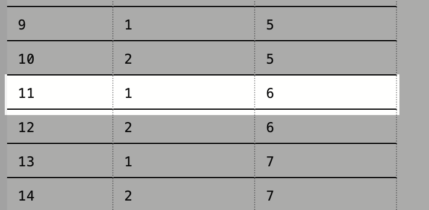


L'entrée en `BDD` a bien été supprimée.

### Code ne fonctionnant pas

```cs
void WillNotRemoveSamouraiFromBattle()
{
    var battle = _context.Battles.Find(2);
    var samurai = _context.Samurai.Find(6);
    
    battle.Samurais.Remove(samurai);
    
    _context.SaveChanges();
}
```

#### ! `Find` ne fonctionne pas avec `Include` (type de retour d'`Include` pas compatible)

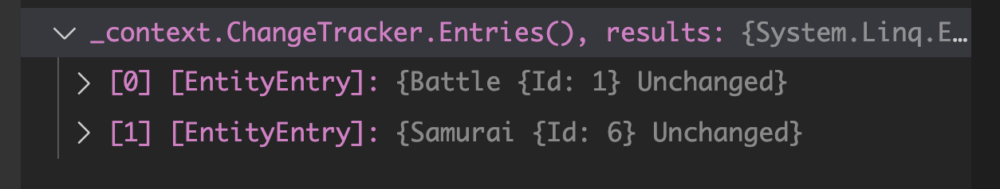

On voit que la relation `BattleSamurai` n'est pas *tracké* ici.

La ligne en `BDD` n'est pas supprimé :


Je la supprime avec la première méthode `RemoveSamuraiFromBattle` :

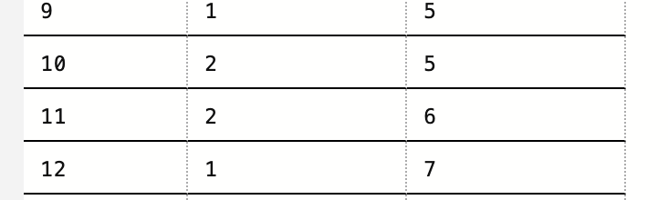

Maintenant je vais essayer d'ajouter avec la même méthode une ligne dans `BattleSamurai` :

```cs
void WillAddingSamouraiFromBattle()
{
    var battle = _context.Battles.Find(2);
    var samurai = _context.Samurai.Find(6);
    
    battle.Samurais.Add(samurai);
    
    _context.SaveChanges();
}
```

Ici cela fonctionne, `BattelSamurai ` va être *tracké* avec `Add` :

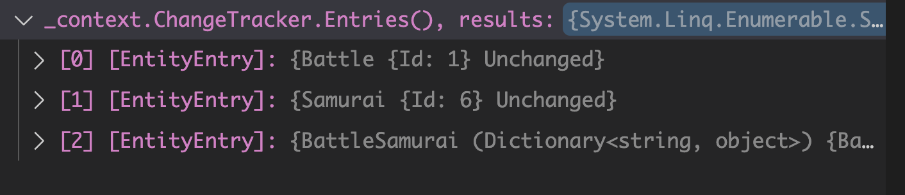

La procédure pourra être simplifiée avec `les procédures stockées`.


## Ajouter un `payload` à la relation `Many-To-Many`

On va refaire une `migration` pour redonner à la `BDD` son `payload` :

```cs
protected override void OnModelCreating(ModelBuilder modelBuilder)
{
    modelBuilder.Entity<Samurai>()
        .HasMany(s => s.Battles)
        .WithMany(b => b.Samurais)
        .UsingEntity<BattleSamurai>(
        bs => bs.HasOne<Battle>().WithMany(),
        bs => bs.HasOne<Samurai>().WithMany()
    )
        .Property(bs => bs.DateJoined)
        .HasDefaultValueSql("getdate()");
}
```

```bash
dotnet ef migrations add ReturnThePayload
```

```bash
dotnet ef database update
```

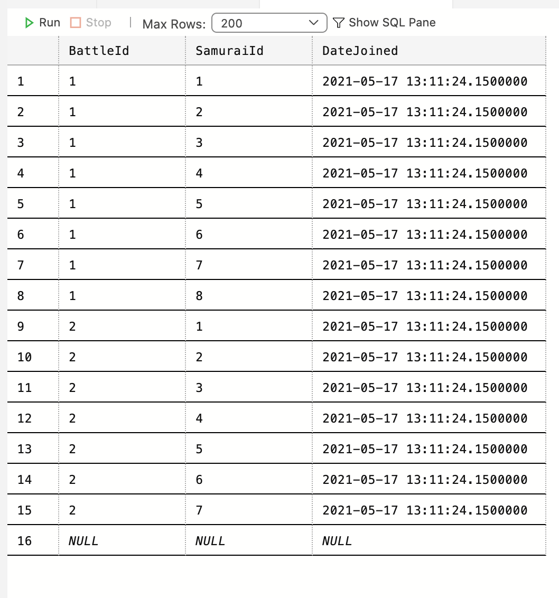

Normalment les `migrations` préservent les données (pas de perte de données).

### ! Certaine conventions peuvent entrainer une perte de données

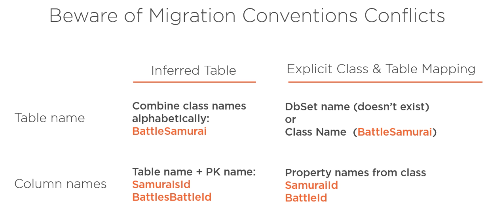

Si j'appelle explicitement ma relation d'une autre façon :

```cs
public class XyzBattleSamurai
{
    public int BattleId { get; set; }
    public int SamuraiId { get; set; }
    public DateTime DateJoined { get; set; }
}
```

```bash
dotnet ef migrations add ModifyingNameBattleSamurai 
```

Je vais voire dans ma migration :

> Je n'ai pas réussi à reproduire le problème ma `migration` ne `drop` pas de `table` (tant mieux)

Il y a un warning jaune en cas de risque de perte de données :

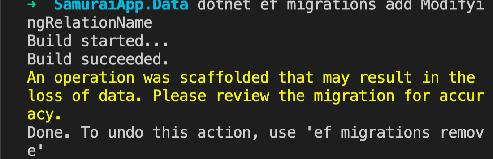

Il vaut mieux toujours lire la migration générée avant de l'exécuter.


## résumé d'une relation explicite `Many-To-Many`

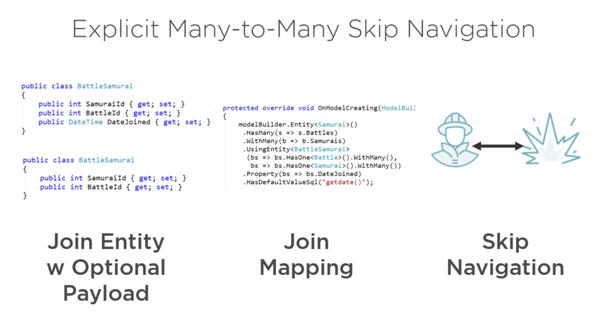

On n'a pas dû ajouter un `DbSet` pour `BattleSamurai` mais on peut en créer un à la voler :

```cs
void RemoveSamuraiFromABattleExplicit()
{
    var b_s = _context.Set<BattleSamurai>()
        .SingleOrDefault(bs => bs.BattleId == 1 && bs.SamuraiId == 6);
    
    if(b_s != null)
    {
        _context.Remove(b_s); // ou _context.Set<battlesamurai>().Remove(b_s)
        _context.SaveChanges();
    }
}
```

On voit que la relation est bien *trackée* et que le status est `Deleted` :

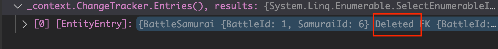

La relation a bien été supprimée de la table `BattleSamurai` :

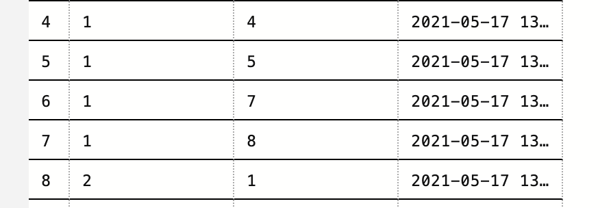

`Single` retourne une et une seule ligne ou lance une `exception`.

`SingleOrDefault` renvoie `null` au lieu de lancer une `exception`.


### modifier le `payload`

```cs
void ModifyPayload()
{
    var b_s = _context.Set<BattleSamurai>()
        .SingleOrDefault(bs => bs.BattleId == 2 && bs.samuraiId == 7);
    
    if(b_s is not null)
    {
        b_s.DateJoined = DateTime.Now;
        _context.SaveChanges();
    }
}
```

```sql
Executed DbCommand (21ms) [Parameters=[], CommandType='Text', CommandTimeout='30']
      SELECT TOP(2) [b].[BattleId], [b].[SamuraiId], [b].[DateJoined]
      FROM [BattleSamurai] AS [b]
      WHERE ([b].[BattleId] = 1) AND ([b].[SamuraiId] = 7)
info: 05/17/2021 16:09:31.150 RelationalEventId.CommandExecuted[20101] (Microsoft.EntityFrameworkCore.Database.Command) 
      Executed DbCommand (20ms) [Parameters=[@p1='1', @p2='7', @p0='2021-05-17T16:09:31.0700410+02:00'], CommandType='Text', CommandTimeout='30']
      SET NOCOUNT ON;
      UPDATE [BattleSamurai] SET [DateJoined] = @p0
      WHERE [BattleId] = @p1 AND [SamuraiId] = @p2;
      SELECT @@ROWCOUNT;
```

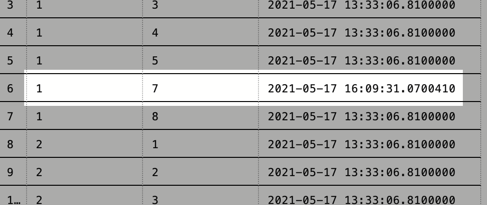


