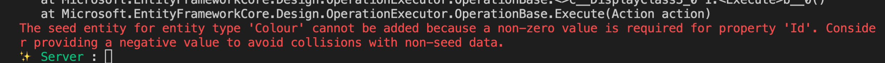

# BB `seeding` des données


## `OnModelCreating` : `HasData`

```cs
protected override void OnModelCreating(ModelBuilder builder)
{
  base.OnModelCreating(builder);

  builder.Entity<Colour>().HasData(
    new Colour { 
      CreatedBy = "system",
      UpdatedBy = "system",
      DateCreated = DateTime.Now,
      DateUpdated = DateTime.Now,
      Name = "Black",
    },
    new Colour { ... },
    // ...
  );
}
```


## Appliquer le `Seeding`

### Grâce à une migration

```bash
dotnet ef migrations SeedMyData
dotnet ef database update
```

Ici le `seeding` aura lieu une fois lors du `database update`


### À chaque exécution : scénario de test pour le développement

On veut ici avoir une `DB` nouvelle et remplie par le `seeding` à chaque démarage de l'application.

On va ajouter ceci dans `Program.cs`

```cs
// Reset and seeding database for testing
using var serviceScope = app.Services.CreateScope();

var robotContext = serviceScope.ServiceProvider.GetService<RobotContext>();

if(robotContext is not null)
{
    Console.WriteLine("database reinitialized");
    await robotContext.Database.EnsureDeletedAsync();
    await robotContext.Database.EnsureCreatedAsync();
}
```

Si on utilise pas `app.Services.CreateScope` on aura une erreur  :

```bash
Unhandled exception. System.InvalidOperationException: Cannot resolve scoped service 'BlazorServerTestIis.Infrastructure.RobotContext' from root provider
```

Car `AddDbContext` a un cycle de vie `scoped` par défaut (qu'il vaut mieux laisser `scoped`). 


## Organiser son `seeding`

On crée les dossiers `Configurations/Entities` et à l'intérieur la classe `ColourSeedConfiguration` :

```cs
namespace Server.Configurations.Entities;

public class ColourSeedConfiguration : IEntityTypeConfiguration<Colour>
{
  public void Configure(EntityTypeBuilder<Colour> builder)
  {
    builder.HasData(
    new Colour {
     
      CreatedBy = "system",
      UpdatedBy = "system",
      DateCreated = DateTime.Now,
      DateUpdated = DateTime.Now,
      Name = "Black",
    },
    new Colour { ... },
    // ...
  );
  } 
}
```

`HasData` est directement appelé depuis `builder` puisqu'il est déjà typé vers `Colour`.

On a une erreur :



> #### ! L'`Id` doit être spécifié
>
> ```cs
> new Colour {
>   Id = 1, // pas mis au début d'où l'erreur
>   // ...
> ```

On va maintenant appeler cette `configuration` dans notre `DbContext` : `OnModelCreating` :

```cs
protected override void OnModelCreating(ModelBuilder builder)
{
  base.OnModelCreating(builder);

  builder.ApplyConfiguration(new ColourSeedConfiguration());
}
```

Le code est ainsi clair et organisé.


## Ajouter une jointure

Les jointure doivent être `seed` "à la main".

On rempli la table de jointure avec les `Id` connus :

```cs
// Jointure User - Role
public class UserRoleSeedConfiguration : IEntityTypeConfiguration<UserRole>
{
  public void Configure(EntityTypeBuilder<UserRole> builder)
  {
    builder.HasData(
      new IdentityUserRole<string>() {
        RoleId = "8daf7094-0a93-4f76-be71-a1a82bc98852	",
        UserId = "020d9b91-7bd8-4441-9f1c-5b6176553a3e"
      },
      new IdentityUserRole<string>() {
        RoleId = "75163e92-1b9b-4d54-b572-2d6671dc969d	",
        UserId = "b10a9257-6e4a-45c1-af2a-bfea9109eb55"
      }
    );
  }
}
```

Utilisation dans `ApplicationDbContext`

```cs
protected override void OnModelCreating(ModelBuilder builder)
{
  base.OnModelCreating(builder);

  builder.ApplyConfiguration(new UserRoleSeedConfiguration());
```

