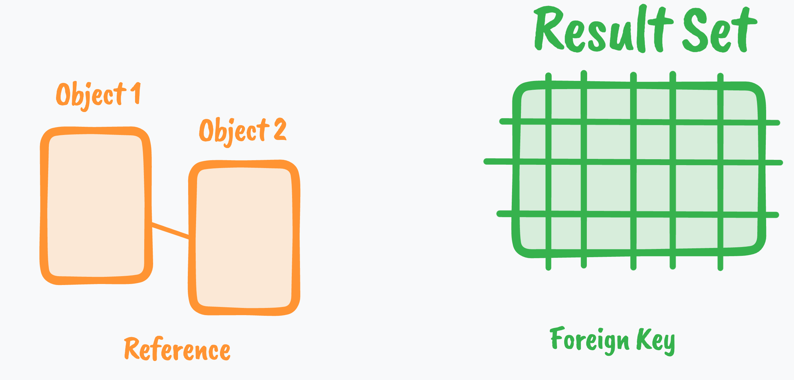
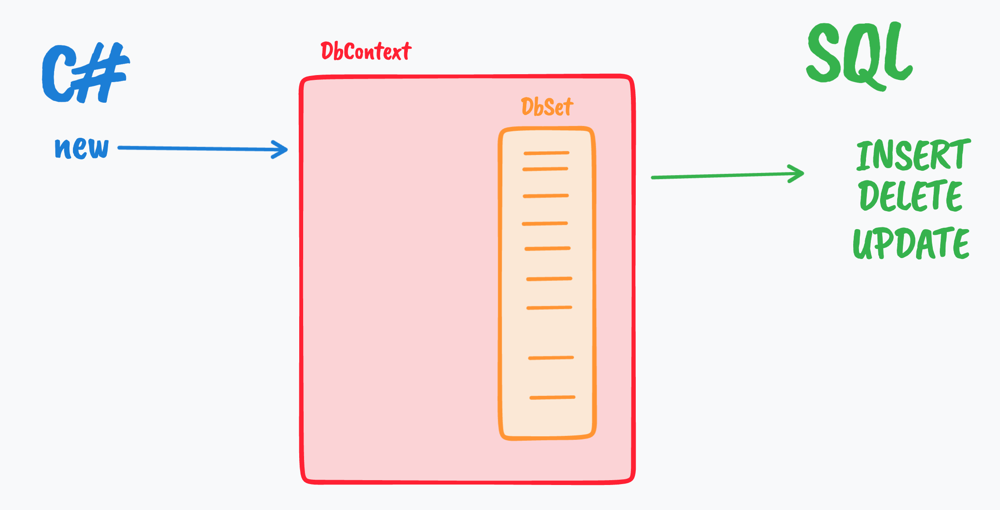

# 00 `ORM`

## `O`bject `R`elational `M`apper

Un `ORM` représente (`To Map`) en `Orienté Object` le résultat (`Result Set`) renvoyé par une  `Data Base`.

Un `Result Set` est une donnée de type `Tabulaire`.

L'`ORM` doit créer les objets correspondant aux différentes lignes du `Result Set`.

Les `Foreign Key` doivent être traduite en référence :



`C#` avec `EF Core` utilise deux propriétés pour représenter le lien :

- Une référence vers l'autre objet (`navigation property`)
- L'`Id` de l'autre objet qui est à proprement parlé la `Foreign Key` de la `DB`

Les `DB` on comme langage `SQL`.

En `C#`, `SQL` est seulement un `string`, mais `C#` possède lui aussi un langage de `Query` : `Linq` (`Language Integrated Query`).

### Le travail d'`EF Core` est de traduire `Linq` en `SQL`.


## `ADD`, `DELETE`, `UPDATE`

Toutes ces opérations doivent d'abord être effectuées sur un `DbSet` du `DbContext` avant d'être transformées en `SQL` compréhensible par la `DB`.



Les modifications ne sont envoyées en `DB` qu'avec l'appelle de `SaveChanges`, les réunissant dans une unique `transaction`.


### `UPDATE`

Par défaut `EF Core` track tous les objets reçus de la `DB` (`SELECT`).

Comme ces objets sont *trackés* , `EF Core` sait s'ils ont subi des modifications sur leurs propriétés.

> Pour les objets qui ne seront pas modifiés par l'application, il est de bonne pratique de préciser à `EF Core` que les objets ne seront pas trackés :
>
> ```cs
> var items = await context.Items.AsNoTracking().ToArrayAsync();
> ```


## Utilisation du `Raw SQL`

Si on veut par exemple augmenter tous les prix de nos produits de `10%`, cela risque d'être laborieux avec `Linq` (traitement dans des boucles très longues).

On peut alors utiliser directement sa propre requête `SQL` avec `EF Core` : `RAW SQL`.

> `Dapper`  utilise d'ailleurs `SQL` pour traiter avec la `DB`. Cela peut être une solution plus légère.


## Schéma

C'est l'ensemble des tables et de leurs relations dans la `DB`.

Pour `C#` c'est l'ensemble des objets, des références, des collections et des relations d'héritage.

`EF Core` est `code first`, ce qui signifie qu'on crée son modèle `OOP` et que `EF Core` crée ensuite le schéma de `DB` pour nous.

### `EF Core` utilise pour cela les `Migrations`.

On modifie le modèle (des `classes`), on ajoute une `migration` et la `migration` produit le `SQL` pour modifier la `DB`.

On peut utiliser les `migrations` pour générer du code `SQL` qui sera appliqué par le service responsable des `DB`.


### Nouveau version `6`

Il est aussi possible avec `EF Core 6` de générer un `EXE` qui modifiera exactement la `DB` comme la commande `database update` le ferait.