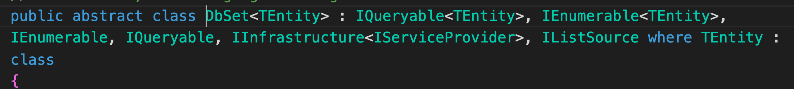

# 02 Le `DbContext`

On installe le `package`  `EntityFrameworkCore.SqlServer` :

```bash
dotnet add package Microsoft.EntityFrameworkCore.SqlServer
```

Pour les `migrations` il faudra aussi `EntityFrameworkCore.design`:

```bash
dotnet add package Microsoft.EntityFrameworkCore.design
```


## Création de son propre `DbContext`

`CookBookContext.cs`

```cs
public class CookBookContext : DbContext
{
    public DbSet<Dish> Dishes => Set<Dish>();
    public DbSet<DishIngredient> Ingredients => Set<DishIngredient>();
    
    public CookBookContext(DbContextOptions<CookBookContext> options) : base(options)
    {
        
    }
}
```

`DbSet` crée une table en `BDD` surlaquelle on pourra exécuter des requête (`sql`, `Linq`). 



On retrouve `IEnumerable` qui est le type de base des méthodes `Linq`.

On a aussi l'interface `IQueryable` qui va opérer la magie avec la `BDD`.

Le `DbSet<Dish>` est un point d'entrée vers la table `Dish` en `BDD` que se soit pour les lectures ou les écritures (`Query`, `Command`).


## Utilisation sans la `Factory`

Pour utiliser directement notre `DbContext` sans passer par une `Factory` on peut soit retirer le `constructeur`, soit ajouter un `constructeur ` vide.

Il faut aussi faire la connexion dans `OnConfiguring` :

```cs
namespace EFCoreOneProjectStropek.Data;
public class CookBookContext : DbContext
{
    public DbSet<Dish> Dishes => Set<Dish>();
    public DbSet<DishIngredient> Ingredients => Set<DishIngredient>();

    public CookBookContext() { }
    
    public CookBookContext(DbContextOptions<CookBookContext> options) 
        : base(options) { }

    protected override void OnConfiguring(DbContextOptionsBuilder optionsBuilder)
    {
        var configuration = new ConfigurationBuilder()
            .AddJsonFile("/path/to/appsettings.json")
            .Build();
        
        optionsBuilder
            .UseSqlServer(
                configuration["ConnectionStrings:MSSqlConnect"]
            );
    }
}
```

Ici la configuration est placée dans le fichier `appsettings.json`

```json
{
    "ConnectionStrings": {
        "MSSqlConnect": "Server=localhost,1433; Database=cook-book-2; User=sa; Password=huk@r2Xmen99"
    }
}
```

`/path/to` étant le chemin complet (réel) vers ce fichier.

On utilise le pacakge `Microsoft.Extensions.Configuration.Json` pour gérer la `Configuration`.


## Utiliser le `context` : `Program.cs`

On utilise `using` pour que la connexion à la `BDD` soit fermer à la fin du programme.

```cs
Console.WriteLine("Hello, EF Core!");

using var context = new CookBookContext();
```


