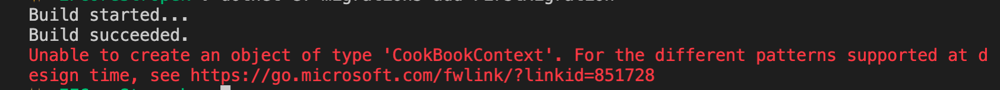

# 02.5 `Factory`

## Utilité

Pour une application `console` on doit créer une `Factory` pour gérer notre `DbContext`.

Si on a pas de `Factory`, on obtient cette erreur si on tente de faire une `migration` :

```bash
 dotnet ef migrations add FirstMigration
```




### Remarques

Ceci n'est pas nécéssaire avec une application `asp.net`, le `framework` ayant un mécanisme `built-in` pour se connecter à `Entity Framework` sans devoir le faire manuellement.

Ce n'est aussi apparemment pas nécessaire si le `DbContext` se trouve dans une librairie lié.


## `CookBookContextFactory.cs`

Il faut au préalable ajouter un `package` :

```bash
dotnet add package Microsoft.Extensions.Configuration.Json
```


```cs
class BloggingContextFactory : IDesignTimeDbContextFactory<BloggingContext>
{
    public BloggingContext CreateDbContext(string[]? args = null)
    {
        var configuration = new ConfigurationBuilder().AddJsonFile("appsettings.json").Build();

        var optionsBuilder = new DbContextOptionsBuilder<BloggingContext>();
        optionsBuilder
            // Uncomment the following line if you want to print generated
            // SQL statements on the console.
            // .UseLoggerFactory(LoggerFactory.Create(builder => builder.AddConsole()))
            .UseSqlServer(configuration["ConnectionStrings:DefaultConnection"]);

        return new BloggingContext(optionsBuilder.Options);
    }
}
```

Les `connection strings` ne doivent jamais être écrits en dur dans le code, mais plutôt il doivent être placés dans un fichier texte séparé  de configuration : `appsettings.json`

```json
{
    "ConnectionStrings": {
        "MSSqlConnect": "Server=localhost,1433; Database=cook-book; User=sa; Password=huk@r2Xmen99"
    }
}
```


## Remarque

Si on ne met pas de constructeur, on n'est pas obligé de fournir la `Factory` pour avoir des `migrations`.

Pour l'instant même en mode `Console` je ne voie pas l'intérêt.


## Remarque Bis

Normalement on obtient une erreur :

```
The configuration file 'appsettings.json' was not found and is not optional. 
```

En fait `Visual Studio` ajoute automatiquement ce code lorsqu'on copie un `appsettings.json` dans un projet :

`MyApp.csproj`

```xml
    // ...
	<ItemGroup>
        <None Update="appsettings.json">
            <CopyToOutputDirectory>PreserveNewest</CopyToOutputDirectory>
            <ExcludeFromSingleFile>true</ExcludeFromSingleFile>
            <CopyToPublishDirectory>PreserveNewest</CopyToPublishDirectory>
        </None>
    </ItemGroup>

</Project>
```

