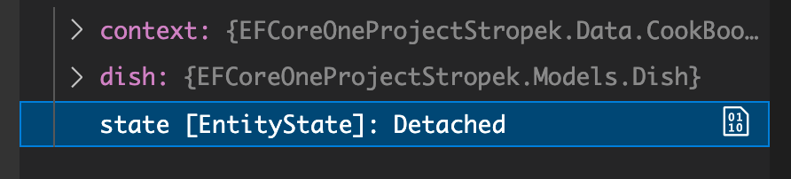

# 07 `State`


## `Change Tracker`

Si on écrit ce code de modification :

```cs
var db = new CookBookContext();
var dish = new Dish { Title = "Burger" };

db.Dishes.Add(dish);
await db.SaveChangesAsync();

dish.Title = "Cheese Burger";
await db.SaveChangesAsync();
```

On obtient le `SQL` suivant :

```sql
// ...
UPDATE [Dishes] SET [Title] = @p0
// ...
```

La question est : Comment `EF Core` sait que seul le `Title` de `dish` a été modifié ?

`EF Core` utilise un `ChangeTracker` en interne pour connaître les changements à effectuer.


## Connaître le `State` d'un objet

```cs
async Task EntityState()
{
    using var context = new CookBookContext();
    var dish = new Dish { Title = "Foo", Notes = "Baz" };

    EntityState state = context.Entry(dish).State;
}
```

On récupère le `state` avec `context.Entry(monObjet).State`.



`EntityState` est un `enum` avec 5 valeurs :

```cs
public enum EntityState
{
    Detached = 0,
    Unchanged = 1,
    Deleted = 2,
    Modified = 3,
    Added = 4
}
```


### `Detached`

Ici le `state` est `Detached`, ce qui signifie qu'`EF Core` (le `context`) ne `track` pas cet objet, ne le connais pas.

```cs
var dish = new Dish { Title = "Foo", Notes = "Baz" };

EntityState state = context.Entry(dish).State; // Detached
```


### `Added`

Puur qu'un objet ait un `state ` : `Added`, il faut qu'il soit ajouter au `context` :

```cs
context.Dishes.Add(dish);
state = context.Entry(dish).State; // Added
```

Un objet avec le `state:Added` est tracké par le `context` mais n'existe pas encore en `BDD`.

Si je modifie l'objet avant un `SaveChangesAsync`, le `state` reste le même car l'objet n'existe toujours pas en `BDD` :

```cs
context.Dishes.Add(dish);
state = context.Entry(dish).State; // Added

dish.Title = "Sauce Burger";
state = context.Entry(dish).State; // Added
```


### `Unchanged`

On enregistre maintenant l'objet en `BDD` :

```cs
context.Dishes.Add(dish);
state = context.Entry(dish).State;

await context.SaveChangesAsync();

state = context.Entry(dish).State; // Unchanged
```

L'objet est tracké (par le `context`) et existe en `BDD`. Les valeurs de ses propriété sont identiques à celles en `BDD`.


### `Modified`

Si je modifie la ou les valeurs des propriétés d'un objet tracké et en `BDD`, je vais avoir le status `Modified` :

```cs
context.Dishes.Add(dish);
state = context.Entry(dish).State; // Added

await context.SaveChangesAsync();
state = context.Entry(dish).State; // Unchanged

dish.Title = "Sauce Burger";
state = context.Entry(dish).State; // Modified
```

L'objet est tracké par le `context` et existe en `BDD`. Une ou plusieurs de ses propriétés ont été modifiées.


### `Deleted`

L'objet est tracké par le `context` et existe en `BDD`, Il est marqué pour suppression.

```cs
context.Dishes.Remove(dish);
state = context.Entry(dish).State; // Deleted
```

La suppression ne sera effective qu'avec l'appelle de `SaveChangesAsync`.

Si on regarde une dernière fois le `state` de notre objet après suppression en `BDD`, on retombe sur `Detached` :

```cs
context.Dishes.Remove(dish);
state = context.Entry(dish).State; // Deleted

await context.SaveChangesAsync();
state = context.Entry(dish).State; // Detached
```

