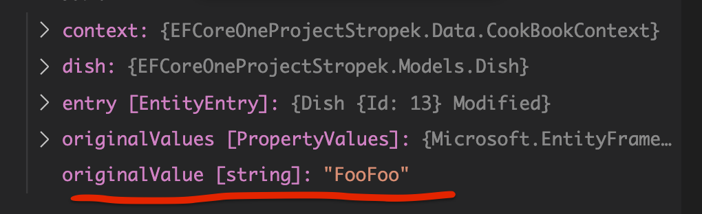
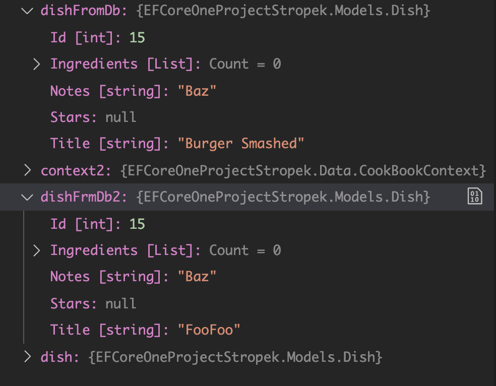

# 08 Change Tracking

Code de base :

```cs
using var context = new CookBookContext();

var dish = new Dish { Title = "FooFoo", Notes = "Baz" };
context.Dishes.Add(dish);

await context.SaveChangesAsync();
dish.Title = "Burger Smashed";
```


## `OriginalValues`

On peut récupérer une `entry` du `context` avec cette syntaxe :

```bash
EntityEntry<Dish> entry = context.Entry(dish);
```

On peut maintenant conaître la valeur original d'une propriété avec `OriginalValues`.

On utilise l'écriture crochet `[propertyName]` pour accéder à la valeur d'une `Property`.

```cs
var originalValue = entry.OriginalValues[nameof(dish.Title)].ToString();
```

C'est en comparant `originalValue` et la valeur actuelle que `EF Core` sait si une propriété a été modifiée.




## Différent `context`

On va créer deux `context` séparés pour observer qu'un même objet (une entité) peut apparaître de manière différente dans les deux.

```cs
var dish = new Dish { Title = "FooFoo", Notes = "Baz" };
// CONTEXT 1
using var context = new CookBookContext();

context.Dishes.Add(dish);

await context.SaveChangesAsync();
dish.Title = "Burger Smashed";

var dishFromDb = await context.Dishes.SingleAsync( d=> d.Id == dish.Id);

// CONTEXT 2
using var context2 = new CookBookContext();

var dishFrmDb2 = await context2.Dishes.SingleAsync(d => d.Id == dish.Id);
```



Le premier `SingleAsync` va chercher l'objet dans son `DbSet` car il est déjà dedans.

Le deuxième `context` n'ayant aucun objet tracké va en `BDD` chercher les valeurs de `dish`.

#### `EF Core` renvoie les données qui se trouvent déjà dans le `ChangeTracker` , il ne passe pas par la `BDD`.

#### Les données sont renvoyées depuis la `BDD` seulement si elles ne sont pas dans le `ChangeTracker`.

Chaque `context` a un `ChangeTracker` indépendant et `SaveChanges` n'opère que sur un seul `context` isolé.

### `Change Tracking by Database Context`


