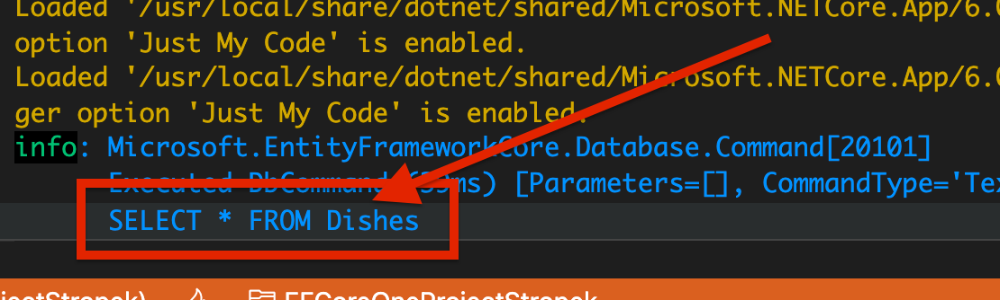
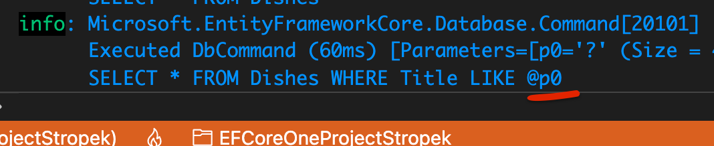
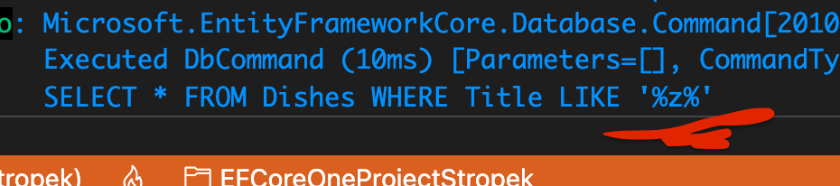
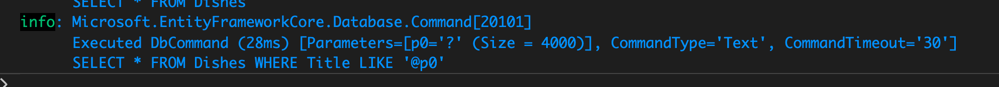

# 11 Exécuter du `SQL` brut

`Entity Framework` donne la possibilité d'écrire ses propre requête `SQL` et de les exécuter.

Il peut y avoir des fonctionnalités spécifique à un systèeme de base de données qui n'existe pas avec les méthodes de `EF Core` (la clause `WITH` de `mssql`).


## `FromSqlRaw`

```cs
var dishes = await context.Dishes
                    .FromSqlRaw("SELECT * FROM Dishes")
                    .ToArrayAsync();
```

`EF Core` va donc exécuter précisement la requête fournie :



On garde les avantages de `EF Core` comme le Tracking.


## `FromSqlInterpolated`

Parfois certain élément de la requête dépendent de variables, on utilise alors les `strings interpolation` avec `$` :

```cs
var filter = "%z%";

dishes = await context.Dishes
    .FromSqlInterpolated($"SELECT * FROM Dishes WHERE Title LIKE {filter}")
    .ToArrayAsync();
```



### Il ne faut pas écrire ça :

```cs
dishes = await context.Dishes
   .FromSqlRaw("SELECT * FROM Dishes WHERE Title LIKE '" + filter + "'")
   .ToArrayAsync();
```

C'est une possibilité d'`injection SQL`




## Exemple d'`Injection SQL`

Ici on imagine que `filter` est reçu de l'extérieur via un formulaire.

```cs
var filter = "%z%';DELETE FROM Dishes WHERE Title LIKE '%%";

dishes = await context.Dishes
                .FromSqlRaw("SELECT * FROM Dishes WHERE Title LIKE '" + filter + "'")
                .ToArrayAsync();
```

Ce code provoque l'effacement de tous les enregistrement de la table `Dishes`.

Il ne génère aucune erreur ou `exception`.


## Syntaxe correcte : `FromSqlInterpolated`

```cs
var filter = "%z%';DELETE FROM Dishes WHERE Title LIKE '%%";

dishes = await context.Dishes
                .FromSqlInterpolated($"SELECT * FROM Dishes WHERE Title LIKE '{filter}'")
                .ToArrayAsync();
```



On obtient une requête paramétrée qui ne pose plus de danger.

Le texte `;DELETE FROM Dishes WHERE Title LIKE '%%` fait partie de la recherche dans la propriété `Title`.

Ici la requête n'efface aucun enregistrement et ne renvoie rien.


## Utilisation de `AsNoTracking` et autres

On peut utiliser les méthodes `Linq` habituelles avec `FromSqlRaw` et `FromSqlInterpolated`:

```cs
dishes = await context.Dishes
                .FromSqlInterpolated($"SELECT * FROM Dishes")
                .Where(d => d.Title!.Contains("u"))
                .AsNoTracking()
                .OrderByDescending(d => d.Notes)
                .ToArrayAsync();
```


## Écriture avec du `raw SQL` : `ExecuteSqlRawAsync`

Pour exécuter du `SQL` brut en écriture, il faut utiliser la méthode `ExecuteSqlRawAsync` sur la propriété `Database` du `DbContext` :

```cs
await context.database
    .ExecuteSqlRawAsync("DELETE FROM Dishes WHERE Id NOT IN (SELECT DishId FROM Ingredients)")
```

