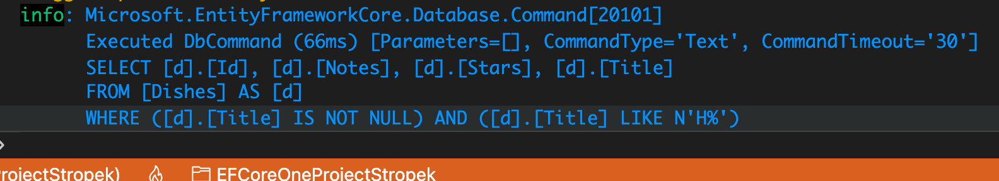
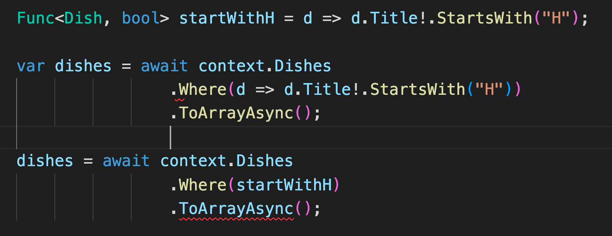
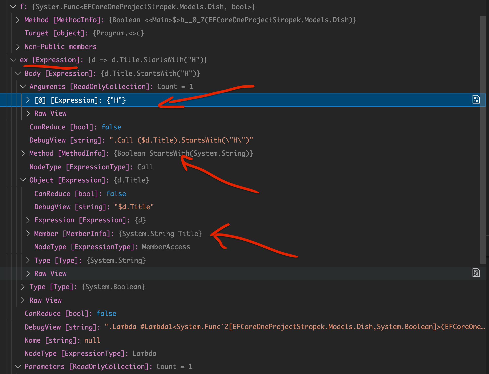
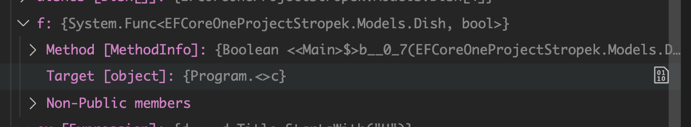

# 13 `Expression` Tree

## Comment `EF Core` transforme les méthodes `Linq` en `SQL` ?

C'est au `Runtime` (et non au `Compile Time`) que `EF Core` transforme les méthodes `Linq` en `SQL` :

```cs
var dishes = await context.Dishes
                    .Where(d => d.Title!.StartsWith("H"))
                    .ToArrayAsync();
```




## `Expression` et `function`



Dans le premier cas `Where` retourne un `IQueryable` et prend une `Expression<Func<Dish, bool>>` en argument.


Dans le deuxième cas `Where` prend donc une `Func<Dish, bool>` en argument et renvoie alors un `IEnumerable`.

`ToArrayAsync` fonctionne avec des `IQueryable` et des `IEnumerable` d'où l'erreur, il faudrait corriger comme ceci :

```cs
dishes = context.Dishes
            .Where(startWithH)
            .ToArray();
```


```cs
Func<Dish, bool> f =              d => d.Title!.StartsWith("H");
Expression<Func<Dish, bool>> ex = d => d.Title!.StartsWith("H");
```

Pour utiliser les `Expressions` il faut ajouter :

```cs
using System.Linq.Expressions;
```

Même si les deux types accepte exactement la même `Lamdba`, il y a une grande différence entre les `Func` et les `Expression`. 



On voit que l'`Expression` contient toutes les informations "décortiquées" de la `Lambda` qui la compose. 

Cela signifie que son code après compilation (le code de la `Lambda`) est toujours disponible :

#### Le code de la `Lambda` est disponible au `Runtime` !

Il n'a pas été pré-compilé en code machine.

C'est ce qu'on appelle un `Object Tree` et c'est ce qui permet à `EF Core` de connaître au `Runtime` le code de la `Lambda` de la méthode `Where`.

La fonction `f` étant compilée comme une méthode, il ne reste plus d'informatrion sur son code au `Runtime` :




## Résumé

Dans le cas d'une collection en mémoire : `IEnumerable` on a cette signature pour `Where` :

```cs
 public static IEnumerable<T> Where<T>(
     this IEnumerable<T> source, 
     Func<T, bool> predicate);
```

`Where` utilise ici une `Func`.

`Where` ne génère pas de `SQL`, il n'a pas besoin des infos de la `Lambda` au `Runtime`.

Dans le cas d'une base de données : `IQueryable` la signature sera :

```cs
public static IQueryable<T> Where<T>(
    this IQueryable<T> source, 
    Expression<Func<T, bool>> predicate);
```

On a ici une `Expression` pour pouvoir générer le `SQL` au `Runtime`.