# 14 Relations

## base

On a un `Enum` pour représenter les `Color` :

`Color.cs`

```cs
public enum Color
{
    Black, White, Yellow, Blue, Red, Orange,
    Violet, Green, LightGrey, DarkGrey, Brown
}
```

### Schéma

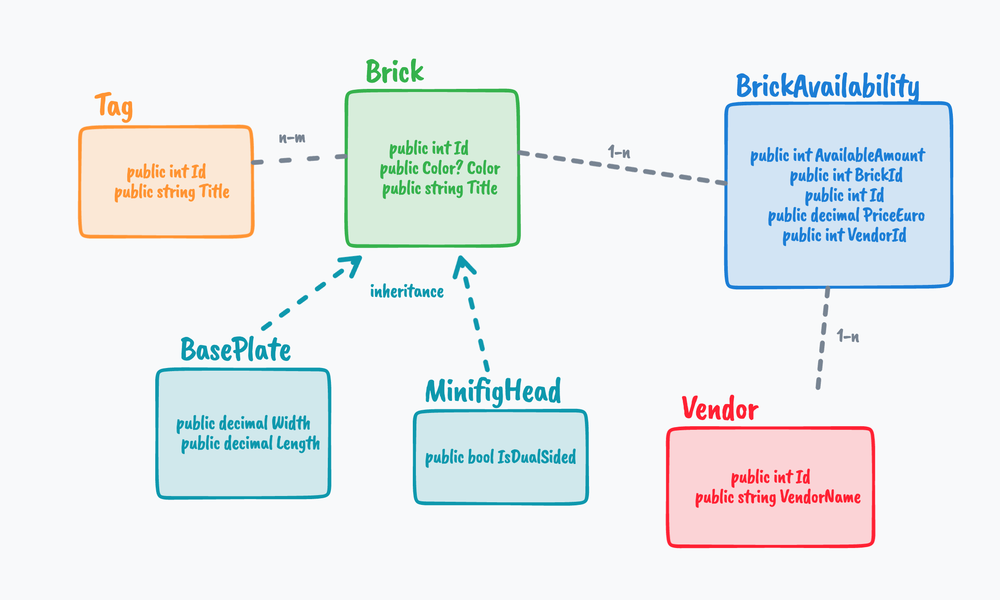


## `One-To-One`

Dans une relation `One-To-One`, `EF Core` a besoin d'avoir les deux `navigation property` et une des deux entités possédant la `Foreign Key`, c'est à dire possédant l'`Id` de l'autre entité.

Si ce n'est pas le cas une erreur est levée :

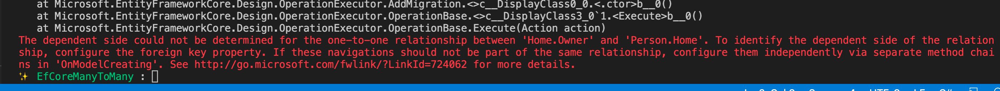

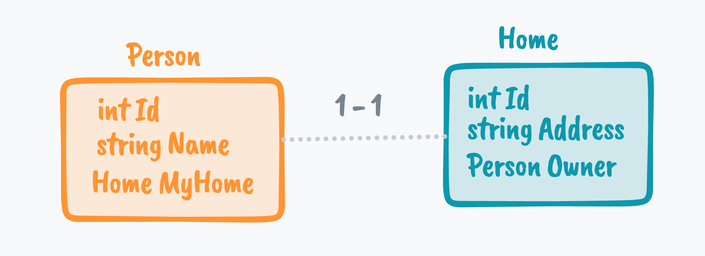

Pour résoudre le problème, il suffit d'ajouter la `Foreign Key` d'un côté de la relation :

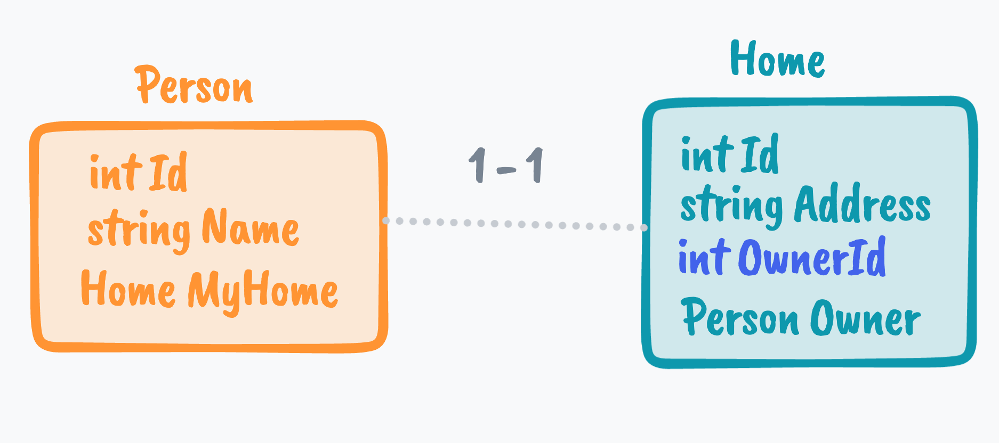


## `Many-To-Many`

`Brick.cs`

```cs
public class Brick
{
    public int Id { get; set; } 
    public Color? Color { get; set; }
    [MaxLength(250)]
    public string Title { get; set; } = string.Empty;
    public List<Tag> Tags { get; } = new();
}
```


`Tag.cs`

```cs
public class Tag
{
    public int Id { get; set; }
    [MaxLength(250)]
    public string Title { get; set; } = string.Empty;
    public List<Brick> Bricks { get; } = new();
}
```

Il suffit simplement de créer une `List` dans chaque entité représentant la relation `many-to-many`.

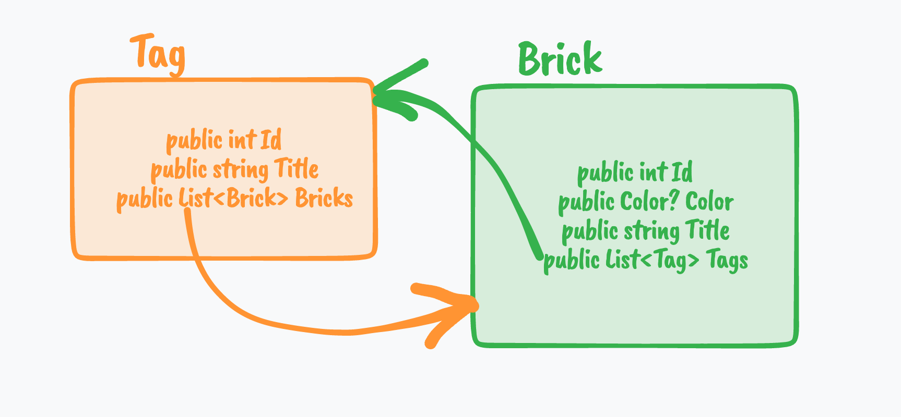

`EF Core` va générer une table pour représenter la relation : `BrickTag`


## Héritage

L'héritage suppose une **spécialisation**.

`BasePlate.cs`

```cs
public class BasePlate : Brick
{
    public int Width { get; set; }
    public int Length { get; set; }
}
```

`MinifigHead.cs`

```cs
public class MinifigHead : Brick
{
    public bool IsDualSided { get; set; }
}
```

Par défaut `EF Core` crée une table par hiérarchie `TPH` en cummulant ensemble `Brick` et `BasePlate`.


## Relation Complexe : `One-To-Many` 

La `relation` `many-to-many` entre `Brick` et `Vendor` contient des informations supplémentaire comme le `Prix` ou bien la `quantité`.

On va créer une table représentant cette relation : `BrickAvailability`.

On a maintenant deux `relation` `One-To-Many`.

`Vendor.cs`

```cs
public class Vendor
{
    public int Id { get; set; }
    [MaxLength(250)]
    public string VendorName { get; set; } = string.Empty;
    public List<BrickAvailability> BricksAvailable { get; set; } = new(); // <=
}
```


`BrickAvailability.cs`

```cs
public class BrickAvailability
{
    public int Id { get; set; }
    public Vendor Vendor { get; set; } // <=
    public int VendorId { get; set; } // <=
    public Brick Brick { get; set; }
    public int BrickId { get; set; }
    public int AvailableAmount { get; set; }
    [Column(TypeName = "decimal(8,2)")]
    public decimal PriceEuro { get; set; }    
}
```

Pour exprimer la `relation 1-N` on ajoute une référence vers l'entité ainsi qu'une propriété `int` comme `Foreign Key` :

`Vendor Vendor` et `int VendorId`.

Cela représente la partie `1` de la `relation.`

Du coté `N`, on a une `List` de `BrickAvailability` comme pour la `relation N-M`.

`Brick` reçoit donc une liste des `BricksAvailable` aussi :

```cs
public class Brick
{
    // ...
    public List<BrickAvailability> BricksAvailabe { get; set; } = new(); 
}
```

`EF Core` va simplement ajouter l'`Id` côté `One` :


## Propriété de `Foreign Key`

On va prendre une relation simple une personne et ses voitures :

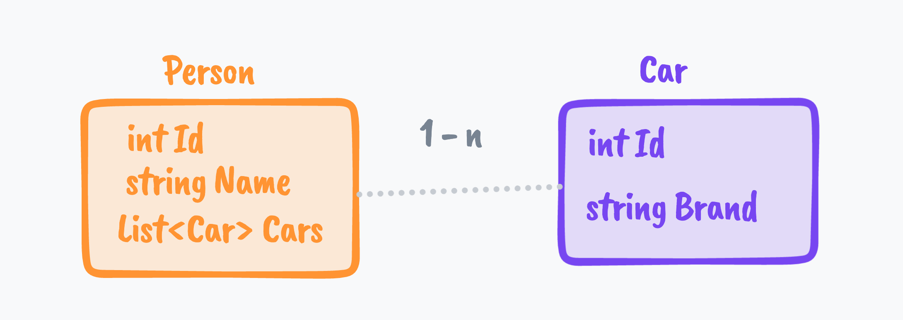

Ici pas besoin d'ajouter la `Foreign Key` dans `Car`, ni de `Navigation Property`.

Si on regarde la `migration` on a :

```cs
migrationBuilder.CreateTable(
    name: "Cars",
    columns: table => new
    {
        Id = table.Column<int>(type: "int", nullable: false)
            .Annotation("SqlServer:Identity", "1, 1"),
        Brand = table.Column<string>(type: "nvarchar(max)", nullable: false),
        PersonId = table.Column<int>(type: "int", nullable: true)
    },
    constraints: table =>
    {
        table.PrimaryKey("PK_Cars", x => x.Id);
        table.ForeignKey(
            name: "FK_Cars_People_PersonId",
            column: x => x.PersonId,
            principalTable: "People",
            principalColumn: "Id");
    });

migrationBuilder.CreateIndex(
    name: "IX_Cars_PersonId",
    table: "Cars",
    column: "PersonId");
```


### 1. Si on ajoute une `Navigation Property` :

```cs
public class Car
{
    public int Id { get; set; } 
    public string Brand { get; set; } = string.Empty;
    public Person Owner { get; set; } // <= ici
}
```

On obtient lors de la `migration` :

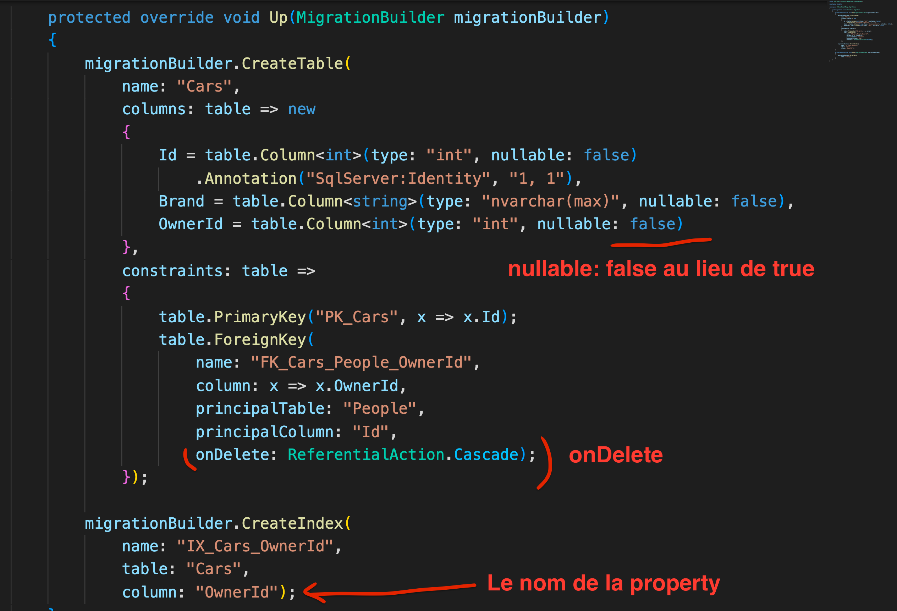

On a trois différence notoire :

- la propriété `OwnerId` devient obligatoire contrairement à `PersonId`
- Une contrainte en cascade lors d'une suppression (si un `owner` est détruit la `car` associé aussi)
- Le nom `PersonId` est maintenant explicité par le nom de la propriété `Owner` et devient `OwnerId`


### 2. Si on ajoute juste la `Foreign Key`

```cs
public class Car
{
    public int Id { get; set; } 
    public string Brand { get; set; } = string.Empty;
    public int PersonId { get; set; }
}
```

On obtient la même chose :

- `PersonId` avec `nullable: false`
- Et une contrainte `onDelete: ReferentialAction.Cascade`

Idem si on ajoute la `Foreign Key` et la `Navigation Property`

```cs
public class Car
{
    public int Id { get; set; } 
    public string Brand { get; set; } = string.Empty;
    public int PersonId { get; set; }
    public Person Person { get; set; }
}
```


## Résumé

Si on ajoute la `Foreign Key` et/ou la `Navigation Property`, on rend la propriété obligatoire et on ajoute une contrainte à la suppression.


## Paramétre l'`héritage` dans le `DbContext`

Il y a deux méthode importante (qu'on `override`) dans `DbContext` :

- `OnConfiguring` pour renseigner la `BDD`
- `OnModelCreating` pour tout le reste.

```cs
public class BrickContext : DbContext
{
    // ...

    protected override void OnModelCreating(ModelBuilder modelBuilder)
    { ... }
}
```

Les indications données avec les annotations (`[MaxLength(250)]`) pourrait très bien être ajoutées grâce à `Fluent Api` dans cette méthode.

Pour gérer l'héritage, on doit ajouter deux lignes de code :

```cs
protected override void OnModelCreating(ModelBuilder modelBuilder)
{ 
	modelBuilder.Entity<BasePlate>().HasBaseType<Brick>();
    modelBuilder.Entity<MinifigHead>().HasBaseType<Brick>();
}
```

À ce stade j'ai une seule table `Bricks` avec toutes les propriétés de toutes les classes dérivées :

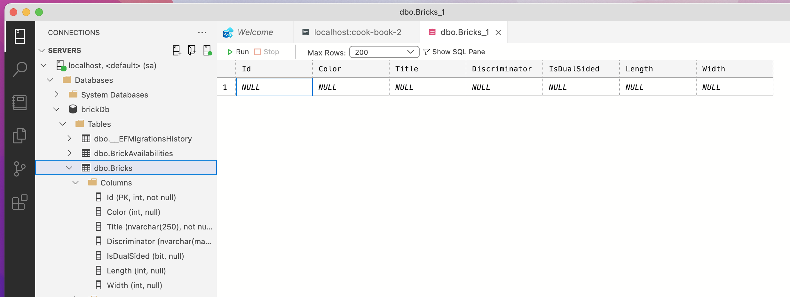

On appelle cette approche `Table per Hierarchie` : Une seule table par hiérarchie.

Une colonne `Discriminator` de type `string` est ajoutée.

le nom sous la forme d'une chaîne de caractère de la classe dérivée est enregistré dans cette colonne.

Les `propriétés` des classes dérivées sont stockées dans des colonnes `nullable`.

En fait c'est le comportement par défaut.

Le problème est qu'on se retrouve avec une table remplie de `null` et que les propriétés propres aux types dérivés ne peuvent être `non nullable`.


### Une table par `Type` : `TPT`

Ici un exemple avec cette structure :

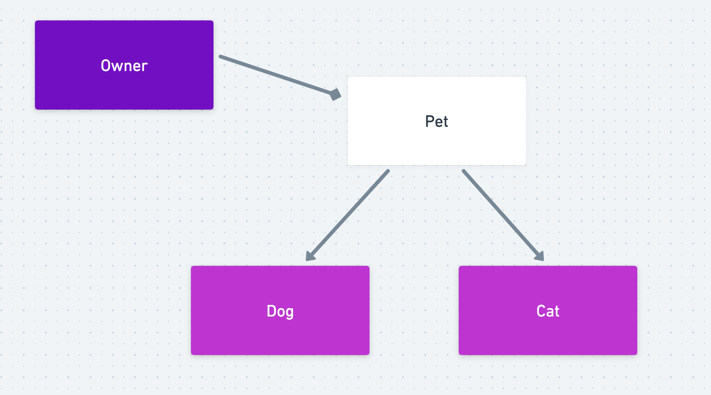

Sans modification on a en `DB` :

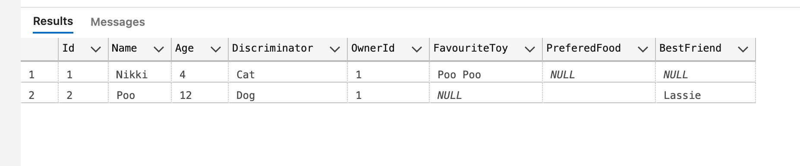


On utilise la `Fluent API` dans `OnModelCreating` pour passer en `Table Per Type` :

```cs
// Dans notre DbContext
protected override void OnModelCreating(ModelBuilder modelBuilder)
{
    modelBuilder.Entity<Dog>().ToTable("Dogs");
    modelBuilder.Entity<Cat>().ToTable("Cats")
}
```

On a maintenant les données de chaque `Type` dérivé dispersé dans deux tables :

Dans la table `Dogs`, `Id` est à la fois la `PK` et la `FK` vers `PETS`.

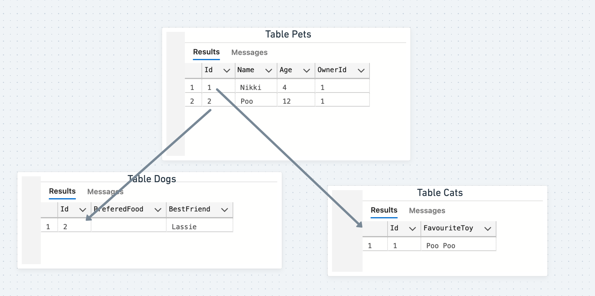

À chaque fois qu'on veut un `Cat` complet on doit effectuer un `JOIN` entre deux tables.

Cela peut être coûteux en ressource ou/et en complexité.


### Table par Type Concret : `TPC`

On peut vouloir une table par classe.

Pour ce faire, il faut passer la classe `Pet` en `Abstract` : mais cela ne semble pas fonctionner avec `Entity Framework Core`.

> Dans la documentation on peut lire que :
>
> Table-per-concrete-type (TPC) is supported by EF6, but is not yet supported by EF Core.


## Insérer des données

On travaille directement avec les objets `c#` sans utiliser les `Foreign Key` :

```cs
Vendor brickKing, heldDerSteine;
context.Vendors.AddRange(new Vendor[] {
    brickKing = new() { VendorName = "Brick King"},
    heldDerSteine = new() { VendorName = "Brick King"},
});
await context.SaveChangesAsync();

Tag rare, ninjago, minecraft, city, marvel;
context.Tags.AddRange(new Tag[] {
    rare = new() { Title = "Rare" },
    ninjago = new() { Title = "Ninjago" },
    minecraft = new() { Title = "Minecraft" },
    city = new() { Title = "City" },
    marvel = new() { Title = "Marvel" },
});
await context.SaveChangesAsync();

context.Add(new BasePlate() {
    Title = "Base Plate 16x16 with water pattern",
    Color = Color.Blue,
    Tags = new() { rare, city, minecraft },
    Length = 16,
    Width = 16,
    BricksAvailable = new() {
        new() {
           Vendor = brickKing, 
            AvailalbleAmount = 5, 
            PriceEuro = 6.5m, 
        },
        new() {
           Vendor = heldDerSteine, 
            AvailalbleAmount = 10, 
            PriceEuro = 6.2m, 
        },
    },
});

await context.SaveChangesAsync();
```


### Résultat en `BDD`

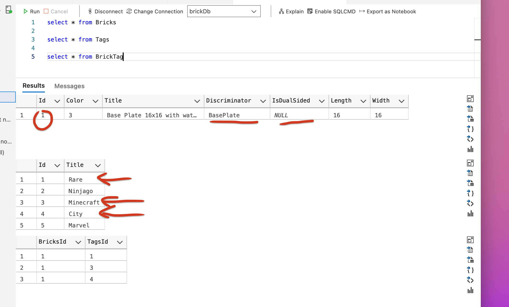

On observe le `Discriminator` ajouter par `EF Core` : `BasePlate` le nom de la classe dérivée.

`IsDualSided` est `null` car pas disponnible pour cette classe.

La table `BrickTag` a été remplie automatiquement par `EF Core` sans que jamais on ait eu à manipuler des `Foreign Key`.

De même pour les relations entre `Brick`, `Vendor` et `BrickAvailabilities` :

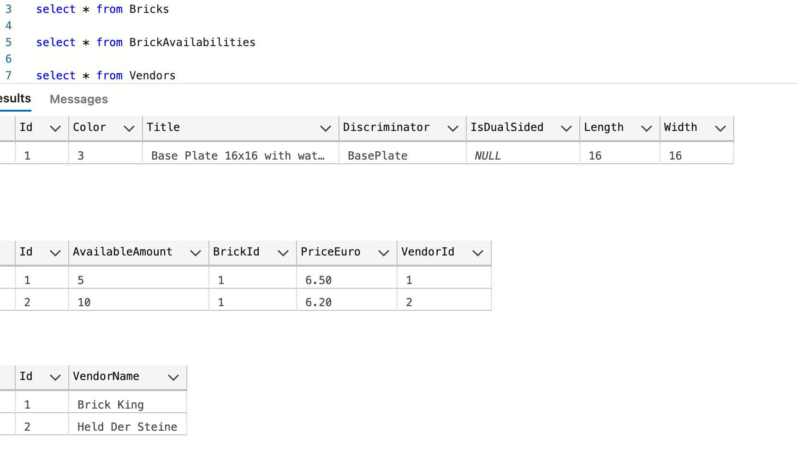

On peut ajouter un graphe d'objet au `DbContext` d'`EF Core` et celui-ci se chargera d'enregistrer correctement les données en `BDD`.


## Remarques

Pour pouvoir insérer correctement les relations `EF Core` doit tracker toutes les entités concernées :

```cs
Vendor brickKing;
context.Vendors.AddRange(new Vendor[] {
    brickKing = new() { VendorName = "Helena Hache'O"},
});
await context.SaveChangesAsync();

var Tags = await context.Tags.ToListAsync();

context.Add(new MinifigHead() {
    Title = "Woman with bige eyes",
    Color = Color.DarkGrey,
    Tags = new() {  Tags[0], Tags[5], Tags[8] },
    IsDualSided = true,
    BricksAvailabe = new() {
        new() {
            Vendor = brickKing, 
            AvailableAmount = 12, 
            PriceEuro = 6.3m, 
        },

    },
});
await context.SaveChangesAsync();
```

Pour ajouter des `Tags`, il doivent être trackés par `EF Core` cela ne fonctionne pas comme ça :

```cs
Tags = new() {  new() { Id = 1, Title = "Rare" }, new() { Id = 5, Title = "Marvel" } },
```

```
Cannot insert explicit value for identity column in table 'Tags' when IDENTITY_INSERT is set to OFF
```

On aurait la même erreur si les `Tags` ne sont pas trackés lors de la requête :

```cs
ar Tags = await context.Tags.AsNoTracking().ToListAsync();

context.Add(new MinifigHead() {
    Title = "Woman with bige eyes",
    Color = Color.DarkGrey,
    Tags = new() {  Tags[0], Tags[5], Tags[8] },
    // ...
```

```
Cannot insert explicit value for identity column in table 'Tags' when IDENTITY_INSERT is set to OFF
```

