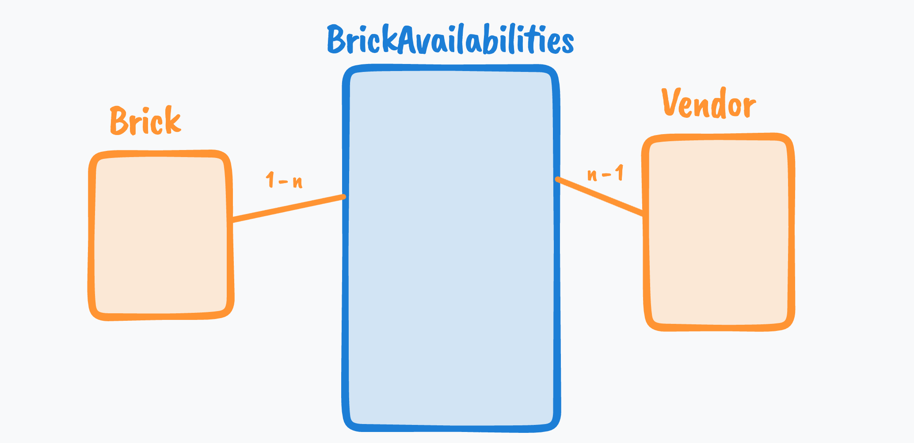
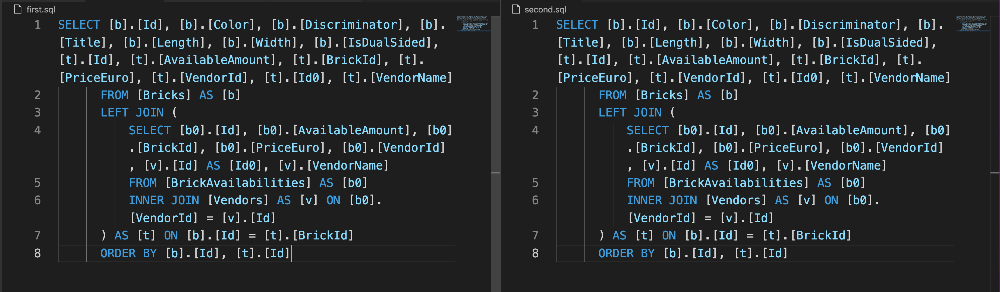

# 15 `Include`

Faire des requête sur des données reliées.


## `Query` : `Include` avec `One-To-Many`

```cs
var availabilityData = await context.BrickAvailibilities
    .Include(ba => ba.Brick)
    .Include(ba => ba.Vendor)
    .ToArrayAsync();
```

`EF Core` va ici générer une requête avec des `JOIN` :

```sql
 SELECT [b].[Id], [b].[AvailableAmount], [b].[BrickId], [b].[PriceEuro], [b].[VendorId], [b0].[Id], [b0].[Color], [b0].[Discriminator], [b0].[Title], [b0].[Length], [b0].[Width], [b0].[IsDualSided], [v].[Id], [v].[VendorName]
      FROM [BrickAvailabilities] AS [b]
      INNER JOIN [Bricks] AS [b0] ON [b].[BrickId] = [b0].[Id]
      INNER JOIN [Vendors] AS [v] ON [b].[VendorId] = [v].[Id]
```

`Include` force un `INNER JOIN` et permet de récupérer les données imbriquées.


## `Include` avec `Many-To-Many`

```cs
var bricksWithVendorAndTags = await context.Bricks  
        .Include(b => b.Tags)
        .ToArrayAsync();

    foreach(var item in bricksWithVendorAndTags)
    {
        Console.Write($"Brick : {item.Title} ");
        if(item.Tags.Any()) Console.WriteLine($"({string.Join(',', item.Tags.Select(t => t.Title))})");
    }
```

Ici le lien entre `Brick` et `Tag` est `n-m`.

```
Brick : Base Plate 16x16 with water pattern (Rare,Minecraft,City)
Brick : Superb head with black eyepatch, Pirat !! (Batman,Disney,Creator)
Brick : Superb head with black eyepatch, Pirat !! (Rare,Batman,Creator)
```

`Any` renvoie `true` si la collection contient au moins un élément.

`string.Join` prend un séparateur et une collection en argument.

`SQL` généré par `EF Core` :

```sql
SELECT [b].[Id], [b].[Color], [b].[Discriminator], [b].[Title], [b].[Length], [b].[Width], [b].[IsDualSided], [t0].[BricksId], [t0].[TagsId], [t0].[Id], [t0].[Title]
      FROM [Bricks] AS [b]
      LEFT JOIN (
          SELECT [b0].[BricksId], [b0].[TagsId], [t].[Id], [t].[Title]
          FROM [BrickTag] AS [b0]
          INNER JOIN [Tags] AS [t] ON [b0].[TagsId] = [t].[Id]
      ) AS [t0] ON [b].[Id] = [t0].[BricksId]
      ORDER BY [b].[Id], [t0].[BricksId], [t0].[TagsId]
```

Ici on a un `LEFT JOIN` et un `INNER JOIN`.

`LEFT JOIN` car on veut toutes les `Bricks`.

`INNER JOIN` car on veut seulement les `Tags` ayant un lien avec une `Brick` dans la table `BrickTag`.


### Clause `Where` sur un objet imbriqué

```cs
var bricksWithVendorAndTags = await context.Bricks  
        .Include(b => b.Tags)
        .Where(b => b.Tags.Any(t => t.Title.Contains("craft")))
        .ToArrayAsync();
```

```sql
SELECT [b].[Id], [b].[Color], [b].[Discriminator], [b].[Title], [b].[Length], [b].[Width], [b].[IsDualSided], [t0].[BricksId], [t0].[TagsId], [t0].[Id], [t0].[Title]
      FROM [Bricks] AS [b]
      LEFT JOIN (
          SELECT [b1].[BricksId], [b1].[TagsId], [t1].[Id], [t1].[Title]
          FROM [BrickTag] AS [b1]
          INNER JOIN [Tags] AS [t1] ON [b1].[TagsId] = [t1].[Id]
      ) AS [t0] ON [b].[Id] = [t0].[BricksId]
      WHERE EXISTS (
          SELECT 1
          FROM [BrickTag] AS [b0]
          INNER JOIN [Tags] AS [t] ON [b0].[TagsId] = [t].[Id]
          WHERE ([b].[Id] = [b0].[BricksId]) AND ([t].[Title] LIKE N'%craft%'))
      ORDER BY [b].[Id], [t0].[BricksId], [t0].[TagsId]
```

```
Brick : Base Plate 16x16 with water pattern (Rare,Minecraft,City)
```


## `Include` complexe



On voudrait tous les `Vendor` pour une `Brick` donnée.

```cs
ar bricksWithVendorAndTags = await context.Bricks
        .Include(nameof(Brick.BricksAvailabe) + "." + nameof(BrickAvailability.Vendor))  
        // .Include(b => b.BricksAvailabe)
        // .ThenInclude(ba => ba.Vendor)
        .Include(b => b.Tags)
        .ToArrayAsync();
```

On a un `Include` de la forme `Include(BricksAvailable.Vendor)`.

```cs
foreach(var item in bricksWithVendorAndTags)
{
    Console.Write($"Brick : {item.Title} ");
    if(item.Tags.Any()) 
        Console.Write($"({string.Join(',', item.Tags.Select(t => t.Title))})");
    if(item.BricksAvailabe.Any()) 
        Console.WriteLine($"is available at {string.Join(',', item.BricksAvailabe.Select(ba => ba.Vendor!.VendorName))}");
}
```

```
Brick : Base Plate 16x16 with water pattern (Rare,Minecraft,City)is available at Brick King,Held Der Steine
Brick : Superb head with black eyepatch, Pirat !! (Batman,Disney,Creator)is available at Ed Gare O'Gorille,Shina Toule
Brick : Superb head with black eyepatch, Pirat !! (Rare,Batman,Creator)is available at Helena Hache'O
```


## Comparaison avec la syntaxe `Include ThenInclude`

On peut écrire la même requête avec `ThenInclude` :

```cs
var bricksWithVendorAndTags = await context.Bricks  
        .Include(b => b.BricksAvailabe)
        .ThenInclude(ba => ba.Vendor)
        .ToArrayAsync();
```

au lieu de 

```cs
var bricksWithVendorAndTags = await context.Bricks
        .Include(nameof(Brick.BricksAvailabe) + "." + nameof(BrickAvailability.Vendor))  
        .ToArrayAsync();
```

### Comparaison des `SQL`



On obtient exactement la même chose.


## Charger le contenu associé à la demande

```cs
var simpleBricks = await context.Bricks.ToArrayAsync();

foreach(var item in simpleBricks)
{
    await context.Entry(item).Collection(i => i.Tags).LoadAsync();
    Console.Write($"{item.Title}");
    if(item.Tags.Any()) 
        Console.Write($" has ({string.Join(',',item.Tags.Select(t => t.Title))})");
    Console.WriteLine(" done !!");
}
```

Dans la première ligne, aucun `Tag` n'est chargé.

Dans la boucle `Foreach` on charge pour chaque `item` les `Tags` associés.
