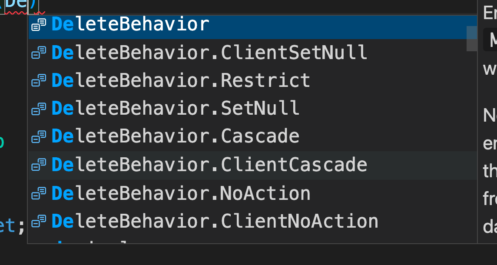

# 16 `Fluent API`

On peut configurer les règles appliquées normalement avec les `Data Annotations` grâce à la `Fluent API` de `EF Core`.


### `HasKey`

Tout se passe dans le `DbContext`et dans la méthode `OnModelCreating` qu'on `override` :

`MyAppContext.cs`

```cs
using Microsoft.EntityFrameworkCore;

namespace MyApp.Data;
public class MyAppContext : DbContext
{
    protected override void OnModelCreating(ModelBuilder modelBuilder)
    {
        modelBuilder.Entity<User>().HasKey(u => u.Id);
    }
}
```

Ce qui est identique à :

```cs
[Key]
public int Id { get; set; }
```


### `HasMaxLength`

```cs
modelBuilder.Entity<User>()
    .Property(u => u.FirstName)
    .HasMaxLength(100);
```

## Séparer les règles du modèle dans différents fichiers

### `IEntityTypeConfiguration`

Pour éviter d'avoir une méthode `OnModelCreating` extrémement longue, `EF Core` permet de créer un de règles externe au `DbContext` en implémentant `IEntityTypeConfiguration`:

```cs
public class UserEntityTypeConfiguration : IEntityTypeConfiguration<User>
{
    public void Configure(EntityTypeBuilder<User> builder)
    {
        builder.HasKey(u => u.Id);
        builder.Property(u => u.FirstName).HasMaxLength(100);
    }
}
```

On peut grouper cette classe avec la classe `User` ou la mettre dans un fichier séparé.


## `ApplyConfigurationsFromAssembly`

On va utiliser la possibilité d'`EF Core` de scanner l'`assembly` pour trouver toutes ses classes de configuration :

`MyAppContext.cs`

```cs
public class S4FDbContext : DbContext
{
    protected override void OnModelCreating(ModelBuilder modelBuilder)
    {
        modelBuilder
            .ApplyConfigurationsFromAssembly(typeof(S4FDbContext).Assembly);
    }
}
```


## Fonctionnalités

Plus d'exemple dans la documentation :

https://docs.microsoft.com/en-us/ef/core/modeling/entity-types?tabs=fluent-api

### `HasIndex` et `IsUnique`

On veut créer un index unique sur l'adresse mail :

```cs
builder.HasIndex(u => u.ConatctEmailAddress).IsUnique();
```


### `UseIdentityColumn`

Utilise les fonctionnalités de `SQL Server IDENTITY` pour générer les valeurs d'`Id`.

```cs
builder.HasKey(u => u.Id);
builder.Property(u => u.Id).UseIdentityColumn(1000, 2);
```

On commence à `1000` et on incrémente de `2`.


### `HasConversion<Type>`

Permet de convertir la valeur numérique d'un `Enum` en `string` :

```cs
public enum IdentityProvider
{
    Google,
    Microsoft,
    Facebook
}
```
```cs
// dans User.cs
public IdendityProvider Provider { get; set; }
```

```cs
// Dans UserTypeConfiguration.cs
builder.Property(u => u.Provider).HasConversion<string>();
```


## Relation en `Fluent API`

On peut définir les relations dans le fichier `MyEntityConfigurationType` :

```cs
public class UserEntityTypeConfiguration : IEntityTypeConfiguration<User>
{
    public void Configure(EntityTypeBuilder<User> builder)
    {
        builder.HasOne(u => u.UserGroup)
            .WithMany(g => g.Users)
            .HasForeignKey(u => u.UserGroupId)
            .OnDelete(DeleteBehavior.Restrict)
            .IsRequired(false);
    }
}
```

### `DeleteBehavior.Restrict` : 

la propriété dans l'entité relié est mise à `null`.

Si ce n'est pas possible une `exception` est levée.

Dans le `SQL` on retrouve : `ON DELETE NO ACTION`

```sql
ALTER TABLE [Users] ADD CONSTRAINT [FK_Users_UserGroup_UserGroupId] FOREIGN KEY ([UserGroupId]) REFERENCES [UserGroup] ([Id]) ON DELETE NO ACTION;
```

> Pour générer le fichier `SQL` des `Migrations` :
>
> ```bash
> dotnet ef migrations script -o migrate.sql
> ```

Autres possibilités :



## Seeding Data en `Fluent API`

### `HasData`

```cs
public void Configure(EntityTypeBuilder<UserGroup> builder)
{
    builder.HasData(
        new UserGroup { Id = 1, Name = "Regular S4F employee"},
        new UserGroup { Id = 1, Name = "System Administrator"},
        new UserGroup { Id = 1, Name = "Manager"}
    );
}
```

`HasData` peut prendre un `Object`, un `Tableau`, un `IEnumerable` ou encore une liste de paramètre `Params`.


## `Check Constraint`

Une `DB` comme `SQL Server` a des outils pour vérifier une contrainte.

Ici on défi it une période de non disponibilité :

```cs
public class UnavailabilityPeriod
{
    public int Id { get; set; }
    public DateTime From { get; set; }
    public DateTime? Until { get; set; }
}
```

On ne voudrait pas que la date `Until` soit antérieur à la date `From` , on va ajouter cette contrainte directement sur la `DB` grâce au `modelBuilder` :

### `HasCheckConstraint`

```cs
public class UnavailabilityPeriodTypeConfiguration : IEntityTypeConfiguration<UnavailabilityPeriod>
{
    public void Configure(EntityTypeBuilder<UnavailabilityPeriod> builder)
    {
        builder.HasKey(p => p.Id);
        builder.HasCheckConstraint("UntilAfterFrom",
           @$"[{nameof(UnavailabilityPeriod.Until)}] IS NULL OR [{nameof(UnavailabilityPeriod.Until)}] > [{nameof(UnavailabilityPeriod.From)}]");
    }
}
```

