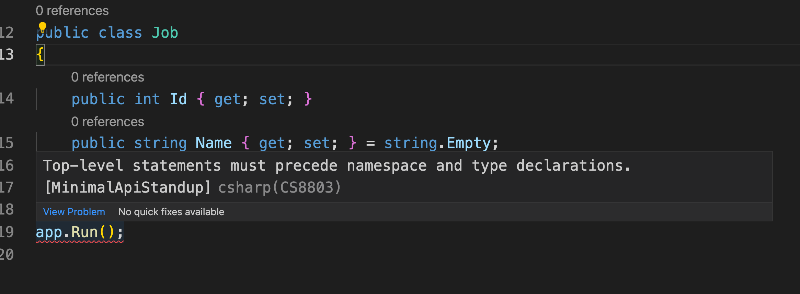

# 00 Présentation de `Minimal API`


# Le `template`

```cs
var builder = WebApplication.CreateBuilder(args);
var app = builder.Build();

app.MapGet("/", () => "Hello world");

app.Run();
```

Il y a deux nouveautés :

- `WebApplication` qui simplifie la création de l'application
- Un `overload` des méthodes `Map...` sui permettent maintenant plus de chose


On eput considérer tous le code de `Program.cs` (en dessous des `using` s'il y en a) comme dans la méthode `Main`.

```cs
using Microsoft.EntityFrameworkCore;

// DEBUT DE MAIN
var builder = WebApplication.CreateBuilder(args);
var app = builder.Build();
// ...
```


### `args`

On retrouve les arguments de la ligen de commande `args`.

```cs
app.MapGet("/", () => {
    foreach(var arg in args)
    {
    	Console.WriteLine($"arg : {arg}");
    }
    
    return Results.Ok("Hello World!");
});
```

```bash
dotnet run toto titi
```

```
arg : toto
arg : titi
```


## Top-Level Statement

Les déclarations de `type` doivent toujours se trouver en bas du fichier :




## Récupérer les `URLs` : `app.Urls`

Elles sont dans une `Icollection<string>` : `app.Urls`.

```cs
Console.WriteLine($"{app.Urls.FirstOrDefault()} {app.Urls.ElementAt(1)}");
```

```
https://localhost:7195 http://localhost:5214
```


## `app.MapSomething`

```cs
app.MapGet("/", () => "hello 🐷");
```

Le premier argument de `MapGet` est la `route`

Cette méthode d'extension prend en deuxième argument un `RequestDelegate` ou un `Delegate`.

C'est un `EndPoint Delegate`.

> Un `Delegate` étant un type référence vers une méthode.

Le `Delegate` sera transformé *"en coulisse"* en `RequestDelegate` par `asp.net`.

Un `RequestDelegate` prend en argument le `HttpContext` :

```cs
app.MapGet("/route", (HttpContext context) => Task.CompletedTask);
```


## Inférence et `Delegate`

On peut passer plusieurs paramètres qui seront déduis par inférence :

```cs
app.MapPost("/", async (Job job, JobSiteDb db, HttpResponse response) => {
    // ...
})
```

On peut explicitement définir leurs provenance en utilisant les `annotations` :

```csharp
app.MapPost("/", async ([FromBody] Job job, [FromServices] JobSiteDb db, HttpResponse response) => {
    // ...
})
```

Ces `annotations`viennet de `MVC` :

```cs
using Microsoft.AspNetCore.Mvc;
```


## `HttpContext`, `HttpRequest` et `HttpResponse`

On peut récupérer ces données dans un `Endpoint Delegate` par inférence :

```cs
app.MapGet(
    "/route", 
    async (HttpContext context, HttpRequest request, HttpResponse reponse)
    	=> await Task.FromResult<string>("hello"));
```

