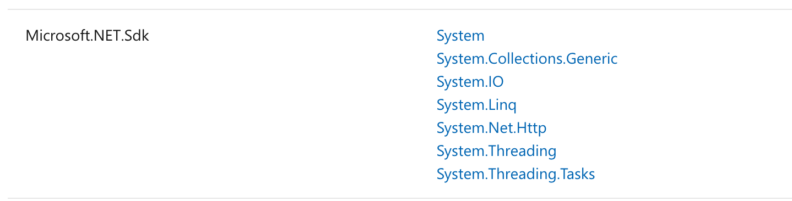
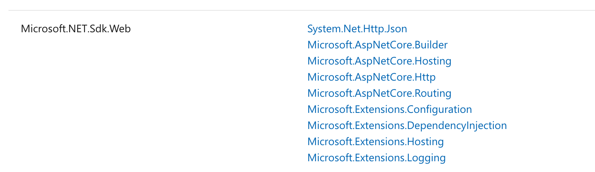
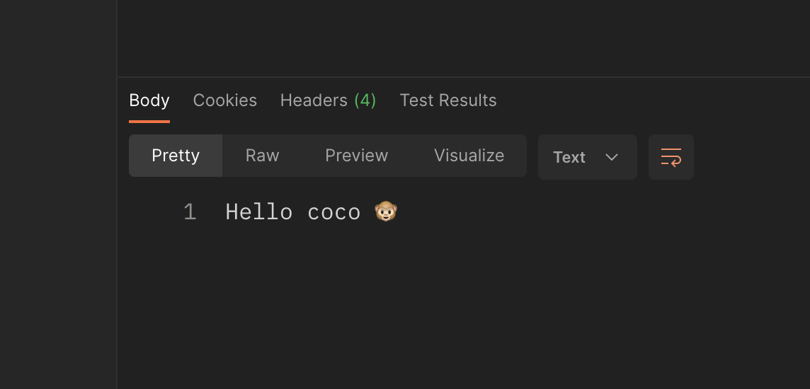
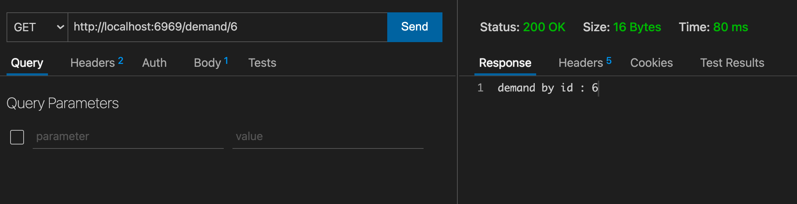

# 01 Création d'une `Minimal API`


## À partir d'une application console

On crée une application `console` 

```bash
dotnet new console -o APIFromConsole
```

On place dans `Program.cs` le code suivant :

```cs
var app = WebApplication.Create(args);

app.MapGet("/", () => "Hello coco 🐵");

app.Run();
```

`Program.cs` utilise le `top level statement` plutôt qu'une classe.

On doit aussi avoir un fichier `.csproj` :

```cs
<Project Sdk="Microsoft.NET.Sdk.Web">
  // à l'origine on a Sdk="Microsoft.NET.Sdk" pour une app console

  <PropertyGroup>
    <OutputType>Exe</OutputType>
    <TargetFramework>net6.0</TargetFramework>
    <ImplicitUsings>enable</ImplicitUsings>
    <Nullable>enable</Nullable>
  </PropertyGroup>

</Project>
```

`ImplicitUsing` un nombre de `namespace` sont mit par défaut en `global using`.





Il faut juste bien spécifier que c'est un `sdk` pour le `web` : `Microsoft.NET.Sdk.Web`.




## Fixer un numéro de `port`

On peut facilement fixer le numéro de `port` en paramètre de `Run` :

```cs
app.Run("http://localhost:6969");
```




## Une application `web`vide

La commande la plus simple c'est :

```bash
dotnet new web
```

