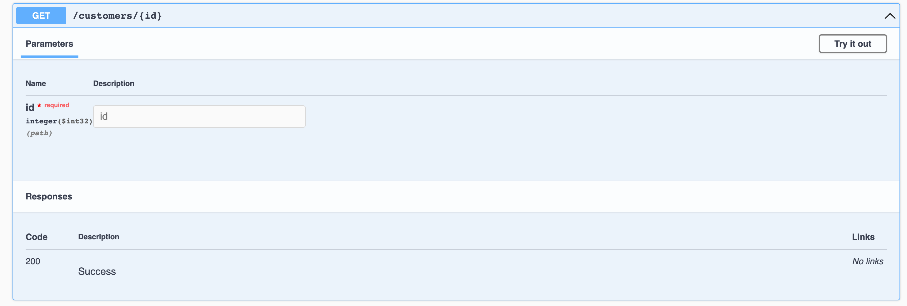
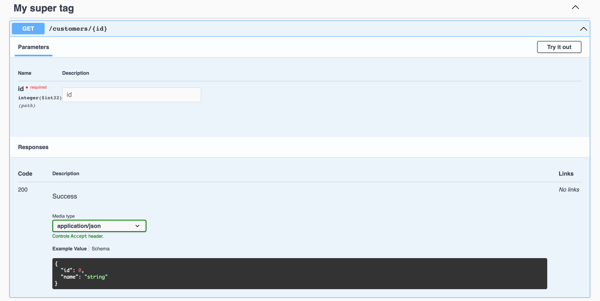
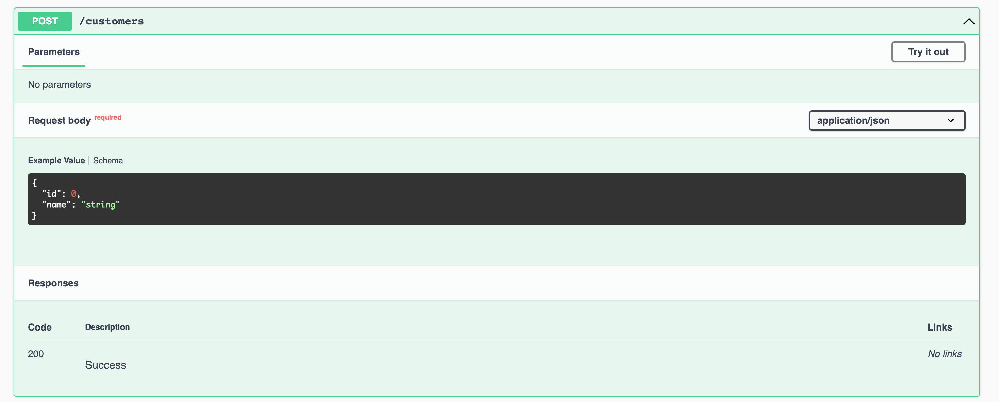
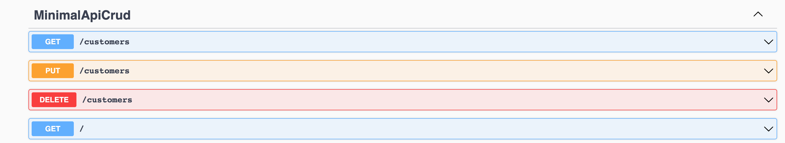
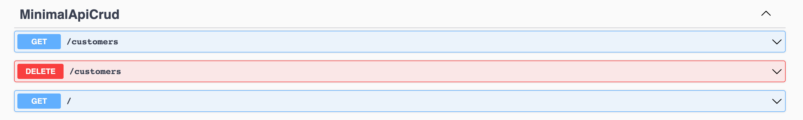

# 03.1 Ajouter `Swagger`

### Il faut d'abord télécharger le package `Swashbuckle`.

```bash
dotnet add package Swashbuckle.AspNetCore --version 6.2.3
```

On peut aussi ajouter manuellement ces lignes dans notre fichier  `.csproj`.

```cs
<ItemGroup>
  <PackageReference Include="Swashbuckle.AspNetCore" Version="6.2.3" />
</ItemGroup>
```

### On ajoute les `services` :

```cs
builder.Services.AddEndpointsApiExplorer();
builder.Services.AddSwaggerGen();
```

### Puis les deux `middlewares` :

```cs
app.UseSwagger();
app.UseSwaggerUI();
```

Seulement pour le développement :

```cs
if (app.Environment.IsDevelopment())
{
    app.UseSwagger();
    app.UseSwaggerUI();
}
```


## Méthodes de configuration pour `Swagger`

### `Produce<Type>`, `WithTags`

```cs
app.MapGet("/customers/{id}", (IRepository db, int id) 
    => db.GetById(id) is Customer customer ? Ok(customer) : NotFound());
```



On peut afficher un modèle du `json` produit grâce à la méthode d'extension `Produces<Customer>` :

```cs
app.MapGet("/customers/{id}", (IRepository db, int id) 
    => db.GetById(id) is Customer customer ? Ok(customer) : NotFound())
    .Produces<Customer>();
```



On voit que l'intitulé a aussi était customisé avec `WithTags` :

```cs
app.MapGet("/customers/{id}", (IRepository db, int id) 
    => db.GetById(id) is Customer customer ? Ok(customer) : NotFound())
    .Produces<Customer>()
    .WithTags("My super tag");
```


### Plusieurs type de réponse

Notre `endpoints` peut renvoyer une réponse `200 OK` ou une réponse `404 NOT FOUND`.

On peut utiliser deux fois `Produces<t>` :

```cs
app.MapGet("/customers/{id}", (IRepository db, int id) 
    => db.GetById(id) is Customer customer ? Ok(customer) : NotFound())
    .Produces<Customer>(StatusCodes.Status200OK)
    .Produces(StatusCodes.Status404NotFound)
    .WithTags("My super tag");
```


On a maintenant deux type de réponse.


### Avec la méthode `POST`

```cs
app.MapPost("/customers", (IRepository db, Customer customer) => {
    var customerCreated = db.Create(customer);

    return Created($"/customers/{customerCreated.Id}", customerCreated);
});
```



Avec quelques modifications

```cs
app.MapPost("/customers", (IRepository db, Customer customer) => {
    var customerCreated = db.Create(customer);

    return Created($"/customers/{customerCreated.Id}", customerCreated);
})
    .Produces<Customer>(StatusCodes.Status201Created)
    .WithTags("Create My Customer");
```


### `ExcludeFromDescription`

On peut aussi retirer un `endpoint` de la documentation `Swagger` avec  `ExcludeFromDescription`.

Avant :




Après :

```cs
app.MapPut("/customers", (IRepository db, Customer updatedCustomer) 
    => Ok(db.Update(updatedCustomer)))
    .ExcludeFromDescription();
```


