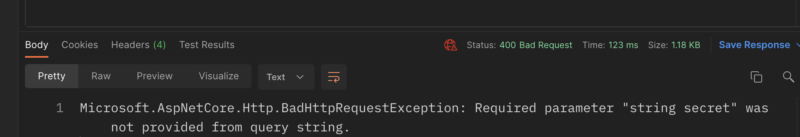

# `Binding`

Dans `minimal API` un certain nombre de `binding` sont appliqué automatiquement.


## `Binding` d'un paramètre d'`url`

```cs
app.MapGet("/customers/{id}", (int id) => {
  // ...
```

On peut changer le nom avec `[FromRoute(Name = "id")]` :

```cs
app.MapGet("/customers/{id}", [FromRoute(Name = "id")] (int titi) => {
  // ...
```


## `Binding`d'un `Query String`

```
https://localhost:5001/robot?secret=tululu
```

```cs
app.MapPost("/robot", (string? secret, RobotDto robot, IRepository repo) =>
{
   var mySecret = secret;
  // ...
```

`?` Rend le `Query String` optionnel, sans cela s'il n'était pas fourni on aurait une réponse `Bad Request` : `400`.

```cs
app.MapPost("/robot", (string secret, // ...
```

```
https://localhost:5001/robot
```




## `Binding` d'un service

On enregistre d'abord un `service` dans le conteneur de `services` :

```cs
var builder = WebApplication.CreateBuilder(args);
builder.Services.AddSingleton<MyRepository>();
```

Puis on peut directement l'utiliser dans le `Delegate` du `Endpoint` par `Injection de Dépendance` :

```cs
app.MapDelete("/customers/{id}", (MyRepository repo, Guid id) => {
  // ...
```

`[FromServices] `peut être utilisé mais ce n'est pas nécessaire.

#### ! Si un `service` est enregistré avec un type abstrait, c'est celui-ci qu'il faut `binder` dans le `endpoint delegate`.

```cs
builder.Services.AddSingleton<IRepository, MyRepository>();
```

```cs
app.MapPost("/customer", (Irepository repo, CustomerDto customer)) => { // ...
```


## `Binding` du contenu du `Body` de la requête

```cs
app.MapPost("/Robots", (MyRepository repo, Robot robot) => {
  // ...
```

Ici `robot` est directement mappé avec le contenu du `body`de la requête `http`. 