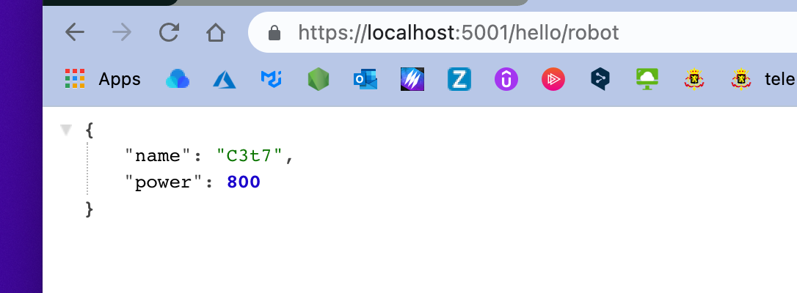

# 05 `IResult`

Les methods static de `Results` renvoie toute un nouveau type de `.net 6` : `IResult`.

C'est l'équivalent de `IActionResult` de `Mvc`.


## Simplifier l'écriture

On peut utiliser un `global using static` pour ne pas écrire à chaque fois la classe `Results`.

Dans un fichier `GlobalUsing.cs` :

```cs
global using static Microsoft.AspNetCore.Http.Results;
```

On a :

```cs
app.MapGet("/robot/{id}", (int id, IRepository repo) => (repo.GetById(id) is null) ?
    Ok(repo.GetById(id)) : NotFound()
);
```

Au lieu de :

```cs
app.MapGet("/robot/{id}", (int id, IRepository repo) => (repo.GetById(id) is null) ?
    Results.Ok(repo.GetById(id)) : Results.NotFound()
);
```


## `Results.Ok(customer)` : `200`

Renvoie un `status code` : `Ok 200`

```cs
var robot = new Robot("C3t7", 800);

app.Map("/hello", () => Results.Ok());
app.Map("/hello/name", () => Results.Ok("My name is 🐸"));
app.Map("/hello/robot", () => Results.Ok(robot));
```

Parse automatiquement le contenu en `json` :




## `Results.Created` : `201`

```cs
Results.Created("ressource/address", ressource);
```

```cs
var robot = new Robot("C3t7", 800);

app.Map("/created", () => Results.Created("/robot/67", robot));
```


`status code` : `201`


On voit qu'un `header` `location` a été ajouté.