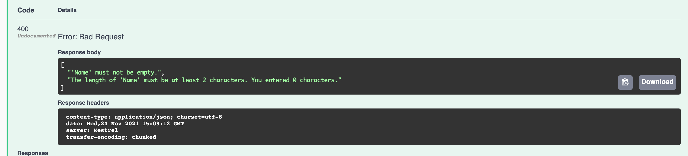

# 07 Validation et `minimal api`

## Utilisation de `FluentValidation`

On installe le package `FluentValidation.AspNetCore`.

Ce package comprend `FluentValidation` et `FluentValidation.DependencyInjectionExtensions`.

```bash
dotnet add package FluentValidation.AspNetCore --version 10.3.4
```

On crée un dossier `Validation` et une classe `CustomerValidator.cs`:

```cs
namespace minimal_api_crud.Validation;
public class CustomerValidator : AbstractValidator<Customer>
{
    public CustomerValidator()
    {
        RuleFor(x => x.Name).NotEmpty().MinimumLength(2);
    }
}
```


## Enregistrement du service

Dans `Program.cs` on ajoute :

```cs
builder.Services.AddValidatorsFromAssemblyContaining<CustomerValidator>();
```


## Utilisation du service

Dans un `endpoint`, on injecte le service `IValidator<T>` :

```cs
app.MapPost("/customers", (IRepository db, IValidator<Customer> validator, Customer customer) => {
  var validationResult = validator.Validate(customer);
  
  if(!validationResult.IsValid)
  {
    var errors = validationResult.Errors.Select(x => x.ErrorsMessage );
    
    return BadRequest(errors);
  }
    var customerCreated = db.Create(customer);

    return Created($"/customers/{customerCreated.Id}", customerCreated);
});
```

Si on envoie un nom vide on obtient :




## Méthode d'extension pour ajouter la validation directement au `Endpoint`

### Nick Chapsas

https://github.com/Elfocrash/DotnetDocsShow.MinimalApis/blob/main/DotnetDocsShow.Extensions.Validation/ValidationExtensions.cs

Les méthodes `MapVerb` sont des méthodes d'extension pour le type `RouteHandlerBuilder` et retourne un `RouteHandlerBuilder`.

```cs
using FluentValidation;

namespace DotnetDocsShow.Extensions.Validation;

public static class ValidationExtensions
{
    public static RouteHandlerBuilder WithValidator<TType>(
        this RouteHandlerBuilder builder) where TType : class
    {
        builder.Add(endpointBuilder =>
        {
            var originalRequestDelegate = endpointBuilder.RequestDelegate;
            endpointBuilder.RequestDelegate = async context =>
            {
                var validator = context.RequestServices.GetService<IValidator<TType>>();

                if (validator is null)
                {
                    await originalRequestDelegate!(context);
                    return;
                }

                context.Request.EnableBuffering();
                var model = await context.Request.ReadFromJsonAsync<TType>();
                if (model is null)
                {
                    context.Response.StatusCode = 400;
                    await context.Response.WriteAsJsonAsync(new
                    {
                        error = "Couldn't map the model from the request body"
                    });
                    return;
                }

                var result = await validator.ValidateAsync(model);
                if (!result.IsValid)
                {
                    context.Response.StatusCode = 400;
                    await context.Response.WriteAsJsonAsync(new { errors = result.Errors });
                    return;
                }

                context.Request.Body.Position = 0;
                await originalRequestDelegate!(context);
            };
        });
        return builder;
    }
}
```

Grosso-modo on sauvegarde le `Delegate` initial du `Endpoint` et on le substitut par un `Delegate` exécutant la validation et appelant le `Delegate de base` si la validation passe.


### Utilisation

Dans la méthode d'extension définissant le `Endpoint` :

```cs
public static void MapCustomerEndpoints(this WebApplication app)
{
    app.MapGet("/customers", GetAllCustomers);
    app.MapGet("/customers/{id}", GetCustomerById);
    app.MapPost("/customers", CreateCustomer).WithValidator<Customer>();
    app.MapPut("/customers/{id}", UpdateCustomer);
    app.MapDelete("/customers/{id}", DeleteCustomerById);
}
```


