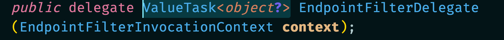
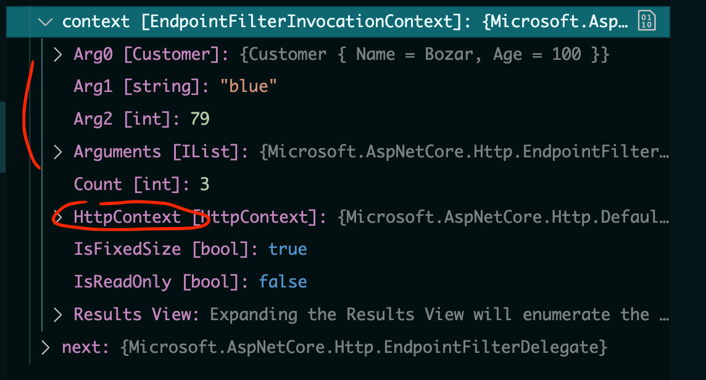
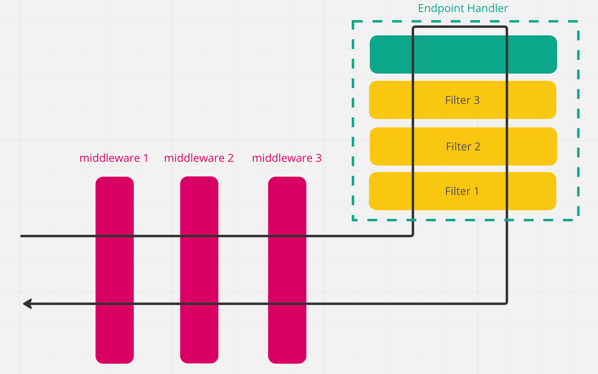

# 07.3 `Filter`

- Exécuter du code avant et après le `Endpoint Handler`
- Inspecter et modifier les paramètres du `Endpoint Handler`
- Intercepter le comportement de réponse du `Endpoint Handler`


## `Delegate Filter` : `AddEndpointFilter`

Un `Filter` peut être enregistré en fournissant un `Delegate` qui prend en argument un `EndpointFilterInvocationContext` et un `EndpointFilterDelegate` : `next` qu'il peut renvoyer.

```cs
AddEndpointFilter(
    ValueTask<object?> (EndpointFilterInvocationContext context, EndpointFilterDelegate next) => {
        return next(context);
    }
);
```

Un `EndpointFilterDelegate` retournant un `ValueTask<Object?>` :




### `EndpointFilterInvocationContext`

Le `EndpointFilterInvocationContext` fournit

- Le `HttpContext`
- une liste d'`Arguments` qui sont les paramètres passé au `Endpoint Handler` dans l'ordre d'origine de la déclaration du `Handler` 




## Retour `ValueTask<object?>`

Cela permet contrairement à un `middleware` de retourner un `IResult`. Cela rend la syntaxe plus agréable pour gérer les cas particulier :

```cs
.AddEndpointFilter(async (EndpointFilterInvocationContext context, EndpointFilterDelegate next) => {
    // Logic Before
    var color = context.GetArgument<string>(1);
    if(color == "blue")
    {
        return Results.Problem("Blue is a problem");
    }

    return await next(context);
});
```


## Ordre d'exécution des `Filters`

```cs
app.MapPost("/customertwo", (Customer? customer) => {
    return Created("customer/5", customer);
})
    .AddEndpointFilter(async (EndpointFilterInvocationContext context, EndpointFilterDelegate next) => {
        app.Logger.LogInformation("Filter one before");
        var result = await next(context);
        app.Logger.LogInformation("Filter one after");

        return result;
    })
    .AddEndpointFilter(async (EndpointFilterInvocationContext context, EndpointFilterDelegate next) => {
        app.Logger.LogInformation("Filter two before");
        var result = await next(context);
        app.Logger.LogInformation("Filter two after");

        return result;
    })
    .AddEndpointFilter(async (EndpointFilterInvocationContext context, EndpointFilterDelegate next) => {
        app.Logger.LogInformation("Filter three before");
        var result = await next(context);
        app.Logger.LogInformation("Filter three after");

        return result;
    });
```

```bash
Filter one before
      Filter two before
      	Filter three before
			## Endpoint Handler ##
      	Filter three after
      Filter two after
Filter one after
```

On remarque que la réponse de `next` est enregistrée dans une variable et retournée à la fin.

`Filter`

```cs
// Logic Before
var result = await next(context);
// Logic After

return result;
```

Le `Filter` doit retourner un résultat.


`Middleware`

```cs
// Logic before
await next(context);
// Logic after
```

Le `Middleware` ne retourne rien (`Task` qui équivaut à `void` pour de l'asynchrone).




## `IEndpointFilter`

On peut créer ses propres `Filters` dans des classes à part à fin d'organiser sa logique, il suffit pour une classe d'implémenter `IEndpointFilter`.

```cs
public class LoggingTestFilter : IEndpointFilter
{
    private readonly ILogger _logger;
    private static int countInstance = 0;
    private readonly int _mySecretId;

    public LoggingTestFilter(ILoggerFactory loggerFactory)
    {
        _logger = loggerFactory.CreateLogger<LoggingTestFilter>();
        _mySecretId = ++countInstance;
    }
    
    public async ValueTask<object?> InvokeAsync(EndpointFilterInvocationContext context, EndpointFilterDelegate next)
    {
        _logger.LogInformation($"Filter {_mySecretId} before");

        var result = await next(context);

        _logger.LogInformation($"Filter {_mySecretId} after");

        return result;
    }
}
```

Et on l'enregistre sur le `EndpointHandler` :

```cs
app.MapPost("/customertwo", (Customer? customer, string color, int weight) => {
    return Created("customer/5", customer);
})
    .AddEndpointFilter<LoggingTestFilter>()
    .AddEndpointFilter<LoggingTestFilter>()
    .AddEndpointFilter<LoggingTestFilter>();
```

```bash
Filter 1 before
      Filter 2 before
      	Filter 3 before
			## Endpoint Handler ##
      	Filter 3 after
      Filter 2 after
Filter 1 after
```


