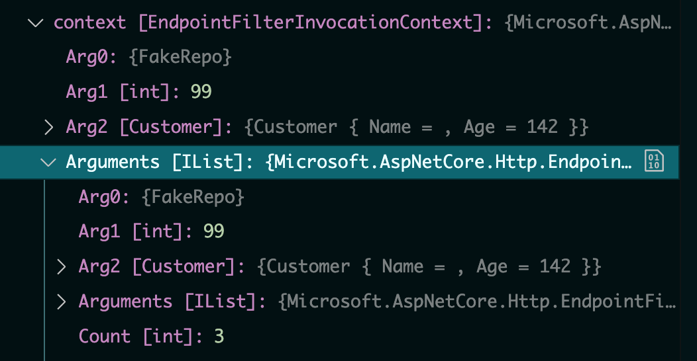
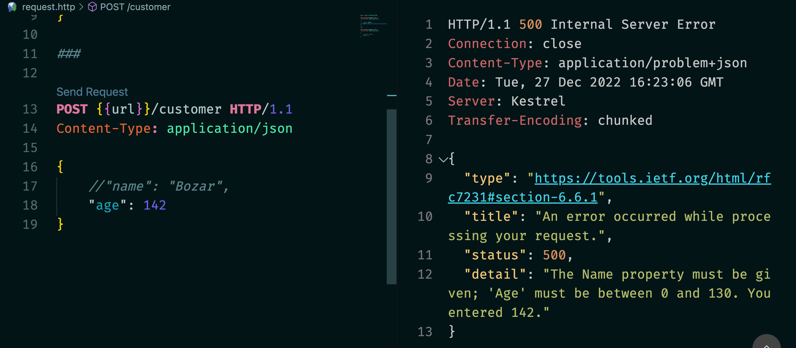

# 07.5 `Validation` avec `Filter`

nouveauté `.net 7`


## `Endpoint Filter`

Permet d'exécuter du code avant et après que le `Endpoint Handler` soit exécuter.


## Créer un `Filter`

Un `Filter` est une classe implémentant `IEndpointFilter` :

```cs
public class CustomerValidationFilter : IEndpointFilter
{
    public async ValueTask<object?> InvokeAsync(
        EndpointFilterInvocationContext context, EndpointFilterDelegate next
    )
    {
        var customer = context.Arguments.FirstOrDefault(
            c => c.GetType() == typeof(Customer)
        ) as Customer;
        
        return await next(context);
    }
}
```

Le `context` contient la liste des `arguments` passés au `Delegate` :

```cs
app.MapPost("/customer/{id:int}", (FakeRepo repo, int id,Customer customer) => {
    // ...
```



On trouve les arguments séparés dans l'ordre du `Delegate` ou une `list` les contenant tous.

Il est préfarable d'utiliser `Linq` sur la `list` car on ne connait pas toujours (et de manière stable) l'ordre des arguments passés.

## Enregistrer le `Filter` dans un `Endpoint`

### `AddEndpointFilter`

```cs
app
    .MapPost("/customer", (Customer customer) => {
        return Ok(customer);
    })
    .AddEndpointFilter<CustomerValidationFilter>();
```


## Ajouter un `Validator`

Comme un `Filter` est une classe, on utilise l'injection de dépendance pour récupérer son `validator`.

Dans `Program.cs` (utilisant `FluentValidation.DependencyInjectionExtension`)

```cs
builder.Services.AddValidatorsFromAssemblyContaining<CustomerValidator>();
```

La classe `CustomerValidator.cs` 

```cs
public class CustomerValidator : AbstractValidator<Customer>
{
    public CustomerValidator()
    {
        RuleFor(c => c.Name)
            .NotEmpty().WithMessage("The {PropertyName} property must be given")
            .MaximumLength(15).WithMessage("{PropertyName} property: {PropertyValue} must have maximum 15 characters");

        RuleFor(x => x.Age)
            .InclusiveBetween(0, 130);
    }
}
```

Notre `CustomerValidationFilter` :

```cs
public class CustomerValidationFilter : IEndpointFilter
{
    private readonly IValidator<Customer> _validator;
    public CustomerValidationFilter(IValidator<Customer> validator)
    {
            _validator = validator;
        
    }
    
    public async ValueTask<object?> InvokeAsync(EndpointFilterInvocationContext context, EndpointFilterDelegate next)
    {
        var customer = context.Arguments.FirstOrDefault(c => c?.GetType() == typeof(Customer)) as Customer;

        if(customer is not null)
        {
            var validationResult = _validator.Validate(customer);
            var errors = validationResult.Errors.Select(e => e.ErrorMessage);

            if(validationResult.IsValid == false) return Json(errors, statusCode: 400);

            return await next(context);
        }

        return BadRequest(new { errorMessage = "No customer is fournished" });
    }
}
```



