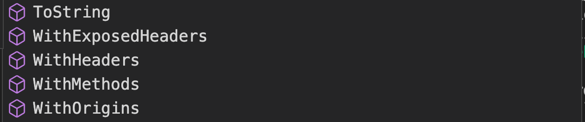

# 08 `cors`

## Mise en place `AddCors` et `UseCors`

Il faut ajouter un `service` : `AddCors` et un `middleware` : `UseCors`

```cs
builder.Services.AddCors(options =>
{
    options.AddPolicy(name: "MyAllowSpecificOrigins", o => 
    {
      o.WithOrigins("https://localhost:7007", "http://titi.lesmoulineaux");
		});
});

// ...

app.UseCors();
```

Les `Urls` sont celles du `Client`.

`o` est de type `CorsPolicyBuilder` et a plusieurs méthode :

```cs
o.AllowAnyOrigin();
o.WithMethods("GET");
o.AllowAnyHeader();
```




## Utilisation `RequireCors`

Pour utiliser la `policy` sur un `endpoint` on utilise la méthode `RequireCors`.

```cs
app.MapGet("/", () => {
        // ...
    })
    .RequireCors(MyAllowSpecificOrigins);
```

