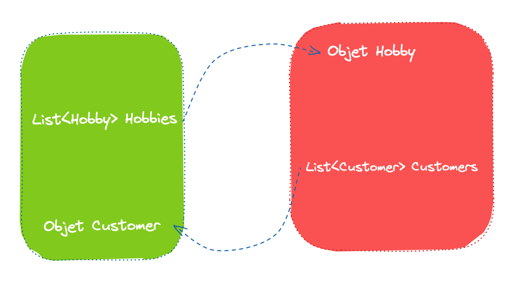
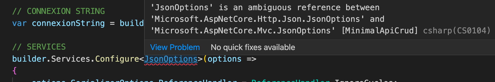

# 09 `json`

## `Circular Reference`

```
System.Text.Json.JsonException: A possible object cycle was detected. This can either be due to a cycle or if the object depth is larger than the maximum allowed depth of 64. Consider using ReferenceHandler.Preserve on JsonSerializerOptions to support cycles.
```

Lorsqu'un objet a une référence vers un objet ayant lui-même une référence vers lui-même, on obtient une référence circulaire.



```cs
using HttpJson = Microsoft.AspNetCore.Http.Json;

// SERVICES
builder.Services.Configure<HttpJson.JsonOptions>(options =>
{
    options.SerializerOptions.ReferenceHandler = ReferenceHandler.IgnoreCycles; 
});
```

On crée l'alias `HttpJson` car sinon il y a un ambiguïté de référence pour `JsonOptions` :



> Il est possible de mettre :
>
> ```cs
> using System.Text.Json.Serialization;
> using HttpJson = Microsoft.AspNetCore.Http.Json;
> 
> // ...
> builder.Services.Configure<HttpJson.JsonOptions>(
>  options => options.SerializerOptions.ReferenceHandler = ReferenceHandler.Preserve
> );
> ```
>
> ou
>
> ```cs
> builder.Services.Configure<HttpJson.JsonOptions>(
>     options => options.SerializerOptions.ReferenceHandler = ReferenceHandler.IgnoreCycles
> );
> ```
>
> `IgnoreCycles` ajoute des `null` pour fermer les `Références`.


## Servir un fichier `json` à travers un `type`

On utilise la librairie `System.Text.Json`.

```cs
using System.Text.Json;

app.MapGet("/contacts", () => {
    
    var contacts = JsonSerializer
        .Deserialize<IEnumerable<Contact>>(
        	File.OpenRead("TotoServiceFile/contact.json")
    	);

    return Results.Ok(contacts);
});

public record Contact(string Name, string City);
```

