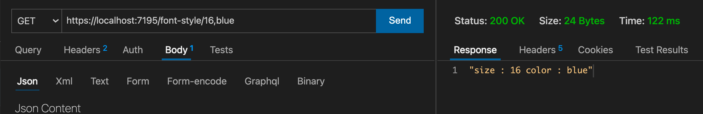

# `TryParse`

Le type `int` ou `string` est automatiquement inféré pour les paramètres de route :

```cs
app.MapGet("/integer/{count}", (int count) => Ok(count + 7));
```

```cs
12
```

```cs
app.MapGet("/text/{name}", (string name) => Ok($"Your name is {name}"));
```

```bash
"Your name is Polo Kugar"
```


## Implémentation dans un `type`

On peut implémenter la méthode `TryParse` dans un `type` qu'on a créé :

```cs
public class FontStyle
{
    public int FontSize { get; set; }
    public string FontColor { get; set; } = string.Empty;

    public static bool TryParse(string input, out FontStyle? fontStyle)
    {
        fontStyle = default;

        var splitArray = input.Split(",");

        if(splitArray is null || splitArray.Count() != 2)
        {
            return false;
        }

        if(!int.TryParse(splitArray[0], out int fontSize))
        {
            return false;
        }

        fontStyle = new() { FontSize = fontSize, FontColor = splitArray[1] };
        return true;
    }
}
```

Dans notre `Endpoint` on peut maintenant inférer le `type`du paramètre de route :

```cs
app.MapGet("/font-style/{fontStyle}", (FontStyle fontStyle) => Ok($"size : {fontStyle.FontSize} color : {fontStyle.FontColor}"));
```

