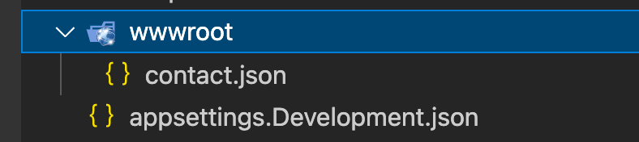
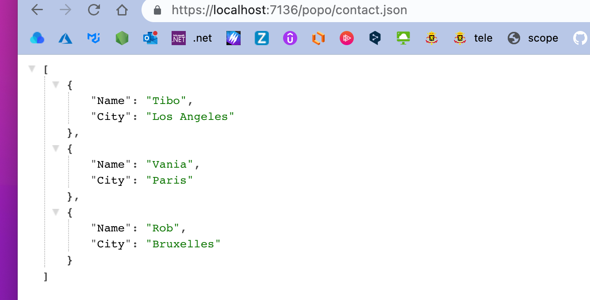
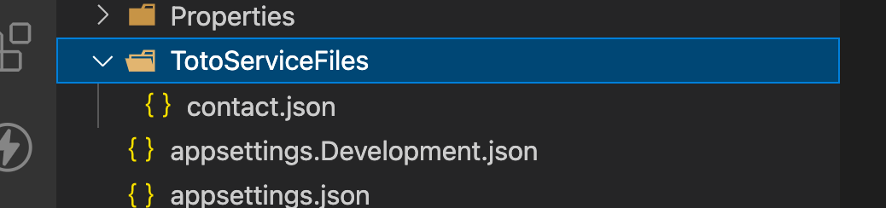
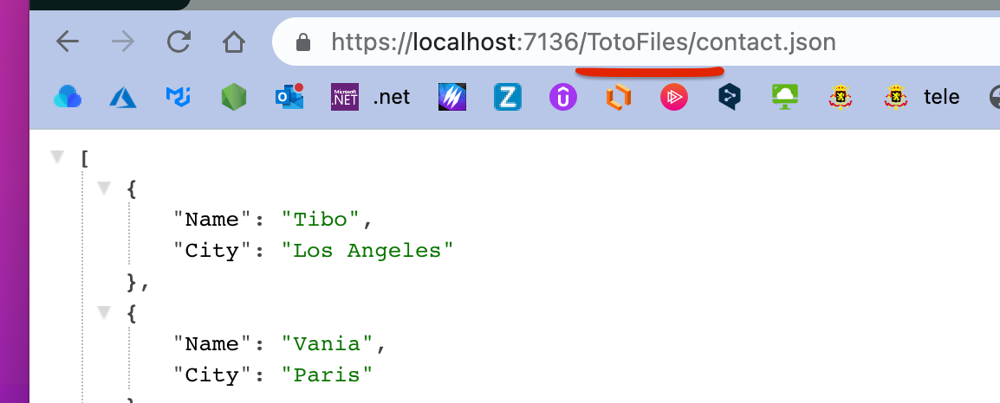

# 12 Servire des `Fichiers`

## `app.UseStaticFiles`

Par convention `UseStaticFiles` utilise le dossier `wwwroot`

```cs
app.UseStaticFiles();
```



On a l'`url` :

```
https://localhost:7136/contact.json
```


### On peut changer l'`url` : `UseStaticFile("newUrl")`

```cs
app.UseStaticFiles("/popo");
```




### On peut aussi changer le dossier `wwwroot`

```cs
using Microsoft.Extensions.FileProviders;

app.UseStaticFiles(new StaticFileOptions
{
    FileProvider = new PhysicalFileProvider(
           Path.Combine(builder.Environment.ContentRootPath, "TotoServiceFiles")),
    RequestPath = "/TotoFiles"
});
```



