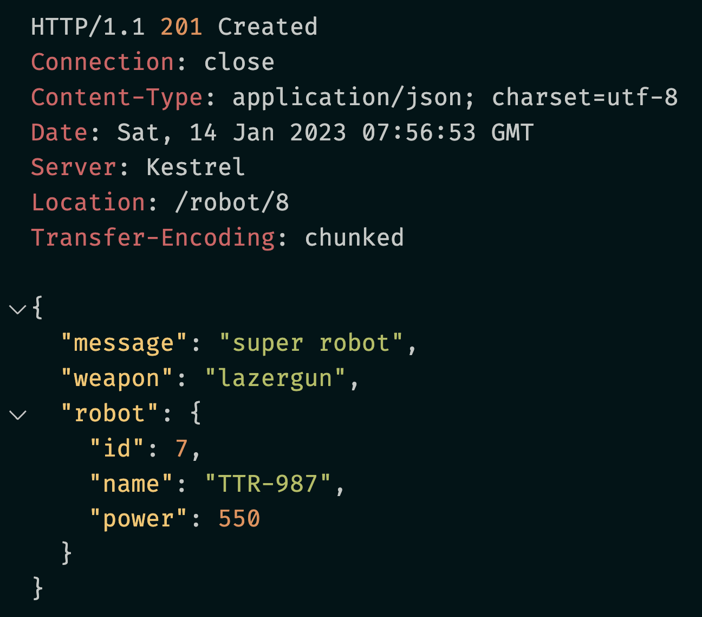
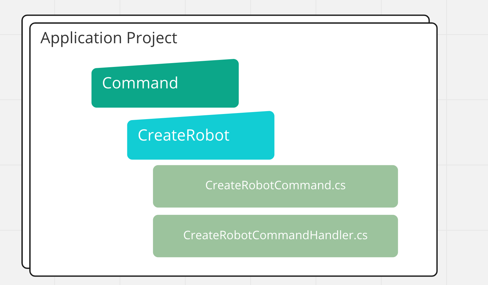

# 14 `MediatR` et l'attribut `[AsParameters]`


## Mise en place

On peut recevoir des paramètres de différents endroits de la requête:

```cs
app.MapPost(
    "/robot/{message}", 
    (string message, string weapon, Robot robot) => Results.Created("/robot/8", new { message, weapon, robot })
);
```

Requête `HTTP`

```http
POST {{url}}/robot/super%20robot?weapon=lazergun HTTP/1.1
Content-Type: application/json

{
    "id": 7,
    "name": "TTR-987",
    "power": 550
}
```

Réponse




## `[AsParameters]`

Grâce à cet attribut, on peut regrouper les paramètres dans une classe :

`PostRobotParameters`

```cs
public class PostRobotParameters
{
    public string Message { get; set; } = string.Empty;
    public string Weapon { get; set; } = string.Empty;
    public Robot? robot { get; set; }
}
```

Dans `Program.cs`

```cs
app.MapPost(
    "/robot/{message}", 
    ([AsParameters]PostRobotParameters parameters) => Results.Created("/robot/8", parameters)
);
```

L'attribut `[AsParameters]` n'est pas induit et doit donc être écrit "en dur".


## `MediatR`

```bash
dotnet add package MediatR.Extensions.Microsoft.DependencyInjection
```

On l'ajoute au conteneur de services en `scoped` pour être raccord avec l'utilisation dans une requête.

```cs
builder.Services.AddMediatR(x => x.AsScoped(), typeof(Program).Assembly);
```

On va créer un `RequestHandler`, on va simplifier `PostRobotParameters` en un `record` `PostRobotRequest` :

```cs
using MediatR;

public record CreateRobotRequest(string Message, string Weapon, Robot Robot) : IRequest<IResult>;

public class CreateRobotHandler : IRequestHandler<CreateRobotRequest, IResult>
{
    public async Task<IResult> Handle(CreateRobotRequest request, CancellationToken cancellationToken)
    {
        await Task.Delay(10);
        return Results.Created("/robot/8", request);
    }
}
```

On simule le côté `Task` avec `await Task.Delay(10)`.

```cs
app.MapPost(
    "/robot/{message}", 
    async ([AsParameters]CreateRobotRequest request, IMediator mediator) 
    	=> await mediator.Send(request)
);
```


## pattern `CQRS`

En renommant on peut aussi être dans le `pattern` `CQRS`:

```cs
public record CreateRobotCommand(string Message, string Weapon, Robot Robot) : IRequest<IResult>;

public class CreateRobotCommandHandler : IRequestHandler<PostRobotCommand, IResult>
{
    public async Task<IResult> Handle(PostRobotCommand request, CancellationToken cancellationToken)
    {
        await Task.Delay(10, cancellationToken);
        return Results.Created("/robot/8", request);
    }
}
```

```cs
app.MapPost(
    "/robot/{message}", 
    async ([AsParameters]CreateRobotCommand command, IMediator mediator) 
    	=> await mediator.Send(command)
);
```

On peut aussi créer un contrat pour être sûr de toujours renvoyer un `IResult`:

```cs
public interface ICommand : IRequest<IResult> {}

public interface IQuery : IRequest<IResult> {}
```

```cs
public record CreateRobotCommand(string Message, string Weapon, Robot Robot) : ICommand;
```

> Le `message` (`IRequest<T>`) et le `handler` peuvent (doivent) être placés dans des fichiers différents.
>
> 

Il est aussi possible de créer un tel contrat pour le `RequestHandler`

```cs
public interface ICommandHandler<TCommand> : IRequestHandler<TCommand, IResult>
    where TCommand : ICommand {}

public interface IQueryHandler<TQuery> : IRequestHandler<TQuery, IResult>
    where TQuery : IQuery {}
```

```cs
public class CreateRobotCommandHandler : ICommandHandler<PostRobotCommand>
{
    // ...
}
```


## `IMediator`, `ISender` et `IPublisher`

`ISender` permet d'envoyer un `message`.

`IPublisher` permet de publier des `notifications`

`IMediator` permet les deux.

Pour plus de clarté, il est préférable de déclarer un `sender` plutôt qu'un `mediator` dans le `Endpoint`:

```cs
app.MapPost(
    "/robot/{message}", 
    async ([AsParameters]CreateRobotCommand command, ISender sender) 
    	=> await sender.Send(command)
);
```

 
