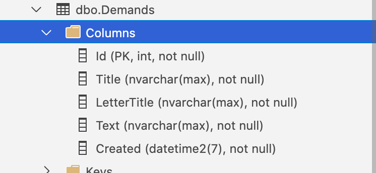

# 19 `Minimal API` et `EF Core`

Exemple de création d'un `Domain`.

## Création du `Domain`


## Création du `Context`

> ### Problème avec les `Warning` pour `Nullable` avec la déclaration des `DbSet`
>
> Avec l'option `nullable : enable` pour le compilateur, la déclaration sans l'initialisation des `DbSet` provoque un `Warning`.
>
> Pour éviter cela la documentation d'`EF Core` propose d'initialiser de cette manière :
>
> ```cs
> public class NullableReferenceTyoesContext : DbContext
> {
>   	public DbSet<Customer> Customers => Set<Customer>();
> }
> ```

`File` étant un nom ambigu avec `System.IO.File`, j'ai changé en `DemandFile`.

De même `Delegate` avec `System.Delegate` se transforme en `DemandDelegate`.

```cs
public DbSet<Demand> Demands => Set<Demand>();
public DbSet<DemandFile> Files => Set<DemandFile>();
public DbSet<Delegate> Delegates => Set<Delegate>();
```

## `OwnsOne`

Il faut maintenant dire à `EF Core` que `LetterValueObject` doit être enregistré dans la même table que `Demand`.

```cs
protected override void OnModelCreating(ModelBuilder modelBuilder)
{
  base.OnModelCreating(modelBuilder);

  modelBuilder.Entity<Demand>().OwnsOne(d => d.Letter);
}
```


## Ajouter le constructeur

Comme on va passer les options au gestionnaire d'injection de dépendances, on doit impérativement créer un constructeur :

```cs
public class MinimalContext : DbContext
{
    public MinimalContext(DbContextOptions<MinimalContext> options) : base(options)
    {

    }

    public DbSet<Demand> Demands => Set<Demand>();
    public DbSet<DemandFile> Files => Set<DemandFile>();
    public DbSet<DemandDelegate> Delegates => Set<DemandDelegate>();

    protected override void OnModelCreating(ModelBuilder modelBuilder)
    {
        base.OnModelCreating(modelBuilder);

        modelBuilder.Entity<Demand>().OwnsOne(d => d.Letter);
    }
}
```


## Ajouter une `migration`

```cs
dotnet ef migrations add CreateFirstMinimalDB
  
dotnet ef database update  
```


## Renommer les colonnes de `Demand`

`Letter` étant enregistré dans la table `Demand` par défaut on a les colonnes :

- `Letter_Title`
- `Letter_Text`
- `Letter_Created`

On voudrait juste avoir `LetterTitle`, `Text` et `Created` :

```cs
protected override void OnModelCreating(ModelBuilder modelBuilder)
    {
        base.OnModelCreating(modelBuilder);

        modelBuilder.Entity<Demand>().OwnsOne(d => d.Letter, l =>
            {
                l.Property(p => p.Title).HasColumnName("LetterTitle");
                l.Property(p => p.Text).HasColumnName("Text");
                l.Property(p => p.Created).HasColumnName("Created");
            });
    }
```

```bash
dotnet ef migrations add ChangeColumnNameForLetter
dotnet ef database update
```




