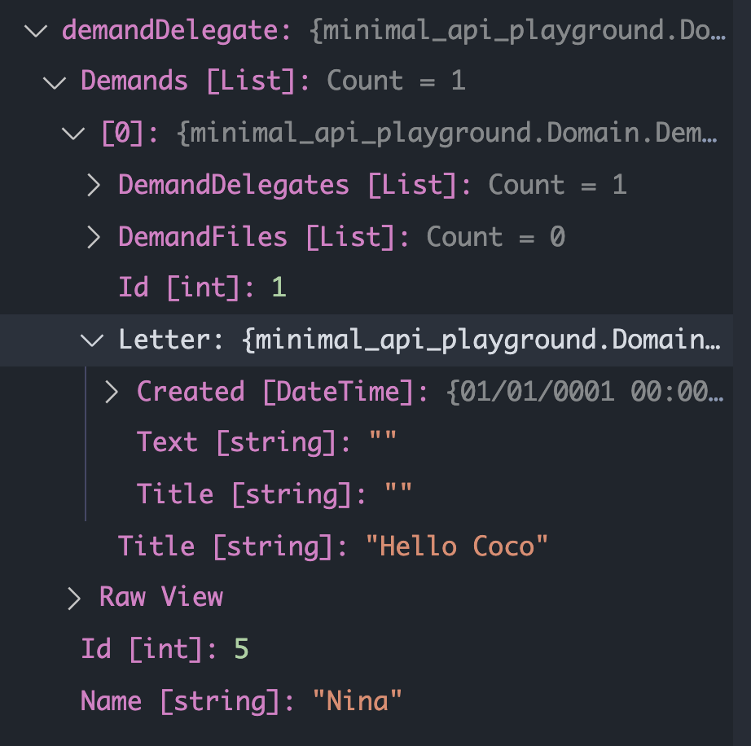
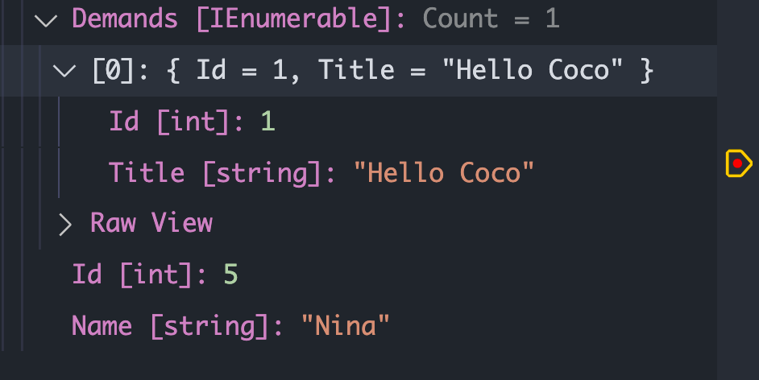

# Application

## Mise en place de `Mediatr`

```bash
dotnet add package MediatR.Extensions.Microsoft.DependencyInjection --version 9.0.0
```

Ajout au conteneur de service dans `Program.cs` :

```cs
builder.Services.AddMediatR(typeof(Program).Assembly);
```


## Ajout de `Mediatr` et du pattern `CQRS`

Dans le dossier `Application`, on crée deux nouveaux dossier : `Queries` et `Commands`.

On aura un fichier par `Queries` ou `Command`.

## Anatomie

### `Query`

```cs
public static class GetTodoById
{
  // Query
	public record Query(int Id) : IRequest<Response>;
  // Handler
  public class Handler : IRequestHandler<Query, Response>
  {
    public Task<Response> Handle(Query request, CancellationToken token)
    {
      // All the business logic
    }
  }

  // Response
  public record Response(int Id, string Name, bool Completed);
}
```


### `Command`

```cs
public static class AddTodo
{
  // Query
	public record Command(string Name) : IRequest<Response>;
  // Handler
  public class Handler : IRequestHandler<Command, Response>
  {
    public Task<Response> Handle(Command request, CancellationToken token)
    {
      // All the business logic
    }
  }

  // Response
  public record Response(int Id);
}
```


## Liste des actions

### `Queries`

- `GetDelegateById`
- `GetAllDelegates`

- `GetDemandById`
- `GetAllDemands`


### `Commands`

- `AddDelegate`
- `UpdateDelegate`
- `RemoveDelegate`


## `Command` : `AddDelegate`

Pour injecter le `context`, on a besoin d'avoir un constructeur dans le `Handler` :

```cs
private readonly MinimalContext _context;
public Handler(MinimalContext context)
{
  _context = context;
}
```


```cs
public static class AddDelegate
{
  public record Command(string name) : IRequest<Response>;
  
  public class Handler : IRequestHandler<Command, Response>
  {
    private readonly MinimalContext _context;
    public Handler(MinimalContext context)
    {
      _context = context;
    }

    public async Task<Response> Handle(Command request, CancellationToken token)
    {
      var demandDelegate = new DemandDelegate { Name = request.name };
      _context.Add(demandDelegate);
      await _context.SaveChangesAsync();
      return new Response(demandDelegate.Id);
    }
  }

  public record Response(int Id);
}
```

#### Remarque :

Comme `Handle` est `async`, on retourne directement `new Response` et non `Task.FromResult(new Response)`.

`_context.Add` plutôt que `_context.Delegates.Add` car `EF Core` est capable de déduire le `DbSet` d'après le type de l'objet passé à `Add`.

On utilise des `record` pour les message. Ils servent aussi de `DTO`.

Pour récupérer l'`id` avec `EF Core`, on crée une instance de l'objet qu'on veut tracer et `EF Core` l'hydrate pour nous après le `SaveChangesAsync`.


> ## Accéder à un service via le conteneur de services
>
> Pour pouvoir tester la partie application sans pour autant utiliser la partie web, ja'i créé une méthode :
>
> ```cs
> async Task<int> AddOneDelegate(string n)
> {
> 
>  var command = new AddDelegate.Command(n);
> 
>  var serviceProvider = builder.Services.BuildServiceProvider();
>  var mediator = serviceProvider.GetService<IMediator>();
> 
>  var response = new AddDelegate.Response(999);
>  if (mediator is not null)
>  {
>      response = await mediator.Send(command);
>  }
> 
>  return response.Id;
> }
> ```
>
> ### `serviceProvider`
>
> Pour construire un service Provider :
>
> ```cs
> var serviceProvider = builder.Services.BuildServiceProvider();
> ```
>
> 
>
> ### `serviceProvider.GetService<MyService>`
>
> Ensuite pour récupérer un service, c'est très simple :
>
> ```cs
> var mediator = serviceProvider.GetService<IMediator>();
> ```


## `Command` : `UpdateDelegate`

Ma `response` retourne un booléen pour dire si cette `id` existe bien dans la `DB` :

- Si oui `true`
- Si non `false`

```cs
public static class UpdateDelegate
{
  public record Command(int Id, string NewName) : IRequest<Response>;

  public class Handler : IRequestHandler<Command, Response>
  {
    private readonly MinimalContext _context;
    public Handler(MinimalContext context)
    {
      _context = context;

    }
    public async Task<Response> Handle(Command request, CancellationToken cancellationToken)
    {
      var demandDelegate = await _context.Delegates.FindAsync(request.Id);

      if (demandDelegate is not null)
      {
        demandDelegate.Name = request.NewName;
        await _context.SaveChangesAsync();

        return new Response(true);
      }

      return new Response(false);
    }
  }

  public record Response(bool Updated);
}
```


## `Command` : `DeleteDelegate`

Ma réponse contient un booléen pour savoir si le `delegate` a été trouvé en `DB`.

`_context.Remove(delegate)` le `context` est assez intélligent pour inférer le type de `delegate` et utiliser le `DbSet` correspondant.

`FindAsync` est une méthode de `DbSet` optimisé pour la recherche par `Id`.

```cs
public static class DeleteDelegate
{
  public record Command(int Id) : IRequest<Response>;

  public class Handler : IRequestHandler<Command, Response>
  {
    private readonly MinimalContext _context;
    public Handler(MinimalContext context)
    {
      _context = context;
    }

    public async Task<Response> Handle(Command request, CancellationToken token)
    {
      var demandDelegate = await _context.Delegates.FindAsync(request.Id);

      if (demandDelegate is null)
      {
        return new Response(false);
      }

      _context.Remove(demandDelegate);
      await _context.SaveChangesAsync();

      return new Response(true);
    }
  }

  public record Response(bool Removed);
}
```


## `Query` : `GetDelegateById`

On aimerai avoir un `delegate` et la liste de ses demandes.

Cependant cette liste ne doit contenir que l'`Id` et le `Title` des demandes.

> #### ! `Include` et `Select` ne fonctionne pas ensemble dans `EF Core`

### Première version de la requête : `Include`

```cs
var demandDelegate = await _context.Delegates
                .Include(d => d.Demands)
                .FirstOrDefaultAsync(d => d.Id == request.Id);
```

**Avantage** : la requête est très simple.

**Inconvénient** : Tous les champs de `Demands` sont ramenés depuis la `DB`.



On voit que tous les champs de `Demand` sont envoyés.


### Deuxième version avec `Select`

À l'aide de deux projection, on va pouvoir choisir les champs que l'on veut importer depuis la `DB`.

```cs
var demandDelegate = await _context.Delegates
                .Select(d => new
                {
                    Id = d.Id,
                    Name = d.Name,
                    Demands = d.Demands.Select(dmd => new
                    {
                        Id = dmd.Id,
                        Title = dmd.Title
                    })

                })
                .FirstOrDefaultAsync(d => d.Id == request.Id);
```

**Avantage** : On voit dans la requête `SQL` que seul les champs voulu sont demandés dans le `SELECT`.

**Inconvénient** : l'écriture est plus complexe et plus verbeuse.



On voit que notre objet récupère juste les champs demandés.


### Code complet

Pour fonctionner dans le `Select`, les `DTO` doivent être des `class` et non des `record`.

Bien penser à utiliser un `ToList` après le deuxième `Select` car on veut une `List`.

```cs
public static class GetDelegateById
{
    public record Query(int Id) : IRequest<Response>;

    public class Handler : IRequestHandler<Query, Response>
    {
        private readonly MinimalContext _context;
        public Handler(MinimalContext context)
        {
            _context = context;
        }

        public async Task<Response> Handle(Query request, CancellationToken token)
        {
            var dlgt = await _context.Delegates
                .Select(d => new DelegateDTO
                {
                    Id = d.Id,
                    Name = d.Name,
                    Demands = d.Demands.Select(dmd => new DemandDTO
                    {
                        Id = dmd.Id,
                        Title = dmd.Title
                    }).ToList()
                })
                .FirstOrDefaultAsync(d => d.Id == request.Id);

            return new Response(dlgt);
        }
    }

    public record Response(DelegateDTO? demandDelegate);

    public class DelegateDTO
    {
        public int Id { get; set; }
        public string Name { get; set; } = "";
        public List<DemandDTO> Demands { get; set; } = new();
    }
    public class DemandDTO
    {
        public int Id { get; set; }
        public string Title { get; set; } = "";
    }
}
```

s
