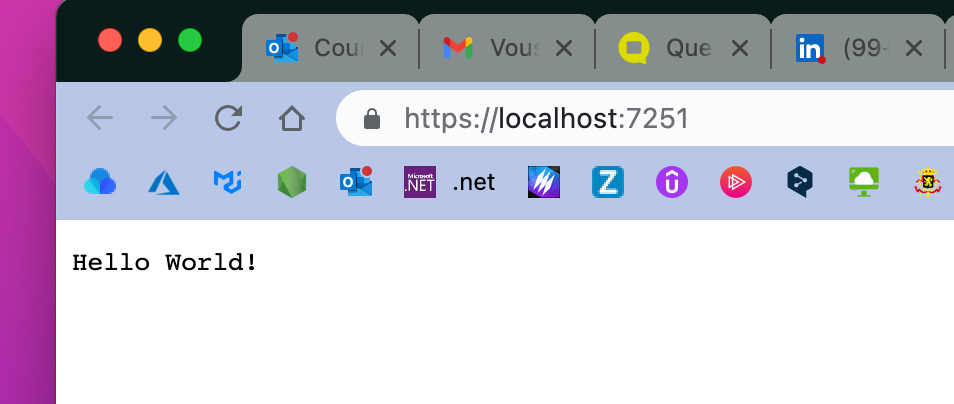
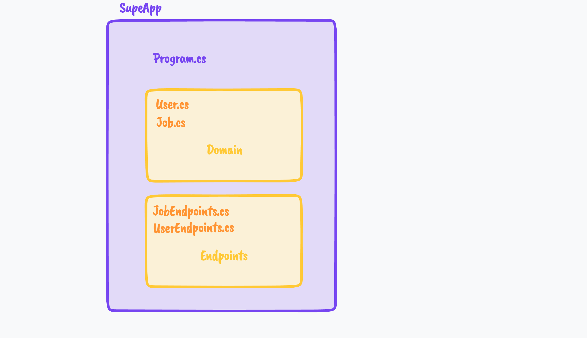
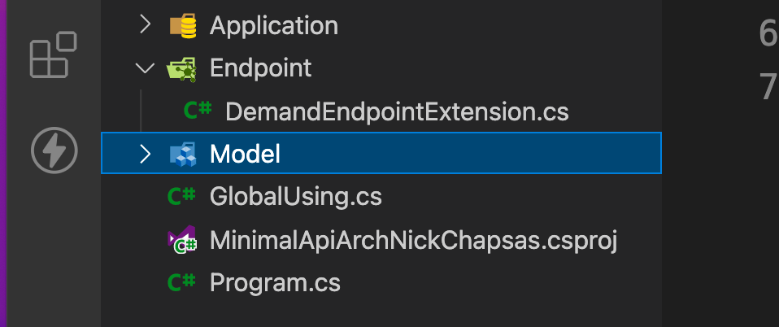

# Considérations architecturales


## La plus simple `API`

```cs
var app = WebApplication.Create(args);

app.MapGet("/", () => "Hello World!");

app.Run();
```

Trois ligne de code.




## Organiser ses `Endpoints` avec une classe `static`

`JobEndpoints.cs`

```cs
using Microsoft.EntityFrameworkCore;
using static Microsoft.AspNetCore.Http.Results;

namespace MinimalApiStandup;
public static class JobEndpoints
{
    public static void Add(WebApplication app)
    {
        app.MapGet("/", async (JobSiteDb db) => ...);
        app.MapGet("/{Id:int}", async (JobSiteDb db, int Id)
            => ...);
        app.MapPost("/", async (JobSiteDb db, Job job) =>... );
        app.MapPut("/{Id:int}", async (JobSiteDb db, int Id, Job newJob) 			=> ...);
        app.MapDelete("/{Id:int}", async (JobSiteDb db, int Id) => ...);
    }
}
```


`Program.cs`

```cs
// ...

var app = builder.Build();

JobEndpoints.Add(app);

app.Run();
```

On peut imaginer une structure très simple :




## Méthode d'`extension`

On peut représenter chaque `Endpoint` avec une méthode d'extension.

`MyEntityEndpointExtension.cs`

```cs
public static class MyEntityEndpointExtension.
{
    public static void AddMyEntityEndpoint(this WebApplication app)
    {
        app.MapGet("/myentity", () => "all entities");
        app.MapGet("/myentity/{Id:int}", (int Id) => $"my entity by id : {Id}");
        // OTHER ENDPOINTS POST PUT ...
    }
}
```

`Program.cs`

```cs
var app = WebApplication.Create();

app.AddDemandEndpoint();

app.Run();
```

On peut avoir une structure de ce type :



> ## NBomber
>
> `NBomber` est un `package` pour tester les performances.
>
> L'approche avec `Minimal API` par rapport à un classique `controller` permet un gain de performance : de `8` à `12%` (voire `Nick Chapsas` ).
>
> https://www.youtube.com/watch?v=HDinmuGYaIA&ab_channel=dotNET