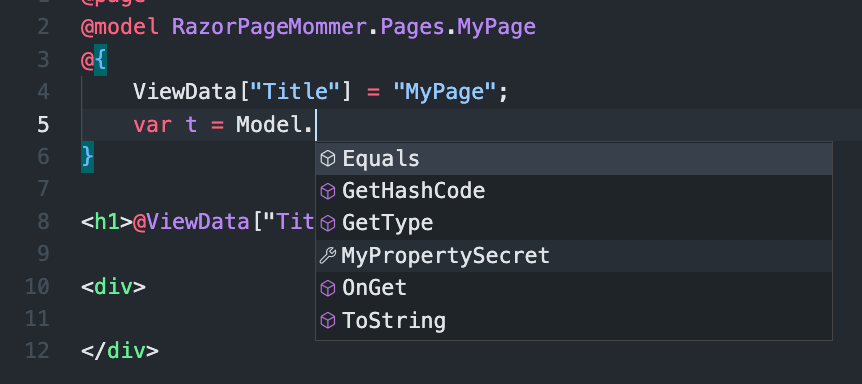

# 04 La classe `PageModel`

Les fichiers `MyPage.cshtml.cs` contiennent une classe héritant de `PageModel`.

Propriété de `PageModel`

```cs
PageContext PageContext { get; set; }
IModelMetadataProvider MetadataProvider { get; set; }
HttpContext HttpContext { get; }
HttpRequest Request { get; }
HttpResponse Response { get; }
ViewDataDictionary ViewData { get; }
ModelStateDictionary ModelState { get; }
RouteData RouteData { get; }
IUrlHelper Url { get; set; }
ITempDataDictionary TempData { get; set; }
ClaimsPrincipal User { get; }
```


## `@model`

Dans le template la classe `MyPage` est rendu accessible via la directive `@model ` :

```cs
@model RazorPageMommer.Pages.MyPage
```

La classe `MyPage` héritant de `PageModel` :

```cs
public class MyPage : PageModel
{
    // ...
```

`MyPage.cshtml.cs` représente le `Model` associé au template `MyPage.cshtml`.

Le template a alors accès aux propriétés et aux méthodes de la classe `Model` (définie par la directive `@model`).


## `Model`

C'est une instance de `MyPage`

```cs
public class MyPage : PageModel
{
    public string MyPropertySecret { get; set; } = "This is my secret 🗝";
    // ...
```



### Afficher une propriété du `Model` avec `@` :

```cs
@page
@model RazorPageMommer.Pages.MyPage
@{
    ViewData["Title"] = "MyPage";
}

<h1>@ViewData["Title"]</h1>

<div>
    <p>@Model.MyPropertySecret</p>
</div>
```


> ## Pas d'interactivité comme `Blazor`
>
> Si on veut créer des boutons réactifs, on doit à chaque fois recharger la page.
>
> La conséquence. c'est qu'on obtient une nouvelle instance de `Model`.
>
> Pour conserver une valeur entre deux appels de page, on doit utiliser les `propriété` (ou les `champs`) `statique` :
>
> ```cs
> public class MyPage : PageModel
> {
>     public static bool IHaveDayDate { get; set; }
>     
>     public string DayDate() => DateTime.Now.ToString("dd/MM/yyyy");
>     // ...
> ```
>
> Dans le `template` :
>
> ```cs
> @if(MyPage.IHaveDayDate)
> {
>     <p>
>         @Model.DayDate()
>     </p>
> }
> ```
>
> On remarque que la classe `MyPage` est accessible dans le `template`.


