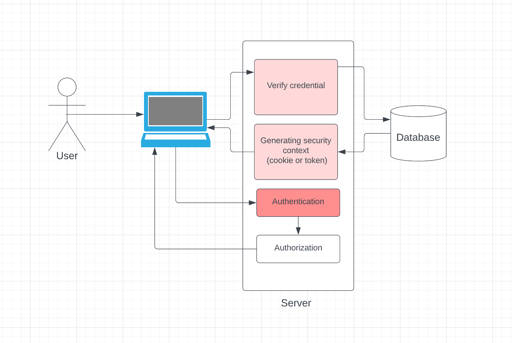
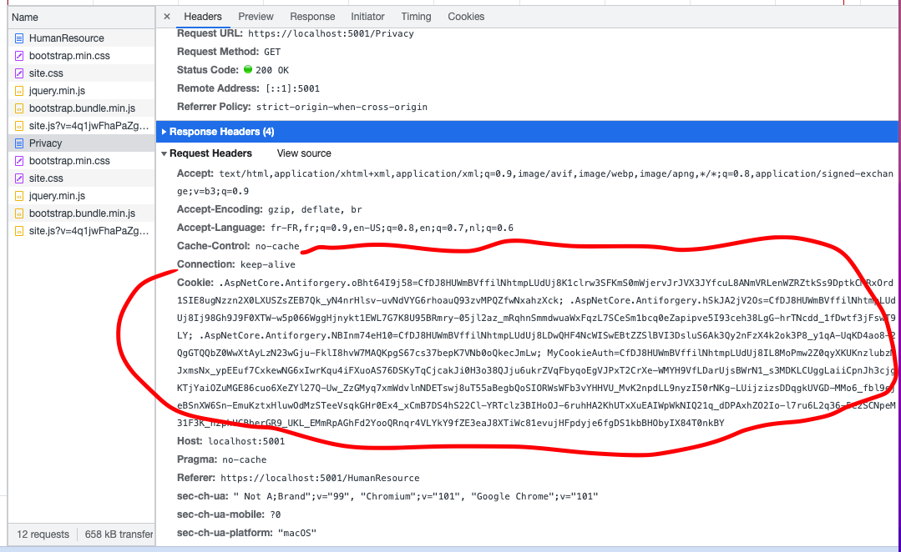

# 01 Les concepts

## Les trois concepts clés

1. Identité : `authentification` => Qui êtes-vous ?
2. `Context de Sécurité` => on reçoit une carte avec un temps limite et nos information d'indentité
3. Permissions : `authorisation` => vérifier que votre `context de sécurité` satisfait les droits d'accès

Dans une application web le `login` représente l'`authentification`.

Ensuite vous recevez un `cookie` ou un `token` représentant le `Security Context`.

Puis la page Web sur le serveur vérifie que votre `Security Context` vous  `authorize` à accéder à une ressource (une `Page`, un `Endpoint`).

## `Cookie`

Un `cookie` est un morceau d'information provenant du même `Domain` par sécurité.

L'échange de `cookies` encrypted permet d'authentifier la personne (savoir qui elle est).

Le `Cookie` contient aussi les `Claims` qui serviront aux différentes `authorization` si besoin.

## Processus d'authentification et d'autorisation

Le `Cookie` est retourné via le `Header ` de la requête `Http`

