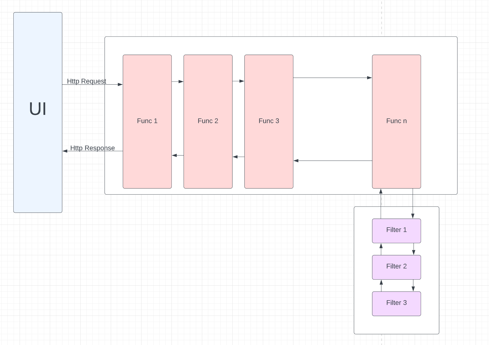
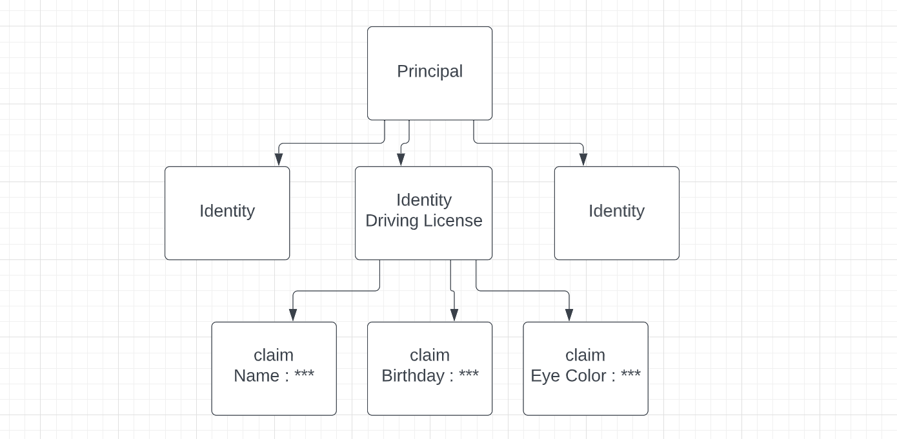
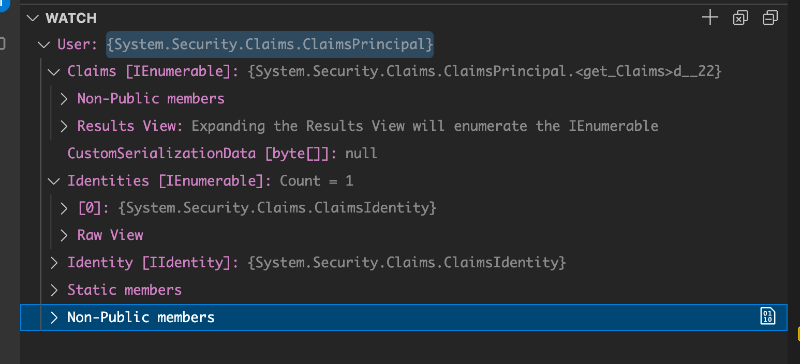
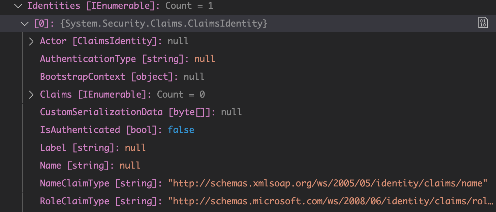
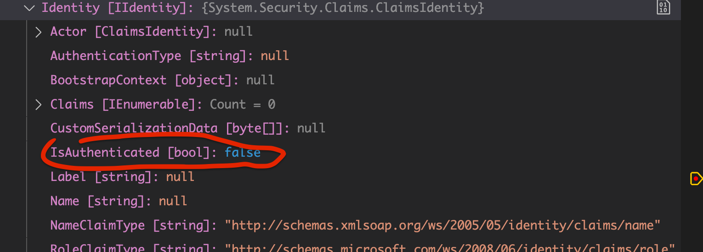

# 02 `ASP.NET`


## Fonctionnement web



On a ici le `pipeline` des `middleware`. (voire pattern `chain of responsabilities`)

L'objet `HttpContext` encapsule `HttpRequest` et `HttpResponse`.

Les `middlewares` sont concernés par toutes les requêtes, alors que les `filtres` eux ne sont concernés que dans certains cas.

> Les filtres sont le pipeline de la partie `mvc`, il dispose d'un contexte ayant accès au `model` des données (après le `binding`).

### Le Middleware

Il peut court-circuiter la requête.

Il passe le `HttpContext` à `next()` .

Il est traversé à l'aller et au retour.

```cs
public class CustomMiddleware
{
    private readonly RequestDelegate _next;

    public CustomMiddleware(RequestDelegate next)
    {
        _next = next;
    }

    public async Task InvokeAsync(HttpContext context)
    {
        // DO SOMETHING BEFORE
        
        await _next(context);
        
        // DO SOMETHING AFTER
    }
}

// ON CRÉÉ UNE M2THODE D'EXTENSION

public static class CustomMiddlewareExtensions
{
    public static IApplicationBuilder UseCustomMiddleware(
        this IApplicationBuilder builder)
    {
        return builder.UseMiddleware<CustomMiddleware>();
    }
}
```

Dans `Program.cs`

```cs
app.UseCustomMiddleware();
```


### Le `filtre`

Il reçoit un context différent : le `ActionExecutingContext`.

Son utilisation est une granularité supplémentaire à l'intérieur du `middleware` particulier `MVC`.

Les `filtres` implémente `Attribute`, `[Authorize]` est un bon exemple de filtre :

```cs
[Authorize]
public IActionResult Contact()
{
    // ...
}
```

Squelette :

```cs
public class SampleAsyncActionFilter : IAsyncActionFilter
{
    // ...
    public async Task OnActionExecutingAsync(ActionExecutingContext context, ActionExecutionDelegate next)
    {
        // Do something before the action executes.
        await next();
        // Do something after the action executes.
    }
}
```

`next()` appèle le `filtre` suivant.

On les enregistre comme ceci :

`Program.cs`

```cs
builder.Services.AddScoped<SampleAsyncActionFilter>()
```

Puis dans le `controller`

```cs
[ServiceFilter(typeof(SampleAsyncActionFilter))]
public IActionResult Index()
{
    // ...
}
```

> On peut aussi hériter de `Attribute` et les utilisé comme ceci (sans les ajouter à `Services`) :
>
> ```cs
> [MyCustomFilter(param)]
> public IActionResult Somewhere()
> {
>     // ...
> }
> ```
>
>  

Un `contrôleur` n'a pas d'interaction avec les différents `middleware`.

Par contre il peut utiliser des `filtres` sur ses actions.

C'est pourquoi le `login` (`authentification`) est plutôt un `middleware` tandis que l'`authorisation` est plutôt un `filter` au niveau des `contrôleurs`.


## Security Context

Ce sont toutes les informations concernant un utilisateur du système réunis dans un objet `SecurityContext`.

On a un objet `Principal` représentant un utilisateur et plusieurs `identities` (`étudiant`, `employé`, `utilisateur bibliothèque`) qui représente toutes les cartes que l'on peut avoir.

Chaque `Identité` peut contenir à son tour plusieurs `Claims` (du verbe clâmer, se réclamer).

Les `Claims ` sont des infomations sous forme clé/valeur, chaque `Claim` correspond à **une seule** paire clé/valeur.




## Création d'une application `Razor Pages`

```bash
dotnet new razor
```

En mettant un point d'arrêt, on peut voire cet `User` par défaut :

(Il faut taper `User` dans `Watch`)



On voit que le `User` contient des `Claims` et des `Identities`.



Chaque `Identity` à son tour contient des `Claims`.


### `Identity` par défaut

L'objet `User` possède une identité anonyme : `Identity`.

Elle est attribuée par défaut par `asp.net` :



On observe que `IsAuthenticated` est à `false`, l'identité anonyme n'est pas authentifiée.