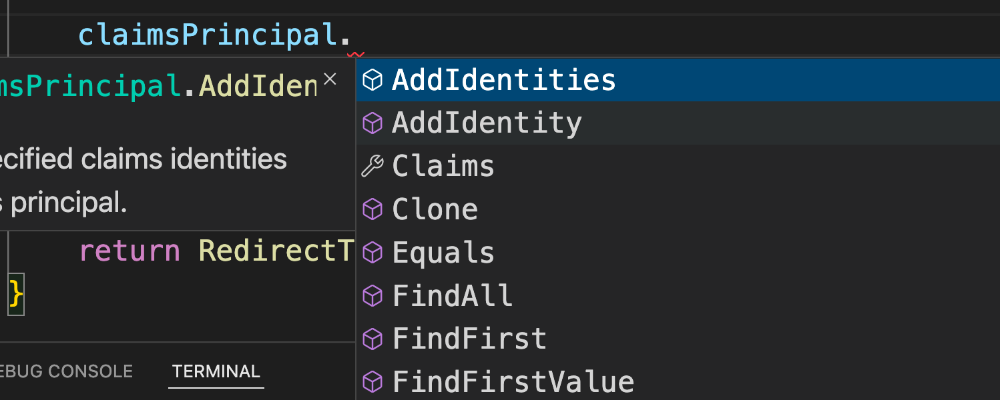
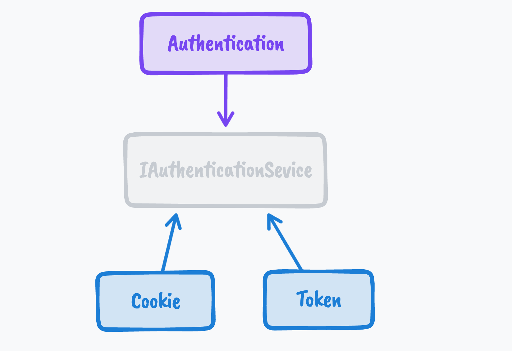
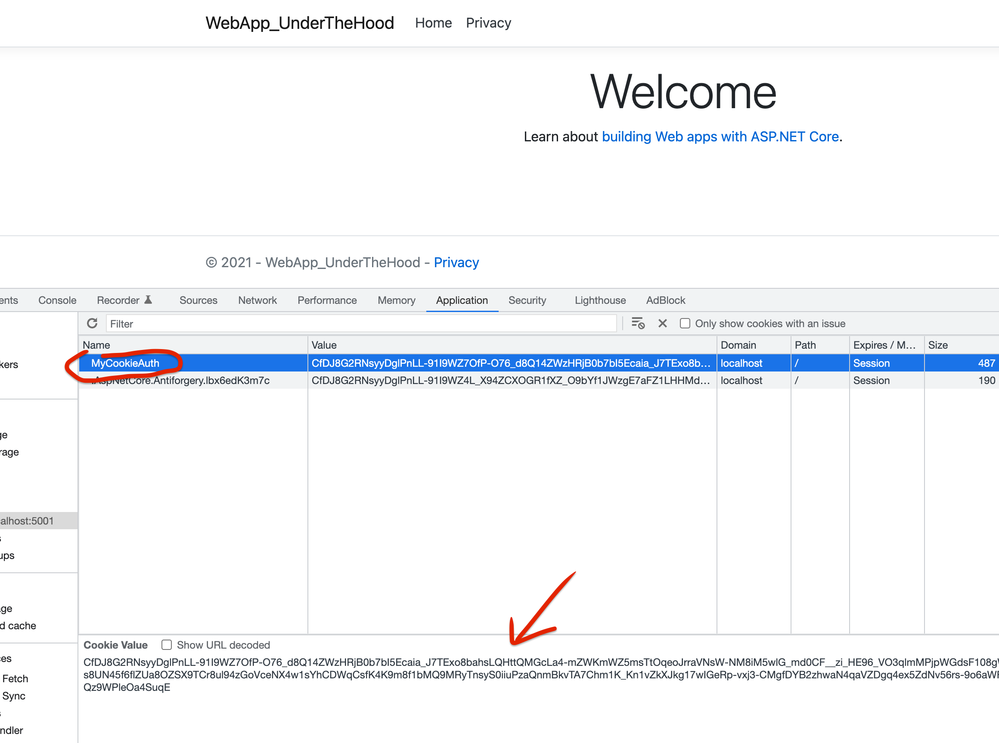
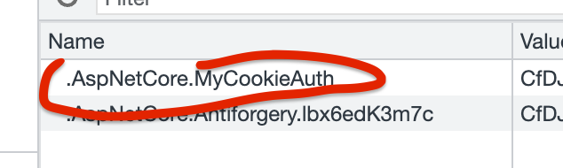
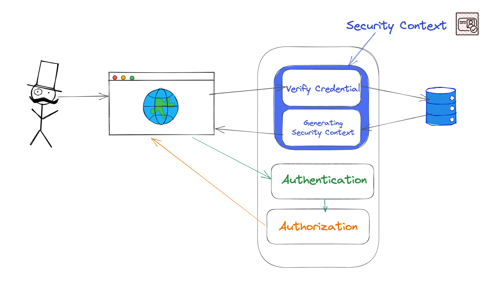

# 04 Générer un `Cookie` : Créer un `Security Context`

## Tester les `Credentials`

Dans la méthode `OnPost` de la `Razor Page` `Login.cshtml.cs`

```cs
public async Task<IActionResult> OnPostAsync()
{
    if(!ModelState.IsValid)
    {
        // renvoie la même page
        return Page();
    }

    // Verify Credential
    if(Credential.UserName == "admin" && Credential.Password == "password")
    {
        // Creating the security context
        var claims = new List<Claim> {
            new Claim(ClaimType.Name, "admin"),
            new Claim(ClaimType.Email, "admin@website.be")
        };
        var identity = new ClaimsIdentity(claims, "MyCookieAuth");
        
        ClaimPrincipal claimPrincipal = new ClaimPrincipal(identity);
        
        await HttpContext.SignInAsync("MyCookieAuth", claimsPrincipal);
        
        return RedirectPage("/Index");
    }
    
    return Page();
}
```

On crée des `Claims` (proclamations !?), on les passe à une `Identity` basée dessus et on lui donne un nom `"MyCookieAuth"`.


Ensuite on construit le `ClaimsPrincipal` avec cette `Identity`.

> ### Ajouter des `Identities`
>
> Il est bien sûr possible d'ajouter des `Identities` au `claimsPrincipal` :
>
> 

`SignInasync` persiste le `ClaimsPrincipal` sous la forme d'un `Cookie` :

- Il serialize le `ClaimsPrincipal` en `string`
- Il l'encrypte
- Le transform en `Cookie`
- Le passe au `HttpContext`


`return Page()` retourne la vue courante.


## `Authentication` Handler

Il faut injecter le `authentication handler` dans le conteneur de services :

```cs
services.AddAuthentication("MyCookieAuth").AddCookie("MyCookieAuth", options =>
  {
      options.Cookie.Name = "MyCookieAuth";
  });
```

Le service `Authentication` ne parle qu'avec une abstraction `IAuthenticationService`.

Comme il peut y avoir plusieurs sortes/scénario d'authentification, des `handler` spécifiques implémentent `IAuthenticationService`, ici `Cookie` et `Token` :



Comme il peut y avoir plusieurs gestionnaire en même temps, il faut leurs donner un nom : `AuthenticationScheme`.

Dans les `options` du `Cookie` on peut lui donner un nom.



On retrouve le nom qu'on a ajouté `options.Cookie.Name = "MyCookieAuth";`.

Sinon on a un nom par défaut :



En bas c'est le `ClaimsPrincipal` sérialité et encrypté (grâce à `SignInAsync`).

C'est la classe  `CookieAuthenticationHandler` qui au final implémente `SignInAsync`

```
CookieAuthenticationHandler 
	: SignInAuthenticationHandler 
	: IAuthenticationSignInHandler
```


On vient de mettre au point le `Security Context` à l'aide d'un `Cookie` :




