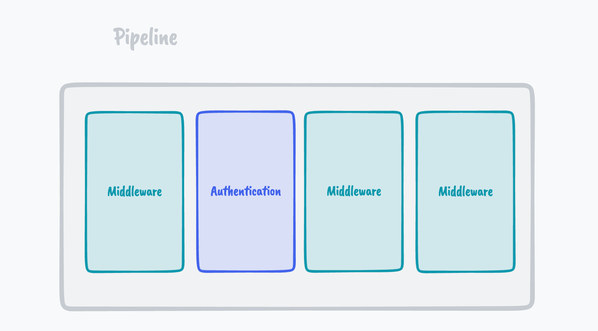
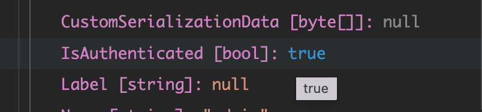
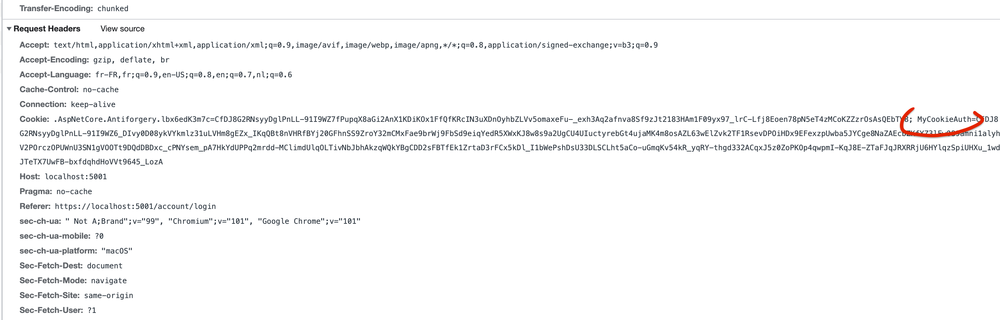
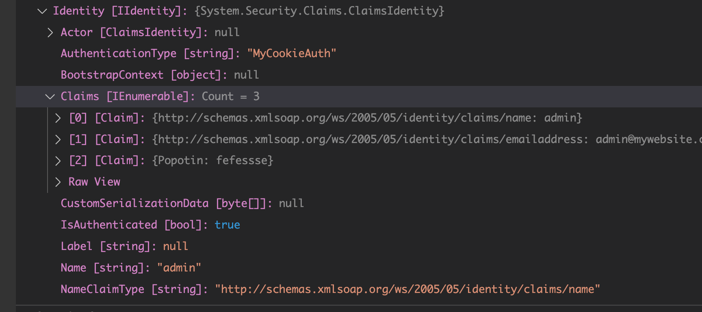

# 05 Authentification avec un `Cookie`

Maintenant que le `Cookie` est créé, il faut un `middleware` pour le lire.



En l'absence du `middleware`, malgré la génération d'un `Cookie`, si on regarde `User.Identity` :


On voit que `IsAuthenticated: false`.

Il suffit d'ajouter le `middleware` `UseAuthentication()` :

```cs
app.UseRouting();

app.UseAuthentication();
//app.UseAuthorization();

app.UseEndpoints(endpoints => {
    endpoints.MapRazorPages();
});
```




## Le `header` de la requête

Le `Cookie` est retourné vers le serveur dans le `header` de la requête :



Le `middleware` d'`Authentication` peut donc le décoder et le déserialiser.

Je récupère dans l'objet `User.Identity` les `Claims` définies dans le `Cookie` :




## Remarque

Si j'ajoute le service d'`Authentication` de cette manière :

```cs
services.AddAuthentication().AddCookie("MyCookieAuth", options => {
    options.Cookie.Name = "MyCookieAuth";
});
```

Je me retrouve de nouveau avec :

```cs
IsAuthenticated: false
```

C'est parcequ'on ne dit pas au middleware `Authentication` quel type de `scheme` il doit utiliser.

Il suffit de lui passer le nom du `scheme` pour que cela fonctionne :

```cs
services.AddAuthentication("MyCookieAuth").AddCookie("MyCookieAuth", options => {
    options.Cookie.Name = "MyCookieAuth";
});
```

