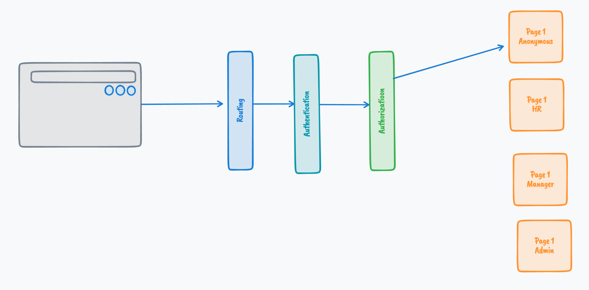
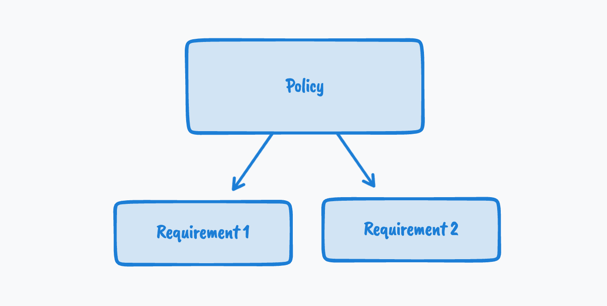
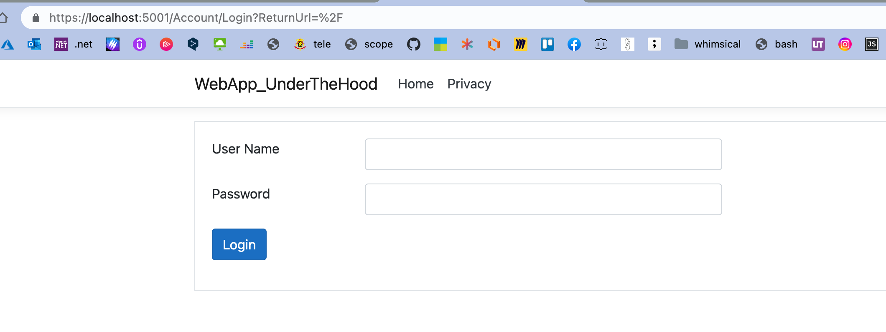
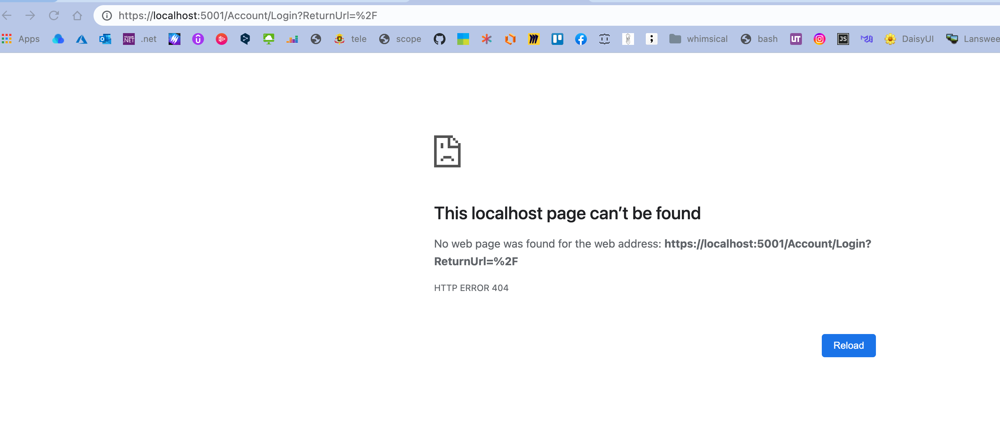
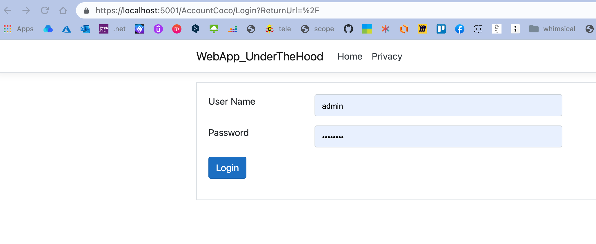

# 06 `Authorization`


## Flow d'accès



On pourrait aussi avoir une page cummulant deux rôles `HR + manager`.

La couche `Authentication` est capable de déserialiser les `Claims` du `Security Context` (ici le `Cookie`).

La couche `Authorization` compare les contraintes d'accès à une page (`requirement`) aux informations continues dans les `Claims` pour authoriser l'accès ou non (`403 Forbidden`) à une page (à une ressource, un `endpoint`).


## `Policy`

Pour réaliser l'`Authorization` , `aps.net` propose l'utilisation de `Policy`.

Les `Policies`contiennent un ou plusieurs `Requirement`.



On applique les `Policies` grâce à l'`attribut` : `[Authorize]` placé sur les différentes pages.

Si la logique d'accès devient complexe, on doit créer des `Custom Requirement` (par exemple une personne de plus de 18 ans).


On doit implémenter un `customAuthorizationHandler` pour un `customRequirement`.

Les différents `Requirement` sont implémentés grâce aux `AuthorisationHandler`.

Les `AuthorisationHandler` sont alors utilisés par `AuthorisationService`.

Il existe plusieurs `AuthorisationHandler` générique déjà fournis.


## Empécher les accès anonymes

Il suffit de décorer la `Page` avec l'`Attribute` : `Authorize`

```cs
[Authorize]
public class IndexModel : PageModel
{
    // ...
```

Si l'`Attribute` : `[Authorize]` est mis sur une page, un utilisateur non identifié (`Authenticated`) sera automatiquement redirigé vers la page de `Login` :



Le middleware `Authorization` sait par convention où se trouve la page de `login` :

- Dans le dossier `Account` et c'est le fichier (la `Page`) `Login`

Si on change le nom du dossier par `AccountCoco` par exemple, on a une erreur `404 NotFound` :



`Index` redirige automatiquement vers `/account/login` et cela crée un `404 NotFound`.


## Renseigner explicitement le chemin du `Login`

```cs
services.AddAuthentication("MyCookieAuth").AddCookie("MyCookieAuth", options => {
    options.Cookie.Name = "MyCookieAuth";
    options.LoginPath = "/AccountCoco/Login";
})
```

En allant à la page `Index` on a bien cette redirection :




> ### Obligation du `middleware` : `Authorisation`
>
> Si on désactive `Authorization` :
>
> ```cs
> // app.UseAuthorization();
> ```
>
> On obtient une erreur si on tente d'accéder à une `page` possédant l'`Attribute` : `[Authorize]`
>
> 


