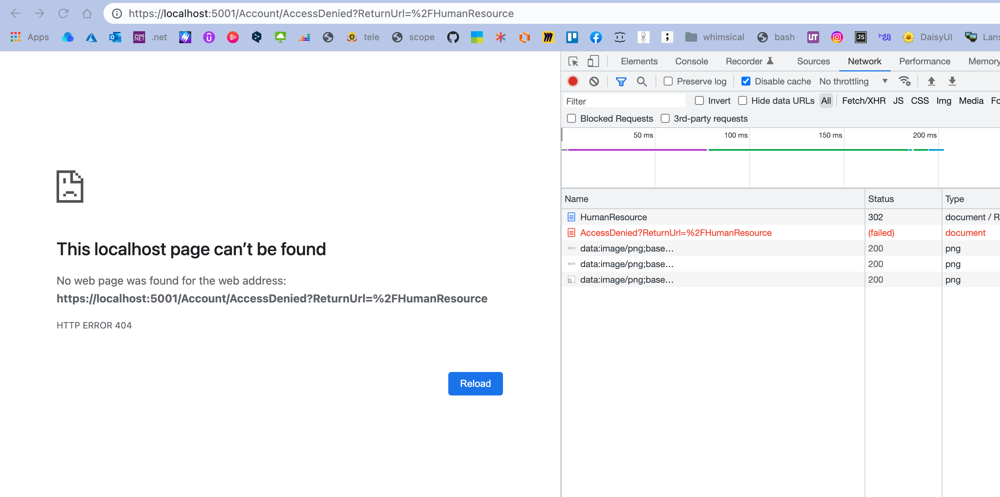
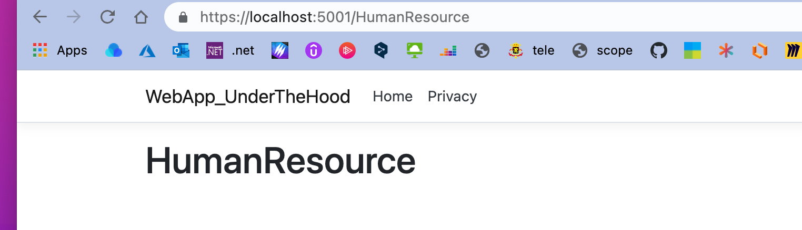
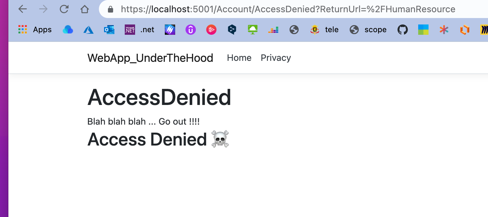

# 07 `Policy`


## Page `Human Resource`

```cs
@page
@model SecurityFranckLiu.Pages.HumanResource
@{
    ViewData["Title"] = "HumanResource";
}

<h1 class="display-4">@ViewData["Title"]</h1>

<div class="text-center">
    <p>Department for Human Resource</P>
</div>
```

On veut ajouter une `Policy` d'accès à cette page.


## Ajout d'une `Policy`

### `options.AddPolicy("NameOfThePolicy", policy => { ... })`

On doit le faire dans la configuration du service d'`Authorization` :

```cs
services.AddAuthorization(options => {
    options.AddPolicy("MustBelongToHRDepartment", 
                      policy => policy.RequireClaim("Department", "HR"));
});
```

On place maintenant la `Policy` sur la page :

```cs
[Authorize(Policy = "MustBelongToHRDepartment")]
public class HumanResource : PageModel
{
    // ...
```

Si on vient sur la page :



On a un `Access Denied`.

Si on ajoute la `Claim` nécessaire au `ClaimsPrincipal` :

```cs
var claims = new List<Claim> {
    new Claim(ClaimTypes.Name, "admin"),
    new Claim(ClaimTypes.Email, "admin@mywebsite.com"),
    new Claim("Popotin", "fefessse"),
    new Claim("Department", "HR") // <=
};

var identity = new ClaimsIdentity(claims, "MyCookieAuth");
ClaimsPrincipal claimsPrincipal = new ClaimsPrincipal(identity);
```

On a maintenant accès à la page.



> ### `RequireClaim` avec un seul paramètre
>
> On peut ne passer qu'un paramètre à `RequireClaim("ClaimName")` :
>
> ```cs
> services.AddAuthorization(options => {
>     options.AddPolicy("AdminOnly", 
>                       policy => policy.RequireClaim("Admin"));
> });
> ```
>
> On ne teste que la présence d'une `Claim`, pas sa valeur.
>
> On ajoute ensuite la `Claim` comme ceci :
>
> ```cs
> new Claim("Admin", "true")
> ```
>
> Le deuxième terme n'a pas d'importance, le `"true"` est simplement sémantique.

## Créer sa page `Access Denied`

On spécifie d'abord son propre chemin :

```cs
services.AddAuthentication("MyCookieAuth").AddCookie("MyCookieAuth", options => {
    options.Cookie.Name = "MyCookieAuth";
    options.LoginPath = "/Account/Login";
    options.AccessDeniedPass = "/Account/AccessDenied";
})
```

Puis on créé la page `AccessDenied` dans le dossier `Account`:

`AccessDenied.cshtml`

```cs
@page
@model SecurityFranckLiu.Pages.Account.AccessDenied
@{
    ViewData["Title"] = "AccessDenied";
}

<h1>@ViewData["Title"]</h1>

<div>
    Blah blah blah ...
    Go out !!!!
    <h2>Access Denied ☠️</h2>
</div>
```




## Chainer les `Requirement`

```cs
services.AddAuthorization(options => {
    // ...
    options.AddPolicy("OnlyAdminIct", policy => {
        policy.RequireClaim("Department", "ICT")
            .RequireClaim("IctRole", "Admin")
            .requireClaim("Localisation", "BXL");
    });
});
```

