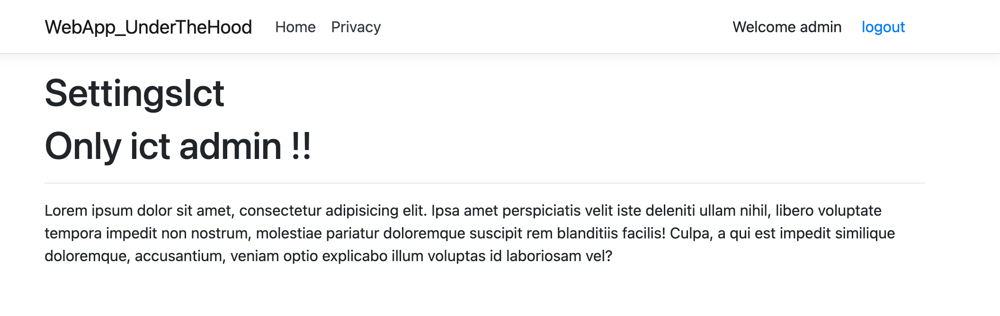
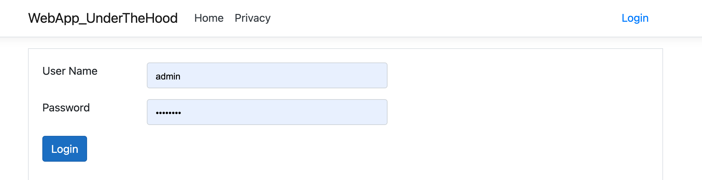

# 08 `Logout`


## Créer une Page `Logout`

Dans le dossier `Account` on va créer une `Razor Page` : `Logout`

```cs
public class Logout : PageModel
{
    public async Task<IActionResult> OnPostAsync()
    {
        await HttpContext.SignOutAsync("MyCookieAuth");
        return RedirectToPage("/Index");
    }
}
```

> Il vaut mieux utiliser une constante plutôt que le magic string  `"MyCookieAuth"`
>
> Par exemple :
>
> ```cs
> MyAuthenticationScheme.MyCookieAuth; // retourne "MyCookieAuth"
> ```
>
> On a ainsi l'autocomplétion et on peut connaître tous les `Scheme` disponibles.


## Ajouter un bouton de `Logout`

Dans le dossier `Shared` on va créer une `partial view` : `_LoginStatusPartial.cshtml`

```asp
@if(User.Identity.IsAuthenticated)
{
	<form method="post" class="form-inline" asp-page="/Account/Logout">
        Welcome @User.Identity.Name
        <button type="submit" class="ml-2 btn btn-link">
            logout
        </button>
</form>
}
else
{
	<a class="btn btn-link" asp-page="/Account/Login">Login</a>
}
```


### Utiliser ce `partial` dans `Layout.cshtml`

```html
<header>
	<nav>
    	// ...
        <div class="mr-2">
            <partial name="_LoginStatusPartial" />
        </div>
    </nav>
</header>
```



Une fois `Logout` on a :

