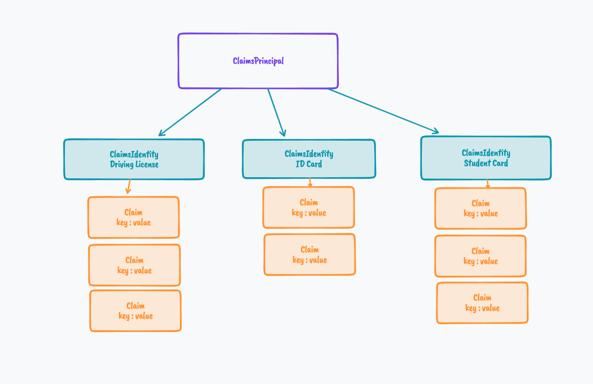

# 05 Les `Claims`

## Relation entre `ClaimsPrincipal` et `ClaimsIdentity`

Une `ClaimsPrincipal` se compose d'une ou plusieurs `ClaimsIdentity` :

La `ClaimsPrincipal` correspond à l'utilisateur

Les `ClaimsIdentity` correspondent aux différentes cartes d'accès et de droit que l'utilisateur possède.

Chaque `Claim` est une paire clé/valeur contenant une information.