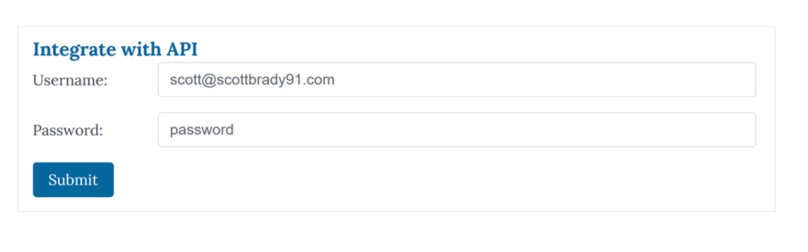
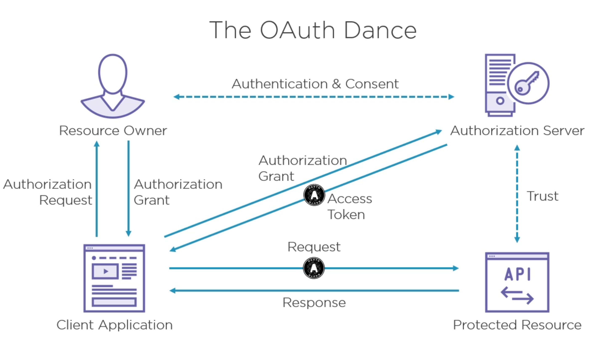

# Les bases de la sécurité des `API` : `OAuth 2.0`

## Différence entre `Authentication` et `Authorization`

### `Authentication`: `Authentification`

C'est le processus de confirmer son identité, on vérifie que vous êtes bien celui que vous dites être.

C'est le moment où l'utilisateur présente qui il est avec un `login` et un `password`pae exemple.

### `Authorization` : `autorisation`

C'est ce qu'une personne est autorisée à faire.

Ce sont les `permissions` et les `contrôle d'accès`.

## Exemple

Permettre à une application d'accéder à une `API` pour envoyer un `email` au nom d'un utilisateur.

### Première solution : Partager les identifiants (`credential sharing`)

L'application doit enregistrer le `login` et le `password`, ce qui augment sa surface d'attaque potentielle.

Les `authentification` à plusieurs facteur ne sont pas possible.

Cette méthode est vulnérable au `Phishing`.

Une application uniquement `Client-Side` n'a aucun moyen de conserver le password de manière sécurisée.

### Deuxième solution utiliser les `Cookies`

Il y a une bonne raison d'éciter les `cookies` : `Cross-Site Request Forgery` (`XSRF`).

`Request Forgery` : falsification de la requête.

Les `cookies` autorise le navigateur entièrement, pas seulement l'application de départ.

Cela permet à un lien malicieux (où à un téléchargement d'image dans un mail) d'exécuter une `URL` avec les bons credentials.

### Troisième solution : `API Keys`

Difficile de garder une application côté client sécurisée.

Il n'y a pas de standard pour créer une `API Key`.

### La solution `OAuth 2.0`

C'est un `framework` d'autorisation, spécifiquement construit pour les `API HTTP`.

Il y a un `Scoped Access`, c'est à dire que l'on peut définir spécifiquement à quelle partie de l'`API` l'utilisateur a accès.

C'est un protocole de délégation.

## Les acteurs de `OAuth 2.0`

Il y a 4 acteurs:

### La ressource protégée : `HTTP API`

### Le `client` (l'application requêrante)

### Le propriétaire de la ressource : l'`Utilisateur`

### Le `serveur` d'autorisation

L'`access token` est le plus souvant un `bearer token`.

## Les limitations de `OAuth`

### Ce n'est pas un framework d'`authentification`, seulement un framework d'`autorisation`.

L'`access token` ne fournit pas d'informations sur l'identité de l'utilisateur.

Le client n'est pas le destinataire attendu du `token`, il ne peut pas vérifier le `token`.

C'est `OpenId Connect` qui permet l'`authentification`.

### Il est trop abstrait

Le format de l'`access token`, la validation de cet `access token` ainsi que la manière de s'authentifier ne sont pas décrit.

La qualité de l'implémentation peut donc fortement variée.

C'est `Jason Web Token` qui règle ce problème : `JWT`.