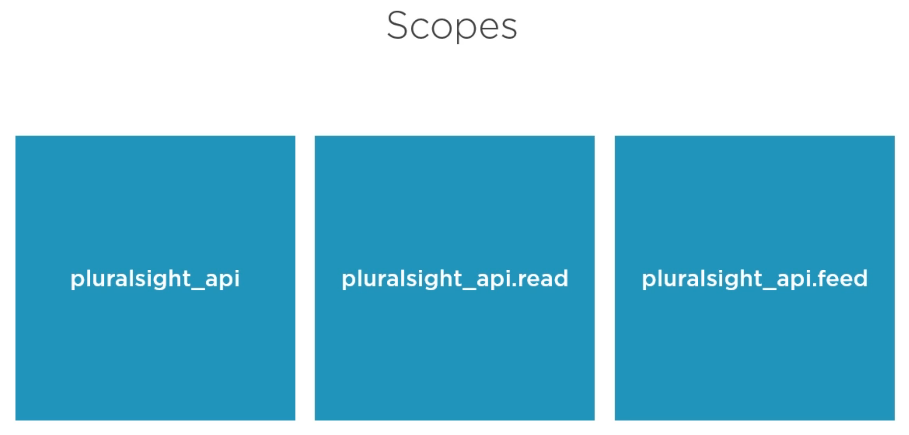
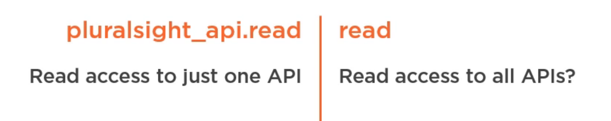
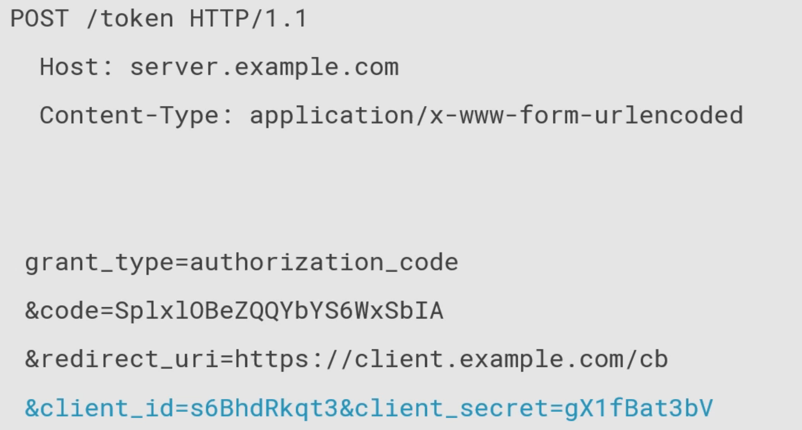
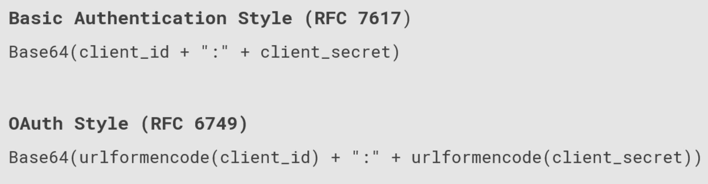
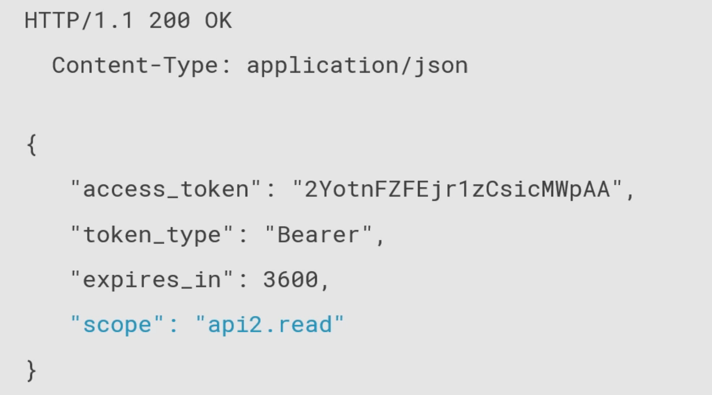

# 02 `OAuth` en détail

## Quelques traductions utiles

> ## `Grant`
>
> `grant` fait référence à l'attribution de privilèges.
>
> On peut le traduire par `attribuer` ou `accorder`.

> ## `Bearer`
>
> Un `bearer token` est un `jeton porteur`.
>
> `Bearer` est ici utilisé pour indiquer que le `token` est transporté à chaque requête effectuée à l'`API`. Le `Bearer Token` est inclus dans le `HEADER` de la requête.

## Les différents `endpoints`

`OAuth` utilise deux `endpoints`:

- le `Authorization endpoint`
- le `Token Endpoint`

Ces `endpoints` doivent utiliser `Transport Layer Security` : `TLS`. 


## Le `Scope`

La permission de faire quelque chose avec une ressource protégée au nom du propriétaire de cette ressource.

On peut avoir un `scope` qui représente l'`API` dans son entièreté, ou un type particulier d'accès ou de fonctionnalité sur cette `API`.



Il vaut mieux préfixer son `Scope` par le nom de l'`API`:



C'est ce `scope` qui est demandé par le `client` à l'`authorization endpoint`.


## Les types d'`authorization` avec code : `Code Grant`

L'`authorization grant` sera échangé au `Authorization Server` contre un `Access Token`.

### `Authorization Request`

```http
https://authserver.example.com/authorize
	?response_type=code
	&client_id=s6BhdRtx7k
	&redirect_uri=https://client.example.com/callback
	&state=xyz
	&scope=api1 api2.read
```


Pour la spécification, seul les trois premier paramètres sont obligatoires `response_type`, `client_id` et `redirect_uri`.

Le `state` sera renvoyé par la réponse, c'est une forme de défense basique contre le `Cross-Site Request Forgery`. Cette valeur ne doit pas être devinable. Dans la spécification `OAuth`, `state` est indiqué comme seulement recommandé.

Le paramètre `scope` est aussi facultatif et permet de demander explicitement quels `scopes` on désire. On demande ici deux `scopes`, un sur l'`api1` en entier et un autre en lecture sur l'`api2`. S'il n'est pas définit, l'`authorization server` renvoie le `scope` par défaut définit de manière générale ou pour un `client` spécifique.


### `Authorization Response`

Une fois que le `resource owner` (utilisateur) s'est authentifié et qu'il a consentit à ce que l'application `client` a demandé, le `Authorization Server` redirige vers l'application `client` à l'adresse passée par `redirect_uri`.

```http
https://client.example.com/callback
	?code=Splx10BeZQQYbYS6WxSbIA
	&state=xyz
```

Le `code` est synonime de `grant type` (type de droit d'accès). Ce code a un temps de vie assez court. Il est relié aux infos fournit dans la `request`.


### `Token Request`

Cette requête utilise maintenant le `token endpoint`.




### Basic Authentication & `OAuth`

Dans la spécification il y a deux manières de faire:



Si on reçoit une réponse `401` `UNauthorized`, il faut peut-être essayer l'autre méthode.

La `basic authentification` utilise le `client_id` et le `client_secret`. Ce n'est possible que pour des `clients` tournant sur un `serveur`.


### `Token Response`



`"expires_in"` est exprimé en `secondes`.

le `"scope"` peut correspondre au `scope` demandé ou peut être plus restreint (comme ici).
