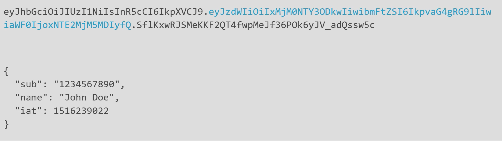
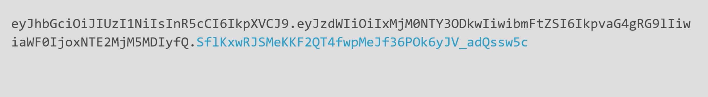
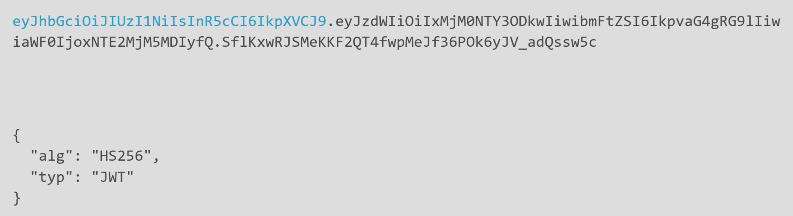
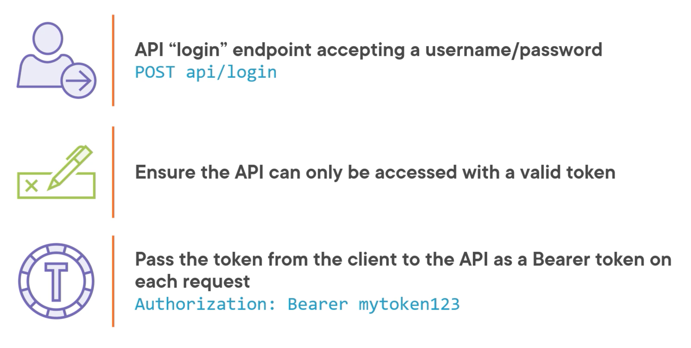

# 02 Implémentation de la sécurité `Token-based`

## Login

On doit implémenter un `endpoint` gérant le `login`.

```
POST api/login
```


## Anatomie du `token`

Un `token` se compose de troie parties :

### 1 Le `payload`



Ce sont des infos sur l'utilisateur au départ en `json`


### 2 La signature

C'est un `hash` du payload, de façon que si le `payload` est modifié après la génération du `token`, la signature ne correspond plus et on sait que le `token ` a été altéré.



Pour signer on a besoin d'une clé (`key`) générée depuis un `secret`.


### 3 Le `header`



Ce sont des informations sur le type de `token` et l'algorithme utilisé.


## Implémentation




