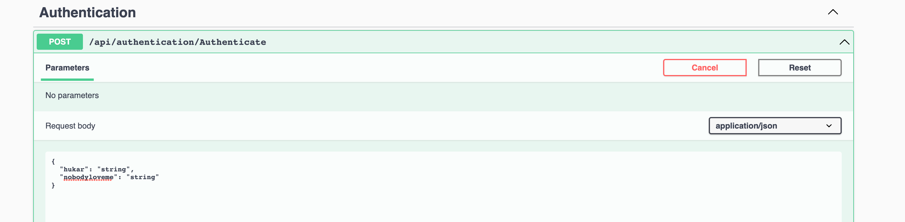
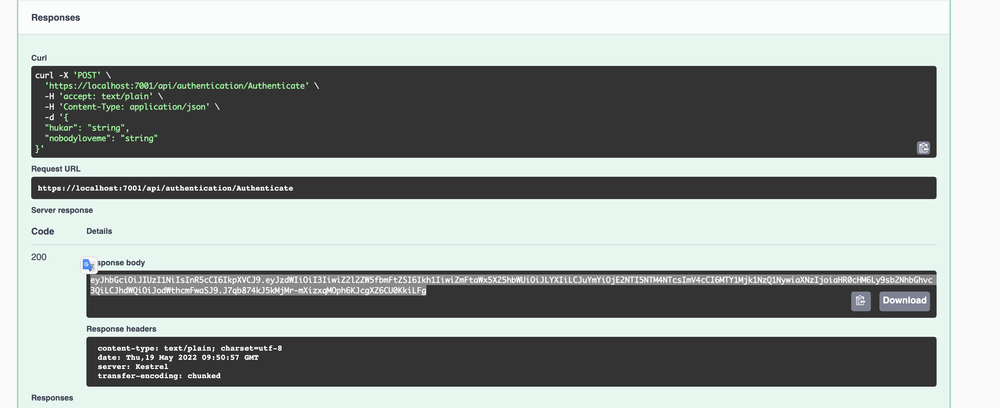
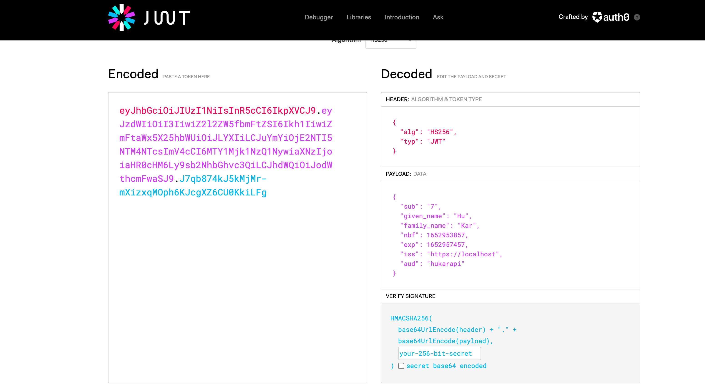

# 03 Créer un `token`


## Créer le `controller`

```cs
[ApiController]
[Route("api/authentication")]
public class AuthenticationController : ControllerBase
{

    [HttpPost("Authenticate")]
    public ActionResult<string> Authenticate(AuthenticationRequestBody authenticationRequestBody)
    {
		// 1 validate username/password
        var user = ValidateUserCredentials(
            authenticationRequestBody.UserName,
        	authenticationRequestBody.Password,);
        
        if(user is null)
        {
            return Unauthorized();
        }
    }
    
    private InfoUser ValidateUserCredentials(string? userName, string? password)
    {
        // Normalement on regarde ici en DB si on a bien les username/password valide
        // On va juste dire qu'ils sont valides
        return new InfoUser { UserName = userName ?? "", FirstName = "Hu", LastName = "Kar" };
    }
}

class AuthenticationRequestBody
{
    public string? UserName { get; set; }
    public string? Password { get; set; }
}

class InfoUser
{
    public int Id { get; set; }
    public string? UserName { get; set; }
    public string? FirstName { get; set; }
    public string? LastName { get; set; }
}
```

Un `token` est un `string`.

On peut *scoper* la classe `AuthenticationRequestBody` avec le `Controller`.

On va placer son secret dans `appsettings.Development.json`

```json
"Authentication": {
    "SecretForKey": "thisissecretforgeneratingkey(mustneatleast32bitslong)",
    "Issuer": "https://localhost:7123",
    "Audience": "cityinfoapi"
}
```

`Issuer` : la source, ici notre `api`

On injecte le service `Configuration` dans le `Controller`

```cs
private raedonly IConfiguration _configuration;

public AuthenticationController(IConfiguration configuration)
{
    _configuration = configuration;
}
```


## Création du `token`

```cs
[HttpPost("Authenticate")]
public ActionResult<string> Authenticate(AuthenticationRequestBody authenticationRequestBody)
{
    // 1 validate username/password
    var user = ValidateUserCredentials(
        authenticationRequestBody.UserName,
        authenticationRequestBody.Password,);

    if(user is null)
    {
        return Unauthorized();
    }

    // 2 create a token
    var securityKey = new SymmetricSecurityKey(
    	Encoding.ASCII.GetBytes(_configuration["Authentication:SecretForKey"])
    );
    var signingCredentials = new SigningCredentials(
        securityKey, SecurityAlgorithms.HmacSha256
    );
    
    // The claims
    var claimsForToken = new List<Claim>();
    claimsForToken.Add(new Claim("sub", user.Id.ToString()));
    claimsForToken.Add(new Claim("given_name", user.FirstName));
    claimsForToken.Add(new Claim("family_name", user.LastName));
    
    // generate token
    var jwtSecurityToken = new JwtSecurityToken(
    	_configuration["Authentication:Issuer"],
        _configuration["Authentication:Audience"],
        claimsForToken,
        DateTime.UtcNow,
        DateTime.UtcNow.AddHours(1),
        signingCredentials
    );
    
    var tokenToReturn = new JwtSecurityTokenHandler()
        .WriteToken(jwtSecurityToken);
    
    return Ok(tokenToReturn);
}
```

Il faut installer les packages `Microsoft.IdentityModel.Tokens` et `System.IdentityModel.Tokens.Jwt`.

`Encoding.ASCII.GetBytes` convertie un `string` en `byte[]` (`array of bytes`).

`HmacSha256` est le standard actuel.

`Claim` pair clé/valeur contenant une information (je clame une information).

`"sub"`, `"given_name"` et `"family_name"` sont les standards pour les `Claims` associé à `Id`, `firstName` et `LastName`.


## Test du `token` : `jwt.io`








