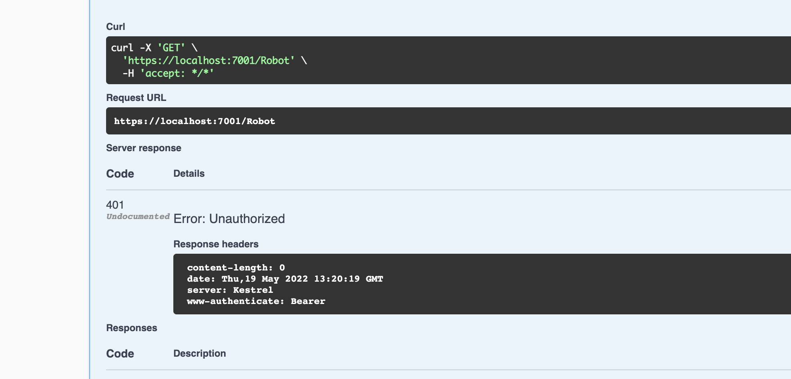
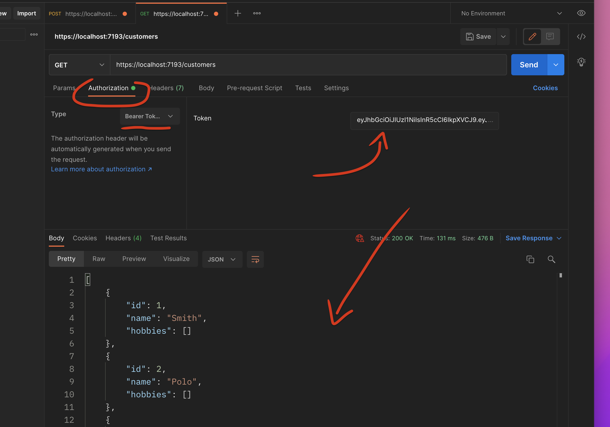

# 04 `Bearer Token`

Pour valider le `token` entrant on utilise un `middleware` : le `JwtBearerMiddleware`

On doit ajouter un `package` : `Microsoft.AspNetCore.Authentication.JwtBearer`

> Le token est lisible (via le site `jwt.io` par exemple), il n'assure donc la sécurité que couplé avec le cryptage d'`HTTPS`.

## Mise en place

Dans `Program.cs`

```cs
builder.Services.AddAuthentication("Bearer")
    .AddJwtBearer(options => {
        options.TokenValidationParameters = new()
        {
            ValidateIssuer = true,
            ValidateAudience = true,
            ValidateIssuerSigningKey = true,
            ValidIssuer = builder.Configuration["Authentication:Issuer"],
            ValidAudience = builder.Configuration["Authentication:Audience"],
            IssuerSigningKey = new SymmetricSecurityKey(
            	Encoding.ASCII.GetBytes(builder.Configuration["Authentication:SecretForKey"])
            )
        };
    });
```

`"Bearer"` est ce qu'on appellle un `AuthenticationScheme`, un schéma d'authentification (ici `porteur` ( : `bearer`) sous entendu `token porteur`).

On passe aux options ce qui doit être validé.

Le temps d'expiration est automatiquement validé

Le but est que notre `API` ne réponde qu'aux possesseurs de `token` valide.

Il faut aussi ajouter avant les `endpoints` :

```cs
app.UseAuthentication();
```

On doit bien entendu maintenant placer l'`Attribut` : `[Authorize]` au-dessus de chaque `Controller` sauf le `Controller` d'authentification :`AuthenticateController`.

### Résultat



J'ai une erreur `401` : `Unauthorized`

> Idem avec `minimal api`


## Envoie du `Bearer Token`

Pour pouvoir de nouveau utiliser l'`api`, il faut renvoyer le `token ` généré :

### Utilisation de `Postman`



Il faut copier le `Bearer Token` obtenu en `POST /authenticate` sans les guillemets.